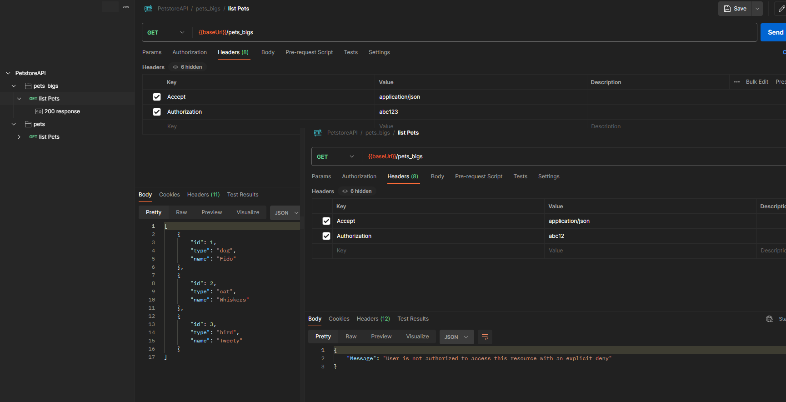

# AWS API Gateway com OpenAPI 3.0 - Projeto PetStore

Este projeto utiliza o Terraform para criar um API Gateway na AWS, com base na especificação OpenAPI 3.0 da PetStore. Ele automatiza o provisionamento dos recursos necessários para expor uma API de exemplo que gerencia informações sobre pets, implementando operações básicas de CRUD (Criar, Ler, Atualizar, Deletar).

## Recursos Criados

- **Lambda Pets Functions:** São criadas funções Lambda para cada operação disponibilizada pela API, começando pela listagem de pets.
- **Lambda Authorizer Function:** Implementa uma função Lambda que atua como um autorizador, validando tokens de autenticação. Se o token recebido for "abc123", a requisição é autorizada; caso contrário, é negada.
- **IAM Roles e Policies:** Define IAM roles e policies que concedem ao API Gateway permissão para invocar as funções Lambda.
- **CloudWatch Log Group:** Cria um grupo de log no AWS CloudWatch para registrar os logs gerados pelo API Gateway e pelas funções Lambda. Uma IAM role é associada para permitir que o API Gateway registre esses logs.
- **API Gateway:** Configura o API Gateway, cria os stages necessários e importa a especificação OpenAPI. O template da especificação é processado para substituir placeholders pelos ARNs das funções Lambda, configurando assim as integrações da API de forma adequada.

## Como Usar

### Inicialização

Para iniciar o projeto e criar os recursos na AWS, siga os comandos:

```shell
terraform init
terraform apply
```

Após executar o `terraform apply`, a URL base da API no API Gateway será exibida nas saídas do Terraform. Por exemplo:

```plaintext
url_api_gateway = "https://lur3p3bpmh.execute-api.us-east-1.amazonaws.com/dev"
```

### Testando a API

Você pode testar a API utilizando uma ferramenta como o Postman. Abaixo está um exemplo de requisição:


### Destruindo os Recursos

Para remover todos os recursos criados por este projeto e evitar custos adicionais, utilize:

```shell
terraform destroy
```
