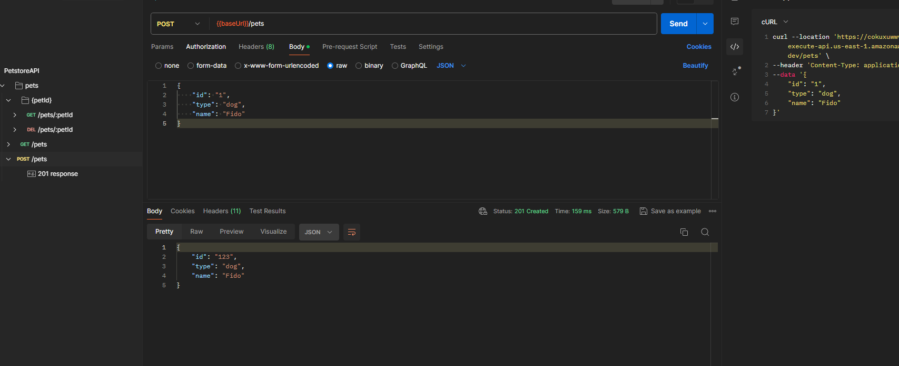

# AWS API Gateway com OpenAPI 3.0 - Projeto PetStore

Este projeto utiliza o Terraform para criar um API Gateway na AWS com base na coleção OpenAPI 3.0 da PetStore. Ele automatiza o provisionamento de recursos necessários para expor uma API de exemplo que gerencia pets, simulando operações básicas de CRUD.

## Recursos Criados

- **Lambda Functions:** São criadas 4 funções Lambda correspondentes a cada operação disponibilizada pela API: listagem de pets, exclusão de um pet, busca por um pet específico e criação de um novo pet.
- **IAM Roles e Policies:** Define roles e policies do IAM para permitir que o API Gateway invoque as funções Lambda.
- **CloudWatch Log Group:** Cria um grupo de log no CloudWatch para armazenar os logs gerados pelo API Gateway e pelas funções Lambda. Uma role de confiança é associada para permitir que o API Gateway escreva nesse grupo de log.
- **API Gateway:** Configura o API Gateway e cria os stages necessários. Importa a especificação OpenAPI em formato de template, substituindo os placeholders pelos ARNs das funções Lambda criadas, para configurar as integrações corretamente.

## Como Usar

### Inicialização

Para iniciar o projeto e criar os recursos na AWS, execute:

```shell
terraform init
terraform apply
```
Após a execução do comando `terraform apply`, a URL base da API do API Gateway será exibida como uma saída do Terraform. Por exemplo:


```plaintext
url_api_gateway = "https://5elyh6ewvl.execute-api.us-east-1.amazonaws.com/"
```




### Destruindo os Recursos

Para remover todos os recursos criados por este projeto e evitar custos adicionais na AWS, execute:

```shell
terraform destroy
```
