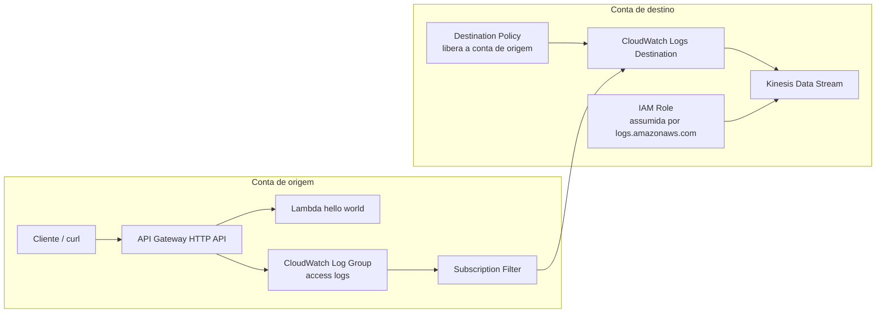

# Terraform — API Gateway HTTP API access logs → CloudWatch Logs → Kinesis Data Streams (cross-account)

Projeto acadêmico, simples de entender, mas **mais completo** do que o exemplo inicial.  
Aqui a conta de origem cria um **API Gateway HTTP API real**, com uma rota **GET /hello** integrada a uma **Lambda**, grava **access logs** em um **CloudWatch Logs log group**, e usa um **subscription filter cross-account** para enviar esses logs para um **Kinesis Data Stream** na conta de destino.

Esse é um ótimo laboratório para relembrar três coisas que confundem bastante:

1. **API Gateway access logs**  
2. **CloudWatch Logs subscription filter cross-account**  
3. **IAM trust policy para `logs.amazonaws.com`**

A AWS documenta que o destinatário cria um **Kinesis Data Stream**, uma **IAM role** assumida pelo serviço **CloudWatch Logs**, e um **CloudWatch Logs destination**; a conta de origem então cria o **subscription filter** para enviar o log group ao destino compartilhado. Para API Gateway, a AWS também documenta que **access logging** escreve em um **CloudWatch Logs log group** configurado no stage. citeturn458118view0turn458118view1turn458118view4

---

## Arquitetura



---

## Fluxo mental do laboratório

```text
Client -> API Gateway -> Lambda
                 |
                 v
         CloudWatch access logs
                 |
                 v
      Subscription Filter (source)
                 |
                 v
 CloudWatch Logs Destination (destination)
                 |
                 v
      Kinesis Data Streams (destination)
```

---

## O que este projeto cria

### Conta de origem
- `aws_lambda_function` com um hello world em Python
- `aws_apigatewayv2_api` do tipo **HTTP**
- `aws_apigatewayv2_integration` do tipo **AWS_PROXY**
- `aws_apigatewayv2_route` para `GET /hello`
- `aws_apigatewayv2_stage` com **access_log_settings**
- `aws_cloudwatch_log_group` para os access logs
- `aws_cloudwatch_log_subscription_filter` enviando os logs para a outra conta

### Conta de destino
- `aws_kinesis_stream`
- `aws_iam_role` assumida por `logs.amazonaws.com`
- `aws_iam_role_policy` dando `kinesis:PutRecord` e `kinesis:PutRecords`
- `aws_cloudwatch_log_destination`
- `aws_cloudwatch_log_destination_policy`

---

## Estrutura

```text
.
├── README.md
├── .gitignore
├── versions.tf
├── providers.tf
├── variables.tf
├── destination.tf
├── lambda.tf
├── source.tf
├── outputs.tf
├── terraform.tfvars.example
└── lambda-src/
    └── index.py
```

---

## Parte que mais dá branco: trust policy

A documentação da AWS para destinos cross-account com Kinesis mostra que o serviço **CloudWatch Logs** precisa assumir uma role no **recipient account**, e recomenda usar condição com `aws:SourceArn` para ajudar a evitar o problema de **confused deputy**. citeturn458118view0turn539973search13

No projeto, a essência está aqui:

```json
{
  "Version": "2012-10-17",
  "Statement": [
    {
      "Effect": "Allow",
      "Principal": {
        "Service": "logs.amazonaws.com"
      },
      "Action": "sts:AssumeRole",
      "Condition": {
        "StringLike": {
          "aws:SourceArn": [
            "arn:aws:logs:REGION:SOURCE_ACCOUNT_ID:*",
            "arn:aws:logs:REGION:DESTINATION_ACCOUNT_ID:*"
          ]
        }
      }
    }
  ]
}
```

### Como pensar nisso sem decorar palavra por palavra

- **Quem assume a role?** `logs.amazonaws.com`
- **Por quê?** porque o CloudWatch Logs precisa escrever no stream
- **Onde está a role?** na conta de destino
- **Para quê serve o `aws:SourceArn`?** restringir quem pode acionar esse assume role

---

## Pré-requisitos

- Terraform `>= 1.6`
- AWS provider `~> 5`
- Archive provider `~> 2.5`
- Dois perfis AWS locais:
  - um para a conta de origem
  - um para a conta de destino
- Permissões para criar:
  - Lambda
  - API Gateway v2
  - CloudWatch Logs
  - IAM
  - Kinesis Data Streams

---

## Como usar

### 1) Copie as variáveis

```bash
cp terraform.tfvars.example terraform.tfvars
```

### 2) Ajuste os valores

Preencha principalmente:

- `source_profile`
- `destination_profile`
- `source_account_id`
- `destination_account_id`
- `region`

### 3) Inicialize

```bash
terraform init
```

### 4) Planeje

```bash
terraform plan
```

### 5) Aplique

```bash
terraform apply
```

---

## Como testar

Depois do `apply`, use o output `api_test_route`.

Exemplo:

```bash
curl "$(terraform output -raw api_test_route)"
```

Isso deve:
1. invocar a Lambda
2. gerar access logs no log group
3. disparar o subscription filter
4. encaminhar os logs para o destination
5. entregar os eventos ao Kinesis Data Stream

---

## O que observar na prática

### Na conta de origem
- API Gateway HTTP API criada
- Stage `$default`
- Log group `/aws/apigateway/study-http-api/access`
- Subscription filter ativo

### Na conta de destino
- Kinesis stream criado
- Destination criado
- IAM role criada
- Policy permitindo a conta de origem usar o destination

---

## Sobre os access logs do API Gateway

A AWS documenta que o **access log format** deve incluir pelo menos `$context.requestId` ou `$context.extendedRequestId`, e recomenda incluir os dois. Por isso o projeto usa ambos no JSON de log do stage. citeturn458118view1

Exemplo usado aqui:

```json
{
  "requestId": "$context.requestId",
  "extendedRequestId": "$context.extendedRequestId",
  "ip": "$context.identity.sourceIp",
  "requestTime": "$context.requestTime",
  "httpMethod": "$context.httpMethod",
  "routeKey": "$context.routeKey",
  "status": "$context.status",
  "protocol": "$context.protocol",
  "responseLength": "$context.responseLength",
  "integrationError": "$context.integrationErrorMessage"
}
```

---

## Observações importantes

### 1) Esse projeto é acadêmico
Ele é para estudo e compartilhamento de conhecimento.  
Não inclui:
- alarms
- DLQ
- consumer do Kinesis
- criptografia com CMK customizada
- módulos Terraform separados

### 2) O fluxo é quase real-time
CloudWatch Logs subscription entrega eventos em tempo quase real para o stream. A documentação do Kinesis confirma esse padrão de uso com CloudWatch Logs subscriptions. citeturn458118view3

### 3) Sobre permissões na conta de origem
A documentação da AWS também destaca que o principal IAM que cria o subscription filter na conta de origem precisa ter permissão explícita para `logs:PutSubscriptionFilter` no destination cross-account, a menos que você esteja usando um principal já privilegiado como Administrator. citeturn458118view4

---

## Limpeza

```bash
terraform destroy
```

---

## Ideias para evoluir depois

- adicionar um consumer Lambda lendo do Kinesis
- mandar os logs para S3 via Firehose em vez de Kinesis Data Streams
- trocar o hello world por uma Lambda que chama DynamoDB
- separar em módulos `source` e `destination`
- adicionar um diagrama SVG gerado a partir do Mermaid

---

## Referências oficiais

- CloudWatch Logs cross-account destination com Kinesis Data Streams: AWS Docs  
- Permissões para destination cross-account: AWS Docs  
- API Gateway access logging em CloudWatch Logs: AWS Docs  
- API Gateway HTTP API stages: AWS Docs  
- Terraform `aws_apigatewayv2_stage`: Terraform Registry  
- Terraform `aws_cloudwatch_log_destination`: Terraform Registry
