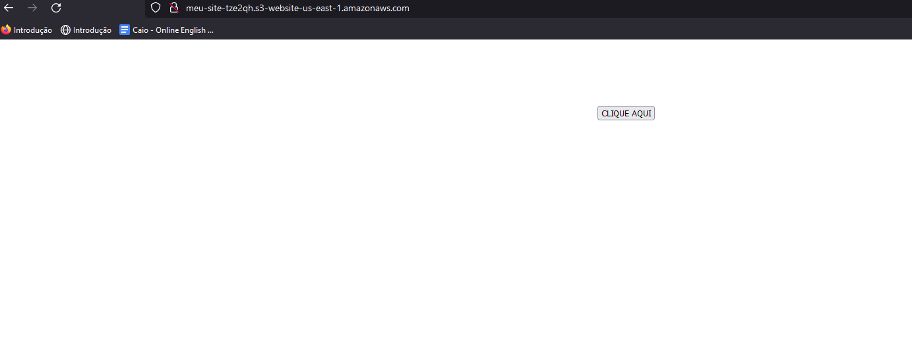
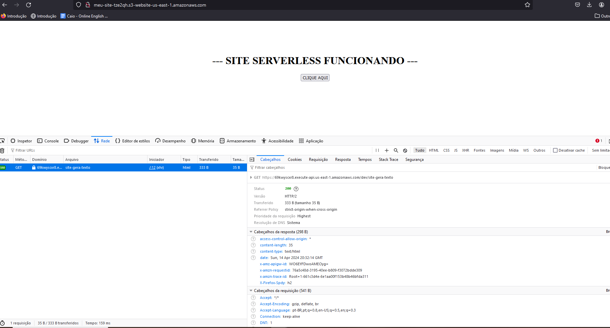
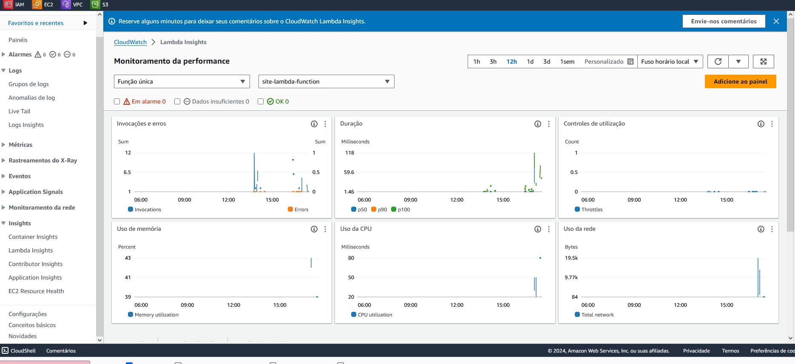

Este projeto cria uma infraestrutura para hospedar um website no S3, que inclui uma página `index.html` que se conecta a uma função Lambda por meio do API Gateway.

### Recursos Criados:
- **Função Lambda em Python**:
    - Memória: 128 MB
    - Timeout: 3 segundos
    - Armazenamento temporário: 1024 MB
    - Habilita Lambda Insights e monitoramento X-Ray
        - Lambda Layer: LambdaInsightsExtension
- **API Gateway do Tipo RestAPI**:
    - Criado a partir do contrato OpenAPI 3
    - Tipo Regional
    - Permissões para invocar a função Lambda
    - Logs armazenados no CloudWatch
- **Bucket S3 do tipo Website**:
    - Contém uma página `index.html`
    - Utiliza recursos do `template_file` para configurar dinamicamente a URL do API Gateway criado
    - Política de `s3:GetObject` habilitada para acesso ao conteúdo

### Como Executar

Execute os seguintes comandos no terminal para criar a infraestrutura:

```shell
terraform init
terraform apply
```

Após a execução, você verá uma saída similar a:

```
Apply complete! Resources: 23 added, 0 changed, 0 destroyed.

Outputs:

s3_bucket_url = "meu-site-tze2qh.s3-website-us-east-1.amazonaws.com"
api_gateway_url = "https://69kwyscxr8.execute-api.us-east-1.amazonaws.com/dev"
```

### Testes

#### Acessando o Website


#### Acionando Ações no Website


#### Visualizando o Painel do Lambda Insights


### Limpeza dos Recursos

Para evitar custos desnecessários, destrua os recursos quando não forem mais necessários utilizando o comando abaixo:

```bash
terraform destroy
```
