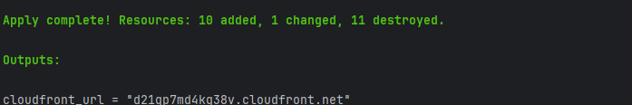
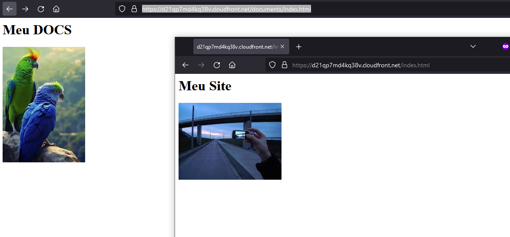

# Projeto de Distribuição de Conteúdo com CloudFront e S3 na AWS

## Sobre
Este projeto utiliza o Terraform para automatizar a criação de uma infraestrutura segura na AWS para distribuição de conteúdo estático via CloudFront, originado de um bucket S3 privado. A configuração garante que o conteúdo só possa ser acessado via CloudFront, utilizando Origin Access Identity (OAI) para restringir o acesso direto ao bucket S3.

## Recursos Criados
- **Bucket S3 Privado:** Armazena o conteúdo estático do website, como páginas HTML, CSS e imagens.
- **Distribuição CloudFront:** Distribui o conteúdo armazenado no S3 globalmente, otimizando a latência e fornecendo uma camada eficiente de cache. Configurações específicas incluem:
    - **Restrição Geográfica:** Acesso ao conteúdo é restrito a apenas alguns países, conforme definido nas políticas de geo-restrição.
    - **Políticas de Cache Diferenciadas:** Implementação de políticas de cache distintas para o caminho raiz `/` e para o caminho `/documents`, permitindo controle granular do comportamento do cache.
- **Identity de Acesso de Origem CloudFront (OAI):** Restringe o acesso ao bucket S3 para garantir que o conteúdo só possa ser acessado via distribuição CloudFront.
- **Política de Bucket S3:** Estabelece as permissões de acesso ao bucket S3, assegurando que somente o CloudFront possa recuperar os objetos.
- **Objetos S3:** Inclui o carregamento de arquivos estáticos como `index.html` e `error.html` para o bucket S3, que são utilizados como páginas padrão e de erro, respectivamente.

## Pré-Requisitos
- Terraform v0.12 ou superior.
- Acesso configurado para a AWS CLI e Terraform com as permissões apropriadas.

## Como Executar

### 1. Inicialização do Terraform
Inicialize o Terraform para instalar os plugins necessários:
```bash
terraform init
```

### 2. Planejamento do Terraform
Revise as mudanças que serão aplicadas com:
```bash
terraform plan
```

### 3. Aplicação das Alterações
Aplique as alterações para criar a infraestrutura:
```bash
terraform apply
```


## Testando a Distribuição CloudFront

Após a aplicação das mudanças, o CloudFront pode levar alguns minutos para distribuir as configurações. Você pode testar o acesso ao conteúdo estático usando o domínio do CloudFront fornecido na saída do Terraform.



## Limpeza dos Recursos

Quando os recursos não forem mais necessários, você pode destruir toda a infraestrutura com:
```bash
terraform destroy
```
