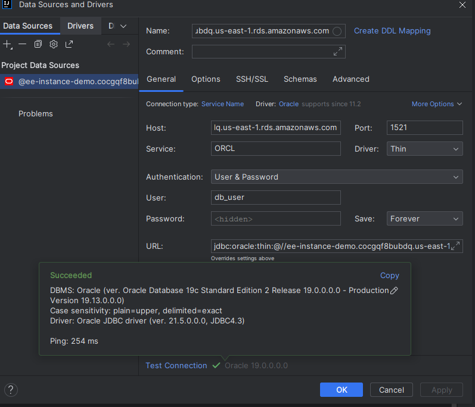
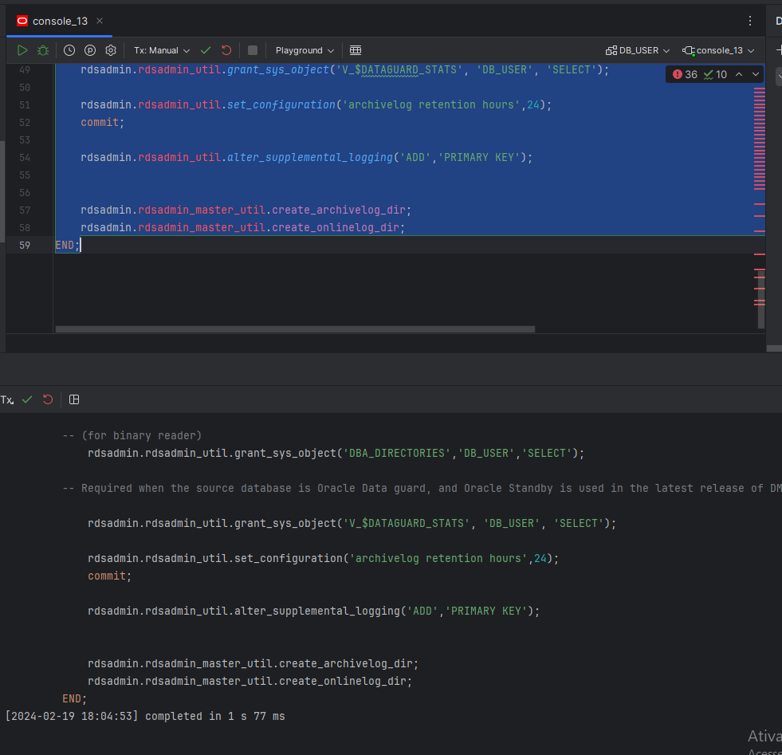
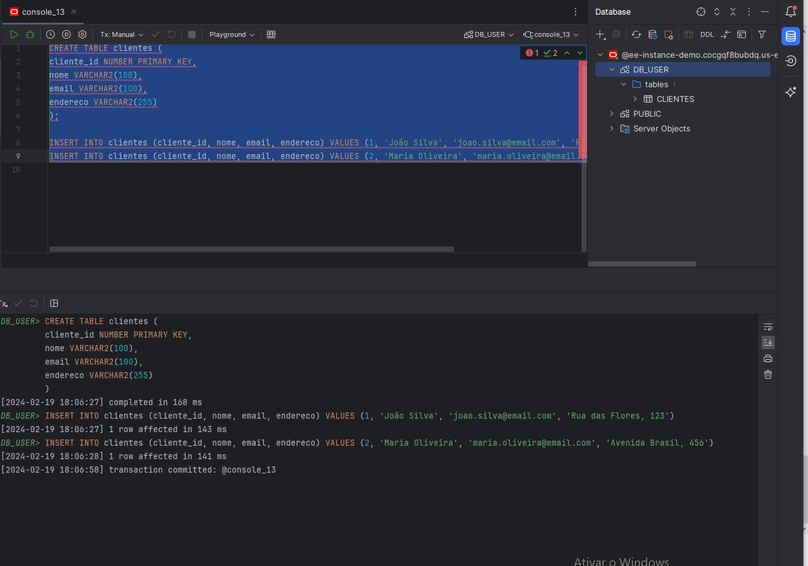
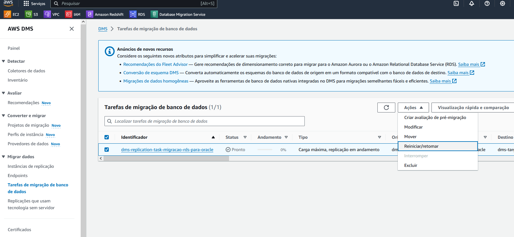
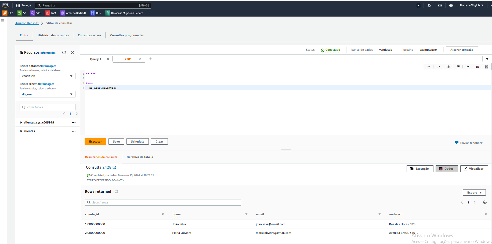

# Módulo AWS DMS Terraform

Este módulo facilita a criação de tarefas de replicação usando o AWS Database Migration Service (DMS). O projeto utiliza o módulo `dms-module`.

## Recursos Criados

Este módulo é responsável por criar e configurar os seguintes recursos na AWS:

- **Oracle SE2 (versão 19)**: Uma instância Oracle gerenciada pela AWS, configurada para replicação golden e acessível publicamente para execução de scripts de criação de tabelas.
- **Instância Redshift Cluster**: Configuração inclui:
  - Subnet para o cluster Redshift.
  - Armazenamento de logs de consultas em um bucket S3.
  - KMS para criptografia dos dados.
- **Security Group**: Contém regras para o Oracle e Redshift.
- **VPC Privada**: Criação de uma VPC privada.
- **VPC Endpoint Gateway S3**: Para acesso do DMS ao S3.  É obrigatório se a versão do DMS for 3.4.7 ou superior e não acessivel publicamentee.
- **AWS DMS**: Criação do serviço DMS usando o `dms-module`, passando como parâmetros os dados do Oracle e do Redshift.

## Pré-requisitos

Antes de começar, você precisa ter o Terraform instalado na sua máquina. Para mais informações sobre como instalar o Terraform, visite a [documentação oficial](https://www.terraform.io/downloads.html).

## Como Usar

### Passo 1: Inicialização

Execute o comando abaixo para inicializar o Terraform e instalar os módulos necessários.

```shell
terraform init
```

### Passo 2: Planejamento

Para criar um plano de execução e verificar o que será criado, modificado ou destruído, execute:

```shell
terraform plan
```

### Passo 3: Aplicação

Após revisar o plano de execução, aplique as mudanças com:

```shell
terraform apply
```

### Passo 4: Configuração do Banco de Dados

Conecte-se ao banco de dados Oracle e execute o script necessário para configurar as tabelas e outros objetos de banco de dados.



Executando scripts de permissão e grants:
A documentação da AWS recomenda executar o script abaixo quando o Banco é totalmente gerenciado pela AWS (https://docs.aws.amazon.com/pt_br/dms/latest/userguide/CHAP_Source.Oracle.html), para demais casos consulte a documentação.

```sql
BEGIN
rdsadmin.rdsadmin_util.grant_sys_object('ALL_VIEWS', 'DB_USER', 'SELECT');
rdsadmin.rdsadmin_util.grant_sys_object('ALL_TAB_PARTITIONS', 'DB_USER', 'SELECT');
rdsadmin.rdsadmin_util.grant_sys_object('ALL_INDEXES', 'DB_USER', 'SELECT');
rdsadmin.rdsadmin_util.grant_sys_object('ALL_OBJECTS', 'DB_USER', 'SELECT');
rdsadmin.rdsadmin_util.grant_sys_object('ALL_TABLES', 'DB_USER', 'SELECT');
rdsadmin.rdsadmin_util.grant_sys_object('ALL_USERS', 'DB_USER', 'SELECT');
rdsadmin.rdsadmin_util.grant_sys_object('ALL_CATALOG', 'DB_USER', 'SELECT');
rdsadmin.rdsadmin_util.grant_sys_object('ALL_CONSTRAINTS', 'DB_USER', 'SELECT');
rdsadmin.rdsadmin_util.grant_sys_object('ALL_CONS_COLUMNS', 'DB_USER', 'SELECT');
rdsadmin.rdsadmin_util.grant_sys_object('ALL_TAB_COLS', 'DB_USER', 'SELECT');
rdsadmin.rdsadmin_util.grant_sys_object('ALL_IND_COLUMNS', 'DB_USER', 'SELECT');
rdsadmin.rdsadmin_util.grant_sys_object('ALL_LOG_GROUPS', 'DB_USER', 'SELECT');
rdsadmin.rdsadmin_util.grant_sys_object('V_$ARCHIVED_LOG', 'DB_USER', 'SELECT');
rdsadmin.rdsadmin_util.grant_sys_object('V_$LOG', 'DB_USER', 'SELECT');
rdsadmin.rdsadmin_util.grant_sys_object('V_$LOGFILE', 'DB_USER', 'SELECT');
rdsadmin.rdsadmin_util.grant_sys_object('V_$DATABASE', 'DB_USER', 'SELECT');
rdsadmin.rdsadmin_util.grant_sys_object('V_$THREAD', 'DB_USER', 'SELECT');
rdsadmin.rdsadmin_util.grant_sys_object('V_$PARAMETER', 'DB_USER', 'SELECT');
rdsadmin.rdsadmin_util.grant_sys_object('V_$NLS_PARAMETERS', 'DB_USER', 'SELECT');
rdsadmin.rdsadmin_util.grant_sys_object('V_$TIMEZONE_NAMES', 'DB_USER', 'SELECT');
rdsadmin.rdsadmin_util.grant_sys_object('V_$TRANSACTION', 'DB_USER', 'SELECT');
rdsadmin.rdsadmin_util.grant_sys_object('V_$CONTAINERS', 'DB_USER', 'SELECT');
rdsadmin.rdsadmin_util.grant_sys_object('DBA_REGISTRY', 'DB_USER', 'SELECT');
rdsadmin.rdsadmin_util.grant_sys_object('OBJ$', 'DB_USER', 'SELECT');
rdsadmin.rdsadmin_util.grant_sys_object('ALL_ENCRYPTED_COLUMNS', 'DB_USER', 'SELECT');
rdsadmin.rdsadmin_util.grant_sys_object('V_$LOGMNR_LOGS', 'DB_USER', 'SELECT');
rdsadmin.rdsadmin_util.grant_sys_object('V_$LOGMNR_CONTENTS','DB_USER','SELECT');
--rdsadmin.rdsadmin_util.grant_sys_object('DBMS_LOGMNR', 'DB_USER', ' UTE');

-- (as of Oracle versions 12.1 and higher)
rdsadmin.rdsadmin_util.grant_sys_object('REGISTRY$SQLPATCH', 'DB_USER', 'SELECT');

-- (for Amazon RDS Active Dataguard Standby (ADG))
rdsadmin.rdsadmin_util.grant_sys_object('V_$STANDBY_LOG', 'DB_USER', 'SELECT');

-- (for transparent data encryption (TDE))

    rdsadmin.rdsadmin_util.grant_sys_object('ENC$', 'DB_USER', 'SELECT');

-- (for validation with LOB columns)
--rdsadmin.rdsadmin_util.grant_sys_object('DBMS_CRYPTO', 'DB_USER', ' UTE');

-- (for binary reader)
rdsadmin.rdsadmin_util.grant_sys_object('DBA_DIRECTORIES','DB_USER','SELECT');

-- Required when the source database is Oracle Data guard, and Oracle Standby is used in the latest release of DMS version 3.4.6, version 3.4.7, and higher.

    rdsadmin.rdsadmin_util.grant_sys_object('V_$DATAGUARD_STATS', 'DB_USER', 'SELECT');

    rdsadmin.rdsadmin_util.set_configuration('archivelog retention hours',24);
commit;

rdsadmin.rdsadmin_util.alter_supplemental_logging('ADD','PRIMARY KEY');


    rdsadmin.rdsadmin_master_util.create_archivelog_dir;
    rdsadmin.rdsadmin_master_util.create_onlinelog_dir;
END;
```



Criando as tabelas e inserts:

```sql
CREATE TABLE clientes (
                        cliente_id NUMBER PRIMARY KEY,
                        nome VARCHAR2(100),
                        email VARCHAR2(100),
                        endereco VARCHAR2(255)
);

INSERT INTO clientes (cliente_id, nome, email, endereco) VALUES (1, 'João Silva', 'joao.silva@email.com', 'Rua das Flores, 123');
INSERT INTO clientes (cliente_id, nome, email, endereco) VALUES (2, 'Maria Oliveira', 'maria.oliveira@email.com', 'Avenida Brasil, 456');
```



### Passo 5: Iniciar a Tarefa de Replicação

1. Acesse o console da AWS.
2. Navegue até o serviço AWS DMS e inicie a tarefa de replicação configurada.
   
3. Aguarde alguns instantes (na primeira vez pode demorar alguns minutos, mas depois são apenas questões de segundos) e acesse o console do Redshift para ver os dados lá.



Você pode realizar múltiplos inserts que aparecerão em instantes no Redshift.


### Monitoramento

Após iniciar a tarefa de replicação, você pode monitorar o progresso acessando o console do Redshift. Lá, você poderá ver os dados sendo replicados e realizar novas inserções para testar a replicação.


### Passo 5: Para destruir todos os recursos criados anteriormente, execute
  ```
    terraform destroy 
  ```
