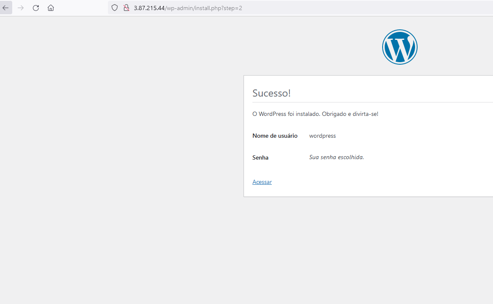

Aqui está uma versão melhorada do seu Markdown:

---

# Projeto de Infraestrutura AWS com WordPress

## Descrição do Projeto
Este projeto envolve a configuração de uma infraestrutura na AWS para hospedar um site WordPress. Utiliza-se uma combinação de RDS MySQL com Multi-AZ e Read Replica, e uma instância EC2.

## Componentes Criados
- **Virtual Private Cloud (VPC):** Configuração de uma VPC dedicada para o projeto.
- **RDS MySQL 5.7 (Master) via Terraform:**
    - Credenciais de acesso definidas como 'wordpress' para usuário e senha.
    - Backup Automático habilitado com retenção de 30 dias.
    - Multi-AZ habilitado para alta disponibilidade.
- **Instância EC2:**
    - Instalação automatizada do WordPress usando script `user_data`.
    - Acesso à máquina habilitado via AWS Systems Manager (SSM) pelo console AWS.

## Processo de Configuração
1. Acessar a instância EC2 via HTTP para iniciar a configuração do WordPress.
2. Seguir as instruções na tela para configurar o WordPress, incluindo a criação de usuário e senha.

## Instalação do Plugin HyperDB
Após a configuração inicial, instale e ative o plugin HyperDB para melhorar a gestão do banco de dados:

```sh
# Instalar o plugin HyperDB
wp plugin install hyperdb
# Saída esperada:
# Instalando HyperDB (1.8)
# Baixando pacote de instalação de https://downloads.wordpress.org/plugin/hyperdb.1.9.zip...
# Descompactando o pacote...
# Plugin instalado com sucesso.

# Ativar o plugin HyperDB
wp plugin activate hyperdb

# Verificar lista de plugins
wp plugin list
# Saída esperada:
# +---------+----------+--------+---------+
# | name    | status   | update | version |
# +---------+----------+--------+---------+
# | akismet | inactive | none   | 5.3     |
# | hello   | inactive | none   | 1.7.2   |
# | hyperdb | active | none   | 1.8     |
# | db.php  | dropin   | none   |         |
# +---------+----------+--------+---------+

# Habilitar plugin
sed -i "/\/\* That's all, stop editing! Happy publishing. \*\//i require_once(ABSPATH . 'db-config.php');" /var/www/html/wp-config.php
```

## Nota Final
Este documento fornece uma visão geral do processo de configuração da infraestrutura e instalação do WordPress na AWS usando Terraform, RDS MySQL e EC2.