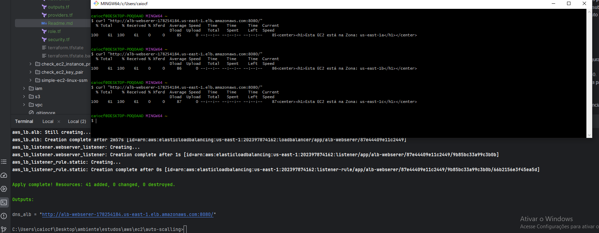

# Projeto Terraform para Infraestrutura de Servidor Web

## Descrição
Este projeto Terraform implementa uma infraestrutura de servidor web na AWS, incluindo um Load Balancer de Aplicação (ALB), um Target Group, um Listener, e um grupo de Auto Scaling para gerenciar as instâncias de servidor web. Adicionalmente, cria uma VPC com subnets públicas e um grupo de colocação do tipo spread para as instâncias.

## Recursos Implementados
- **AWS Load Balancer (ALB)**
- **Target Group**
- **Listener e Listener Rule**
- **Módulo VPC**
- **AWS Spread Placement Group**
- **Launch Template**
- **Auto Scaling Group**

## Políticas de Auto Scaling
- **Política de Escalonamento Baseada em CPU**: Ajusta automaticamente o número de instâncias no grupo de Auto Scaling com base na utilização média de CPU. Se a utilização média de CPU ultrapassar 50%, o grupo escala para adicionar mais instâncias.
- **Política de Escalonamento Baseada em Solicitações do ALB**: Escala o grupo de Auto Scaling com base no número de solicitações recebidas por target no ALB. Se o número de solicitações exceder 100 por minuto por target, mais instâncias serão adicionadas.

## Ações Agendadas de Auto Scaling
- **Aumento de Capacidade Durante Horário Comercial**: Aumenta automaticamente o número de instâncias às 7 da manhã.
- **Diminuição de Capacidade Após Horário Comercial**: Reduz automaticamente o número de instâncias às 5 da tarde.

## Como Usar
Para usar este código Terraform:
1. **Pré-Requisitos**
2. **Inicializar o Terraform**
   ```sh
   terraform init
   ```
3. **Planejar a Execução**
   ```sh
   terraform plan
   ```
4. **Aplicar a Configuração**
   ```sh
   terraform apply
   ```
5. **Teste Usando Curl**
   
6. **Destruir a Infraestrutura**
   ```shell
   terraform destroy
   ```

