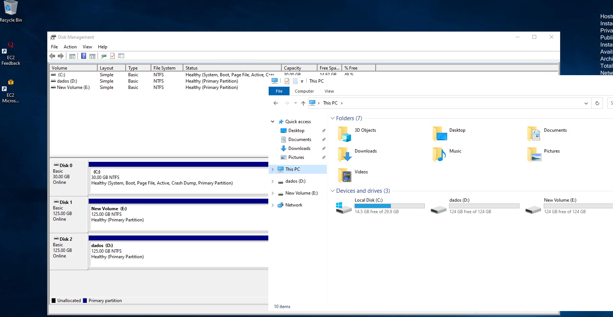

## Projeto Terraform para Infraestrutura AWS

### Sobre
Este projeto Terraform automatiza a configuração de uma infraestrutura AWS robusta, incluindo a implantação de instâncias EC2, configuração de perfis e roles IAM, grupos de segurança, e a criação e anexação de volumes EBS. É ideal para o deployment de aplicações web que demandam alto desempenho e segurança.

### Recursos Criados
- **Instâncias EC2:** Utiliza uma AMI específica de Windows Server 2022, otimizando as instâncias para aplicações web. As instâncias são configuradas para oferecer desempenho e segurança aprimorados.
- **Volumes EBS:** Cria e anexa volumes Elastic Block Store (EBS) às instâncias EC2 para fornecer armazenamento persistente, expansível e de alto desempenho.
    - **Volume SC1:** Um volume `sc1` com 125 GB é criado para armazenamento com custo otimizado, ideal para cargas de trabalho com acesso infrequente aos dados.
    - **Volume GP3:** Um volume `gp3` com 125 GB, 250 MiB/s de throughput, e 3000 IOPS é criado para oferecer um balanço entre custo e desempenho, adequado para a maioria das cargas de trabalho.
      Os volumes são anexados às instâncias EC2, com o volume `sc1` montado em `/dev/sdb` e o volume `gp3` em `/dev/sdc`, garantindo armazenamento adicional e desempenho otimizado para as aplicações.
- **Perfil de Instância IAM e Role IAM:** Define permissões e políticas de acesso para as instâncias EC2, assegurando um controle de acesso detalhado e aderência às melhores práticas de segurança.
- **Grupo de Segurança:** Estabelece regras de acesso para permitir RDP e HTTP, controlando o acesso às instâncias de forma segura e eficaz.
- **Provedores Terraform:** Configura os provedores `aws`, definindo a região e as versões necessárias para a execução do projeto.
- **Dados AWS:** Emprega data sources para selecionar dinamicamente VPCs padrão, subnets e AMIs, facilitando a configuração e o deployment da infraestrutura.
- **Variáveis:** Permite a customização da região AWS onde os recursos serão implantados, proporcionando flexibilidade ao usuário.

### Pré-Requisitos
- Terraform v0.12 ou superior.
- Acesso configurado à AWS CLI e Terraform com permissões adequadas.

### Como Executar

#### 1. Inicialização do Terraform
Para preparar o Terraform para execução, utilize:
```bash
terraform init
```

#### 2. Planejamento do Terraform
Para revisar as mudanças propostas antes da aplicação, execute:
```bash
terraform plan
```

#### 3. Aplicação das Alterações
Para criar a infraestrutura especificada, execute:
```bash
terraform apply
```


### Limpeza dos Recursos
Quando os recursos não forem mais necessários, utilize o comando abaixo para evitar custos desnecessários:
```bash
terraform destroy
```