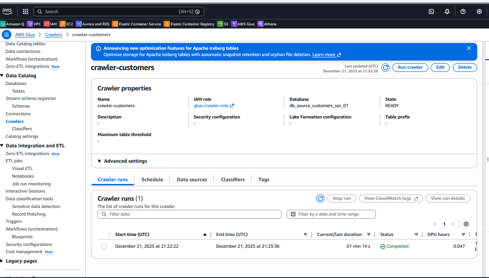
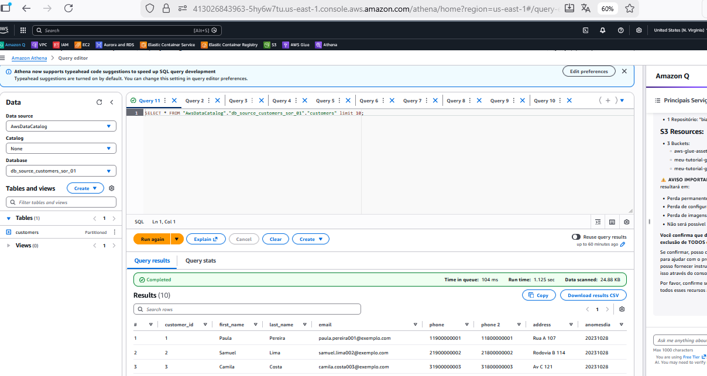

# Terraform - AWS Glue Data Catalog (SOR Layer)

Este repositório contém a infraestrutura como código (IaC) para a criação de um pipeline de catalogação de dados na AWS, focado na camada **SOR (System of Record)**. O projeto utiliza Terraform para provisionar recursos de armazenamento, segurança e metadados.

## 📌 Descrição do Projeto

O objetivo deste projeto é estabelecer uma base para engenharia de dados, permitindo a descoberta automática de esquemas de arquivos CSV armazenados no Amazon S3 através do AWS Glue.

A infraestrutura inclui:

* **Camada de Armazenamento (S3):** Um bucket configurado com bloqueio de acesso público e criptografia em repouso.
* **Catálogo de Metadados (Glue):** Um banco de dados e um Crawler para indexar as partições dos dados.
* **Gestão de Identidade (IAM):** Roles e políticas granulares para o funcionamento do Crawler.

## 🏗️ Arquitetura e Recursos

### 1. Amazon S3

* **Bucket SOR:** Criado dinamicamente usando o ID da conta AWS (`corp-sor-sa-east-1-${account_id}`).
* **Segurança:** Implementação de `aws_s3_bucket_public_access_block` para restringir todo o acesso público.
* **Criptografia:** Configurado com algoritmo `AES256` por padrão.
* **Ingestão de Amostra:** Upload automático do arquivo `customers_1.csv` para a partição `anomesdia=20231028/`.

### 2. AWS Glue

* **Catalog Database:** Nomeado via variável `sor_db_name_source` (Padrão: `db_source_customers_sor_01`).
* **Crawler:** * Mapeia o caminho `${local.sor_s3bucket}/${var.sor_table_name}/`.
* Possui agendamento via cron para execução diária às 02:00 AM.
* Executa automaticamente após o provisionamento via comando `local-exec`.
* Configurado para registrar mudanças de schema (`LOG`) e atualizar o banco de dados.


### 3. IAM & Segurança

* **Role Principal:** `glue-crawler-role` com política de confiança para o serviço `glue.amazonaws.com`.
* **Políticas:**
* Anexo da política gerenciada `AWSGlueServiceRole`.
* Política inline personalizada permitindo `s3:GetObject`, `s3:PutObject` e `s3:ListBucket` especificamente no bucket de dados.


## ⚙️ Variáveis de Configuração

As principais variáveis configuráveis em `variable.tf` são:

| Variável | Descrição | Valor Padrão |
| --- | --- | --- |
| `sor_db_name_source` | Nome do Banco de Dados no Glue | `db_source_customers_sor_01` |
| `sor_table_name` | Nome da tabela/pasta de destino | `customers` |
| `control_account` | ID da conta AWS de controle (opcional) | `null` |
| `spec_s3bucket` | Prefixo do bucket de especificações | `s3://corp-sor-sa-east-1-` |

## 🚀 Como Utilizar

1. **Pré-requisitos:**
* Terraform instalado e AWS CLI configurado.
* O arquivo `customers_1.csv` deve estar na raiz do projeto para o upload inicial.


2. **Inicialização e Deploy:**
```bash
terraform init
terraform plan
terraform apply

```


3. **Verificação:**
* Após o `apply`, o Crawler será iniciado automaticamente. Verifique o progresso no console do AWS Glue.

Execução Crawler:


Resultado Consulta Athena:


---

## 🗑️ Limpeza de recursos

Para destruir tudo ao final do laboratório:

```bash
terraform destroy
```
