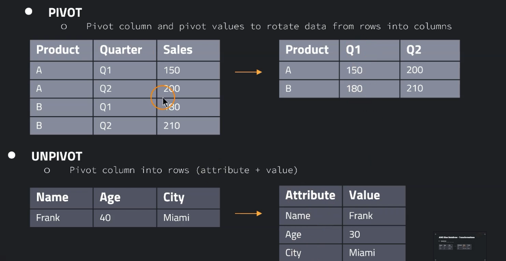
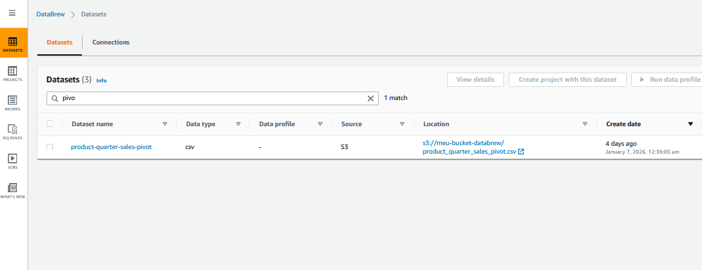
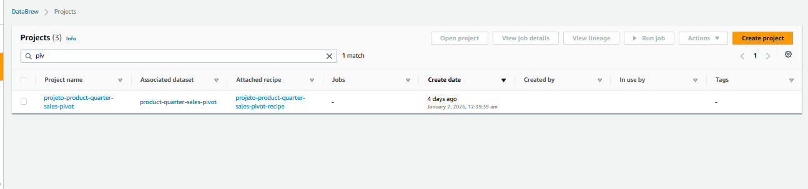
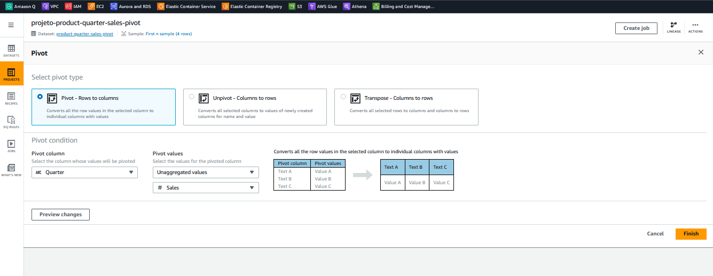

# AWS Glue DataBrew – Pivot (Rows → Columns) com `Quarter` (CSV no S3 → CSV no S3)

Este repositório documenta um caso de uso no **AWS Glue DataBrew** em que eu:

1. Leio um arquivo **CSV** a partir de um caminho no **Amazon S3**
2. Aplico uma **receita (recipe)** com **Pivot (Rows to columns)**
3. Salvo o resultado novamente no **S3**, em **outra pasta (prefix)** e no formato **.csv**

> Observação: no momento em que eu fiz este projeto, eu **não usei Terraform** para o DataBrew (por limitações/suporte incompleto em alguns recursos/fluxos via IaC). Este exemplo foi montado na **console do AWS Glue DataBrew** e está documentado aqui para estudo e reprodução.

---

## Visão geral (o que eu queria resolver)

Eu tinha um dataset no formato “longo” (long format), onde cada linha representa a venda de um produto em um trimestre:

- `Product`: produto (ex.: A, B)
- `Quarter`: trimestre (ex.: Q1, Q2)
- `Sales`: valor de vendas

E eu queria “abrir” o trimestre em colunas (wide format), ficando assim:

- Uma linha por `Product`
- Uma coluna para cada trimestre (`Q1`, `Q2`, …)
- O valor preenchido com `Sales`

Isso é útil para:
- relatórios (BI) e planilhas,
- comparação lado a lado (Q1 vs Q2),
- visualizações que esperam colunas fixas por categoria.

Ideia Geral:


---

## Objetos do DataBrew usados

No DataBrew, normalmente você trabalha com:

- **Dataset**: definição da origem (ex.: CSV no S3)

    

 - **Project**: ambiente para explorar os dados e montar a recipe
  

- **Recipe**: lista versionada de transformações

    

- **Job**: execução da recipe e gravação da saída (ex.: S3)

Neste caso, eu criei:

- **Dataset**: `product-quarter-sales-pivot`
- **Project**: `projeto-product-quarter-sales-pivot`
- **Recipe**: `projeto-product-quarter-sales-pivot-recipe` (Version 1.0)
- **Job**: criado a partir do botão “Create job” para exportar a saída no S3

---

## Entrada (CSV de origem)

Arquivo de entrada (exemplo real usado no projeto):

```csv
Product,Quarter,Sales
A,Q1,150
A,Q2,200
B,Q1,180
B,Q2,210
````

[product_quarter_sales_pivot.csv](dataset%2Fproduct_quarter_sales_pivot.csv)

### Origem no S3 (exemplo do seu print)

```text
s3://meu-bucket-databrew/product_quarter_sales_pivot.csv
```

---

## Recipe (transformação aplicada)

Na sua recipe aparece **1 step**:

1. **Pivot Quarter and compute Unaggregated values on Sales**

A seguir eu explico exatamente o que isso significa.

---

## Passo 1 — Pivot (Rows to columns)

### O que eu fiz

Usei a operação **Pivot → Pivot (Rows to columns)**.

Configuração na UI (conforme seu print):

* **Pivot column**: `Quarter`

    * Os valores distintos de `Quarter` (ex.: Q1, Q2) viram **novas colunas**.
* **Pivot values**: `Unaggregated values`

    * Em vez de somar/média, o DataBrew guarda os valores “como vieram”, normalmente em formato de **lista** (quando pode haver mais de um registro).
* Coluna de valores selecionada: `Sales`

### Como fica o resultado na prática

Como você escolheu **Unaggregated values**, o DataBrew tende a produzir colunas com sufixo parecido com:

* `Quarter_Q1_Sales_collect_list`
* `Quarter_Q2_Sales_collect_list`

E os valores aparecem como lista, por exemplo:

* `[150]` em vez de `150`
* `[200]` em vez de `200`

Isso é esperado porque o DataBrew está dizendo:
“Para cada Product + Quarter, eu vou coletar os Sales em uma lista (collect_list).”

No seu exemplo, como existe **apenas um valor por Product/Quarter**, cada lista tem 1 item.


### Saída esperada (conceitualmente)

```csv
Product,Quarter_Q1_Sales_collect_list,Quarter_Q2_Sales_collect_list
A,[150],[200]
B,[180],[210]
```


---

## (Opcional) Como deixar os números “limpos” (sem lista)

Se você quiser que a saída final fique assim:

```csv
Product,Q1_Sales,Q2_Sales
A,150,200
B,180,210
```

Você pode adicionar passos extras na recipe, por exemplo:

* **Unnest** nas colunas geradas (`..._collect_list`) para “achatar” a lista
* ou **Extract / Map** para pegar o primeiro elemento da lista (quando você tem certeza que sempre haverá 1 item)

> Você não aplicou esses passos neste projeto (sua recipe está com 1 step), mas vale como evolução natural caso você vá publicar uma versão “mais final”.

---

## Saída no S3 (resultado do Job)

Após criar e executar o **Job**, você define o destino no S3 (bucket + prefix/pasta).

### Exemplo de destino (sugestão)

```text
s3://meu-bucket-databrew/saida/pivot-product-quarter-sales/
```

Formato de saída: **CSV**

> Boa prática: separar entrada e saída por prefix:

* `raw/` para entrada
* `processed/` para saída
* `curated/` para camadas finais

---

## Como reproduzir pela Console (passo a passo)

1. **S3**

    * Suba o arquivo `product_quarter_sales_pivot.csv` no bucket.

2. **Glue DataBrew → Datasets**

    * Crie um dataset apontando para o CSV no S3.

3. **Glue DataBrew → Projects**

    * Crie um project usando esse dataset.

4. **Recipe**

    * Clique em **Pivot**
    * Selecione **Pivot – Rows to columns**
    * Configure:

        * Pivot column = `Quarter`
        * Pivot values = `Unaggregated values`
        * Value column = `Sales`
    * Finalize para registrar o step na recipe.

5. **Create Job**

    * Crie um job para executar a recipe e salvar no S3
    * Defina o destino e o formato CSV
    * Execute o job.

