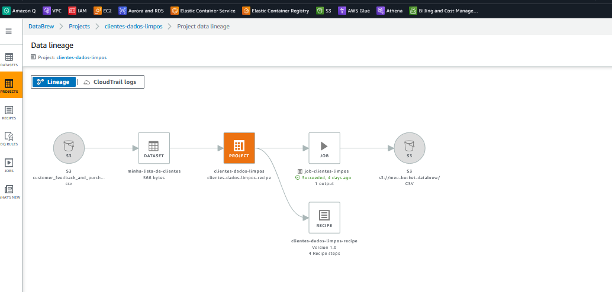
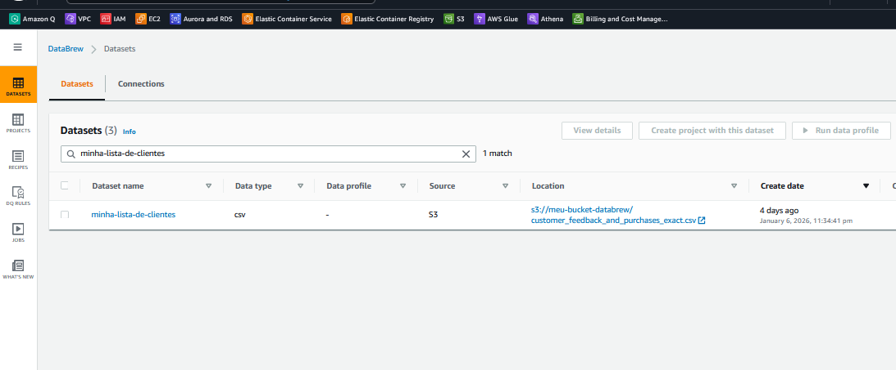
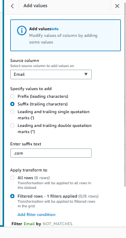
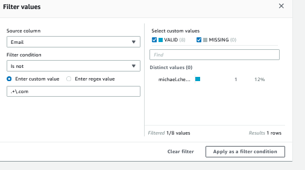
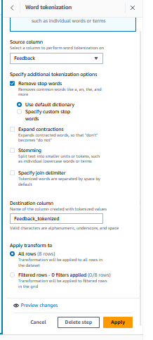
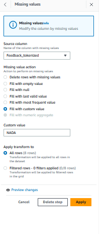
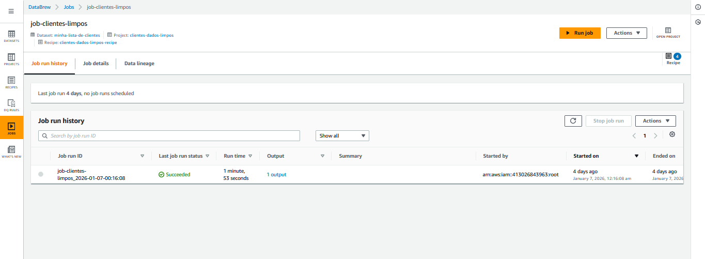

# AWS Glue DataBrew – Limpeza de dados de clientes (CSV no S3 → CSV no S3)

Este repositório documenta um caso de uso no **AWS Glue DataBrew** onde eu:

1. Leio um arquivo **CSV** a partir do **Amazon S3**
2. Aplico uma **recipe** para **limpeza e padronização** de dados
3. Executo um **job** para salvar a saída novamente no **S3** em formato **CSV**

> Contexto: este projeto foi montado pela **console do AWS Glue DataBrew** (não via Terraform) e está documentado aqui de forma educacional para estudo e referência.


---

## Objetos do DataBrew usados (o “mapa” do projeto)

No DataBrew, normalmente você trabalha com:

- **Dataset**: aponta para o arquivo de origem no S3
- **Project**: ambiente para explorar os dados e construir a recipe
- **Recipe**: conjunto versionado de transformações
- **Job**: execução da recipe e gravação do resultado no S3

Neste caso, pelos prints:

- **Dataset**: `minha-lista-de-clientes` (CSV no S3)
    

- **Project**: `clientes-dados-limpos`
  

- **Recipe**: `clientes-dados-limpos-recipe` (Version 1.0)
   
- **Job**: `job-clientes-limpos`
  

---

## Entrada (CSV de origem)

Arquivo: `customer_feedback_and_purchases_exact.csv`

Exemplo de conteúdo (resumo):

```csv
CustomerID,Name,Age,Email,PurchaseAmount,Feedback
C001,John Doe,29,john.doe@example.com,120.50,Excellent service!
C002,Jane Smith,,jane.smith@example.com,89.99,Good experience overall
C003,,35,sam.taylor@example.com,45.00,Fast shipping but packaging was poor
C004,Emily Davis,42,emily.davis@example.com,,Very satisfied
C005,Michael Chen,31,michael.chen@example,98.75,Loved the product!
C006,Raj Patel,,raj.patel@example.com,110.2,Prompt delivery and easy checkout
C007,Lisa Wong,27,lisa.wong@example.com,,Great quality!
C008,Omar Ali,38,omar.ali@example.com,76.9,
````
[customer_feedback_and_purchases_exact.csv](dataset/customer_feedback_and_purchases_exact.csv)

O dataset tem colunas como:

* `CustomerID`, `Name`, `Age`, `Email`, `PurchaseAmount`, `Feedback`

---

## O que a Recipe faz (transformações aplicadas)

A recipe possui **4 passos**, e o arquivo exportado dela está neste repositório:

* `clientes-dados-limpos-recipe.yml`
[clientes-dados-limpos-recipe.yml](recipe/clientes-dados-limpos-recipe.yml)

Abaixo está o “porquê” de cada passo, com foco didático.

---

### 1) Preencher idade faltante com a média (Age)

**Objetivo:** evitar valores nulos em `Age`, o que ajuda em análises estatísticas, segmentações e validações.

* Operação: `FILL_WITH_AVERAGE` na coluna `Age`

, o DataBrew substitui pela **média** das idades válidas.

> No CSV enviado, a média das idades preenchidas é aproximadamente **33,67** (pode variar na apresentação por arredondamento).


---

### 2) Padronizar e-mail adicionando o sufixo “.com” quando faltar

**Objetivo:** garantir consistência do campo `Email` e reduzir erros de qualidade.

* Operação: `ADD_SUFFIX` com `pattern: .com` em `Email`
* Condição: só aplica quando o valor **não** “parece” já ter `.+\.com` (regex)




**Exemplo prático**

* `michael.chen@example` → `michael.chen@example.com`
* `john.doe@example.com` (já tem) → permanece igual

---

### 3) Tokenizar o texto do feedback (criar `Feedback_tokenized`)

**Objetivo:** preparar `Feedback` para análises de texto (NLP), busca por termos, classificação, etc.

* Operação: `TOKENIZATION` a partir de `Feedback`
* Configuração (destaques): delimitador espaço, stemming desabilitado, stopwords padrão
* Coluna de saída: `Feedback_tokenized`

  

**Exemplo prático (conceitual)**

* `"Excellent service!"` → algo como `["Excellent","service"]` (o formato pode variar conforme o DataBrew exporta)
* `"Fast shipping but packaging was poor"` → tokens separados por palavras

---

### 4) Preencher tokenização inválida com “NADA”

**Objetivo:** garantir que `Feedback_tokenized` não fique vazio/invalidado quando o `Feedback` estiver ausente.

* Operação: `FILL_WITH_CUSTOM` com valor `NADA` na coluna `Feedback_tokenized`
* Condição: aplica quando `Feedback_tokenized` for inválido




**Exemplo prático**

* Se `Feedback` está nulo → `Feedback_tokenized` vira `NADA`


---

## Saída (CSV final no S3)

Após executar o `job-clientes-limpos`, o DataBrew grava um CSV no S3 (conforme o fluxo de lineage do projeto).


### O que muda no dataset final?

* `Age`: sem nulos (preenchidos pela média)
* `Email`: padronizado (garante `.com` quando necessário)
* Nova coluna: `Feedback_tokenized`
* `Feedback_tokenized`: sem valores inválidos (usa `NADA`)

### Exemplo de “antes → depois” (trechos)

**Antes**

* `C002 Age = null`
* `C005 Email = michael.chen@example`
* `C008 Feedback = null`

**Depois (conceitual)**

* `C002 Age ≈ 33,67`
* `C005 Email = michael.chen@example.com`
* `C008 Feedback_tokenized = NADA`


---

## Como reproduzir pela Console (passo a passo)

1. **S3**

    * Suba o CSV em um bucket (ex.: `s3://meu-bucket-databrew/customer_feedback_and_purchases_exact.csv`)

2. **DataBrew → Datasets**

    * Crie o dataset apontando para o CSV no S3.

3. **DataBrew → Projects**

    * Crie um project usando esse dataset.

4. **No Project (Recipe)**

    * Aplique os passos:

        1. Fill missing with average (Age)g)
        2. Add suffix `.com` (Email) com condição NOT_MATCHES
        3. Tokenize (Feedback → Feedback_tokenized)
        4. Fill invalid (Feedback_tokenized → “NADA”)

5. **Create/Run Job**

    * Configure o destino no S3 (bucket + prefix de saída)
    * Formato: CSV
    * Execute o job.



---

## Dicas e boas práticas (para evoluir o case)

* **Valide também** `PurchaseAmount` (há nulos no seu arquivo de exemplo) antes de usar em análises.
* **Considere regras de qualidade (DQ Rules)** se quiser bloquear registros inválidos ao invés de “corrigir”.
* **Salve a recipe exportada** no GitHub (como já foi feito aqui) para versionar as transformações fora da AWS.

---


