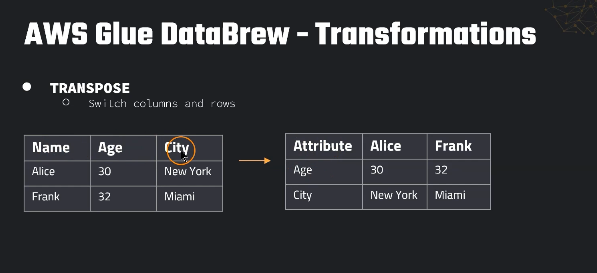
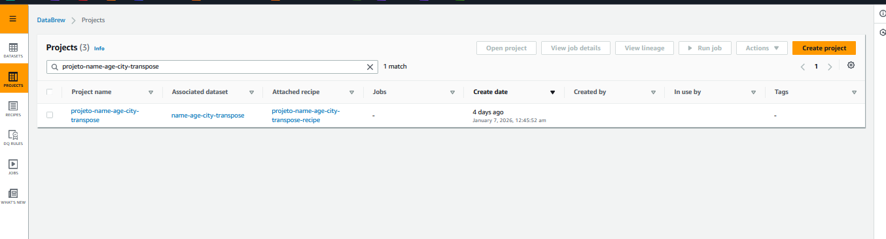
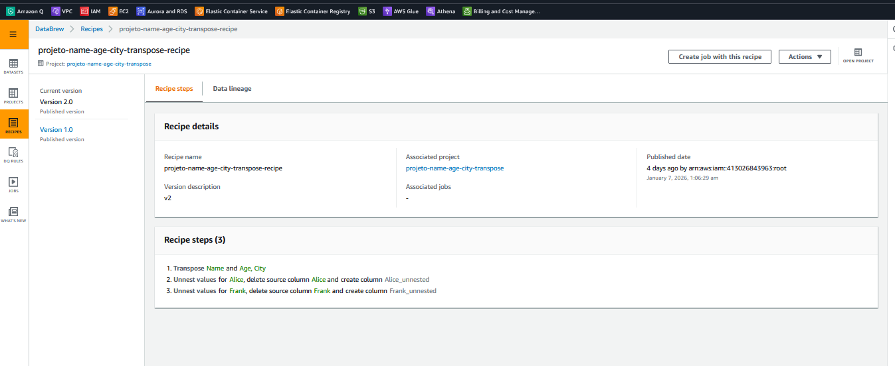
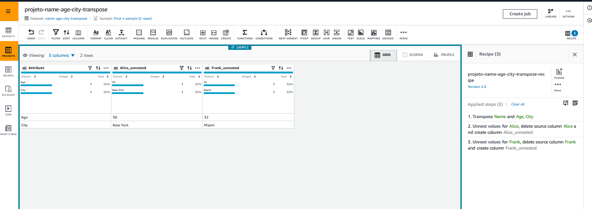

# AWS Glue DataBrew – Transpose + Unnest (CSV no S3 → CSV no S3)

Este repositório documenta um pequeno caso de uso no **AWS Glue DataBrew** onde eu:
1. Leio um arquivo **CSV** a partir de um caminho no **Amazon S3**
2. Aplico uma **receita (recipe)** com transformações (Transpose + Unnest)
3. Salvo o resultado novamente no **S3**, em **outra pasta (prefix)** e no formato **.csv**

> Observação: no momento em que eu fiz este projeto, **o Terraform ainda não tinha suporte completo/estável** para provisionar todos os recursos do DataBrew (principalmente recipe/projeto com as mesmas opções da UI). Por isso, este exemplo foi montado pela **console do AWS Glue DataBrew** e documentado aqui para estudo e repetição.

---

## Visão geral (o que eu queria resolver)

Eu tinha um CSV no formato “linha por pessoa”:

- Cada linha é uma pessoa (`Name`)
- As colunas trazem os atributos (`Age`, `City`)

E eu queria transformar para um formato “atributo por linha”, ficando assim:

- `Attribute` vira a coluna que lista os atributos (Age, City)
- Cada pessoa vira uma **coluna** (Alice, Frank)
- As células mostram os valores correspondentes

Isso é útil quando você quer:
- “girar” (pivot/transpose) dados para comparação lado a lado,
- transformar um dataset em formato mais “matricial”,
- ou preparar dados para relatórios.

Ideia Geral:


---

## Estrutura do DataBrew (objetos usados)

No DataBrew, normalmente você trabalha com estes objetos:

- **Dataset**: conexão com os dados de origem (ex.: um CSV no S3).
- **Project**: ambiente interativo para explorar dados, testar transformações e montar a receita.
- **Recipe**: lista versionada de passos (transformações) que serão aplicados nos dados.
- **Job**: execução da recipe em cima do dataset, gravando a saída (ex.: S3).

Neste caso, eu criei:

- **Dataset**: `name-age-city-transpose` 
    

- **Project**: `projeto-name-age-city-transpose`


- **Recipe**: `projeto-name-age-city-transpose-recipe` (Version 2.0)

- 
- **Job**: criado a partir do botão “Create job” no projeto (para processar e salvar no S3)

---

## Entrada (CSV de origem)

Arquivo de entrada (exemplo real usado no projeto):

```csv
Name,Age,City
Alice,30,New York
Frank,32,Miami
````

[name_age_city_transpose.csv](dataset/name_age_city_transpose.csv)


### Origem no S3 (exemplo)

```text
s3://SEU-BUCKET/de/entrada/name_age_city_transpose.csv
```

---

## Recipe (transformações aplicadas)

A recipe tem **3 steps** (como aparece na UI do DataBrew):

1. **Transpose Name and Age, City**
2. **Unnest values for Alice, delete source column Alice and create column Alice_unnested**
3. **Unnest values for Frank, delete source column Frank and create column Frank_unnested**

A seguir eu explico cada passo.

---

## Passo 1 — Transpose (Columns to rows)

### O que eu fiz

Usei a operação **Pivot → Transpose (Columns to rows)**.


Na configuração da UI:

* **Transpose rows to columns**: selecionei a coluna **`Name`**

    * Isso faz com que os valores de `Name` (“Alice”, “Frank”) virem **novas colunas**.
* **Transpose columns to rows**: selecionei **`Age`** e **`City`**

    * Isso faz com que “Age” e “City” virem **linhas**.
* **New column name**: defini como **`Attribute`**

    * Essa coluna passa a indicar qual atributo a linha representa.

> Em termos de resultado, esse passo “vira” a tabela.


### Resultado esperado após o Transpose (conceitualmente)

```csv
Attribute,Alice,Frank
Age,30,32
City,New York,Miami
```




### Por que aparecem “nested values”?

Dependendo da opção de agregação/saída, o DataBrew pode gerar os valores em formato **aninhado (array/struct)** internamente durante o transpose (especialmente quando você escolhe algo como “Unaggregated values”).
Por isso, nos próximos passos eu usei **Unnest** para “achatar” e deixar como valores simples no CSV.

> Dica: você percebe isso quando o DataBrew recomenda/permite “Unnest values …”.

---

## Passo 2 — Unnest da coluna `Alice` (e renomeia)

### O que eu fiz

* Apliquei **Unnest** nos valores da coluna **`Alice`**
* Pedi para o DataBrew:

    * **deletar** a coluna original `Alice`
    * **criar** a nova coluna `Alice_unnested`

### Por que isso é importante?

* Se a coluna estiver como array/objeto (aninhada), o CSV final pode ficar “estranho” (ex.: com colchetes, aspas, etc.).
* O **Unnest** “achata” para um valor simples por célula.
* A coluna nova (`Alice_unnested`) fica mais explícita e controlada.

---

## Passo 3 — Unnest da coluna `Frank` (e renomeia)

Repete a mesma ideia do passo anterior, agora para a pessoa Frank:

* Unnest na coluna **`Frank`**
* Deleta `Frank`
* Cria `Frank_unnested`

---

## Saída (CSV final no S3)

Depois dos 3 passos, o dataset final fica com 3 colunas:

* `Attribute`
* `Alice_unnested`
* `Frank_unnested`

### Exemplo de saída final

```csv
Attribute,Alice_unnested,Frank_unnested
Age,30,32
City,New York,Miami
```

### Destino no S3 (exemplo)

```text
s3://SEU-BUCKET/de/saida/transpose-output/name_age_city_transpose.csv
```

> Você pode salvar no mesmo bucket, apenas mudando o **prefix** (pasta).
> Ex.: entrada em `raw/` e saída em `processed/`.

---

## Como reproduzir (passo a passo pela Console)

1. **S3**

    * Suba o CSV em um bucket (ex.: `raw/name_age_city_transpose.csv`)

2. **Glue DataBrew → Datasets**

    * Crie um dataset apontando para o arquivo no S3 (formato CSV)

3. **Glue DataBrew → Projects**

    * Crie um projeto usando esse dataset

4. **Recipe**

    * No projeto, aplique:

        * Pivot → **Transpose (Columns to rows)**
        * Configure:

            * rows→columns: `Name`
            * columns→rows: `Age`, `City`
            * new column name: `Attribute`
    * Depois aplique:

        * Unnest na coluna `Alice` → criar `Alice_unnested` e deletar `Alice`
        * Unnest na coluna `Frank` → criar `Frank_unnested` e deletar `Frank`

5. **Create Job**

    * Crie o job para executar a recipe
    * Configure a saída em S3 (bucket + prefix)
    * Formato: **CSV**

---

## Boas práticas (pra deixar esse projeto “de verdade” em produção)

* **Versionar a recipe**

    * O DataBrew permite versionamento (ex.: Version 2.0).
* **Exportar recipe (JSON)**

    * Mesmo sem Terraform, dá pra guardar o JSON exportado no repositório para rastrear mudanças.
* **Separar dados em camadas**

    * `raw/` (entrada), `processed/` (saída), `curated/` (pronto para BI).
* **Nomenclatura clara**

    * Dataset/Project/Recipe/Job com nomes padronizados.

---


