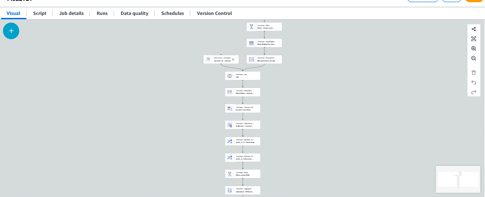

# Terraform — AWS Glue ETL (Customers + Orders) → Parquet (Silver/Gold) com Job Bookmarks e agendamento

Este repositório provisiona (via **Terraform**) um pipeline simples de **ETL com AWS Glue (Spark)** usando **AWS Glue Studio (Visual Job)**.

A ideia é ter dados em **CSV no S3 (bronze)**, transformar/enriquecer no Glue e gravar o resultado em **Parquet no S3** (camadas *silver/gold*), com **agendamento** e **Job Bookmarks** para evitar reprocessamento.

---

## ✅ O que este projeto cria

### AWS (via Terraform)
- **1 bucket S3** (com versioning e criptografia) para:
  - **dados bronze** (CSV): `s3://<bucket>/<bronze_prefix>/...`
  - **scripts do Glue**: `s3://<bucket>/<scripts_prefix>/glue_job.py`
  - **tmp**: `s3://<bucket>/tmp/`
- Upload de **arquivos de exemplo**:
  - `customers_*.csv` em `.../<bronze_prefix>/customers/ano=YYYY/mes=MM/dia=DD/`
  - `orders_*.csv` em `.../<bronze_prefix>/orders/ano=YYYY/mes=MM/dia=DD/`
- **IAM Role** para o Glue Job, incluindo:
  - leitura/escrita no bucket do projeto
  - logs no CloudWatch
  - **leitura do bucket de transforms do Glue Studio** (`aws-glue-studio-transforms-510798373988-prod-us-east-1`) — necessário para módulos `gs_*` usados pelo job
- **AWS Glue Job** (Spark, `glueetl`) apontando para o script enviado ao S3
- **AWS Glue Trigger** agendado para rodar o job a cada **15 minutos** (cron)

> Observação: o arquivo `MeuETL_ImportIU-ConsoleAWS.json` está no repositório como referência do Visual Job (DAG) exportado do Glue Studio.

---

## 🧱 Fluxo do pipeline

1) **Extract (S3 / CSV)**
- Lê `customers` e `orders` (CSV) do S3

2) **Transform (Glue / Spark)**
- Enriquecimento e limpeza (join, filtros, agregações etc.)

3) **Load (S3 / Parquet)**
- Grava resultado em Parquet (compressão) e atualiza/usa Glue Data Catalog (quando habilitado no script)

---

## 🔄 Transformações usadas (Glue Studio / Script)

Abaixo, um resumo das transformações que este job aplica (no Visual Job e no script em `scripts/glue_job.py`):

1. **Filter (clientes ACTIVE)**  
   Filtra apenas clientes com `status == "ACTIVE"` (ex.: `Filter.apply(...)`).

2. **ApplyMapping (Rename keys for Join)**  
   Renomeia/ajusta schema das colunas de customers para evitar conflito no join (ex.: prefixo `cli_`).

3. **Join (orders + customers)**  
   Faz o join por `customer_id` para enriquecer orders com dados do cliente.

4. **DropFields (remover PII)**  
   Remove colunas sensíveis como telefone/endereço (PII).

5. **Custom Transform (PySpark)**  
   Transformação personalizada para:
   - `trim()` em campos (`cli_email`, `cli_name`)
   - filtro de qualidade: manter apenas registros com email **não nulo** e **não vazio**

6. **Conversão/Formatação de timestamp (`order_ts`)**
   - `gs_to_timestamp` (autodetect / conversão para timestamp)
   - `gs_format_timestamp` (ex.: gerar `order_ts_formatado` com `yyyy-MM-dd`)

   > Esses módulos (`gs_to_timestamp.py`, `gs_format_timestamp.py`, `gs_common.py`) são bibliotecas do Glue Studio e precisam estar configuradas como **Python library path** (em Terraform isso vira `--extra-py-files`).

7. **Filter (orders PAID)**  
   Mantém apenas pedidos com status `PAID`.

8. **Aggregate (Relatório de Vendas / Gold)**
   Agregação (group by) para gerar métricas de vendas (ex.: por estado/canal/data), com **sum**/**count**.

9. **Evaluate Data Quality**
   Executa regras simples de qualidade (ex.: `ColumnCount > 0`) e publica resultados.

---

## 🧩 Pré-requisitos

- **Terraform** >= 1.6
- Credenciais AWS configuradas (ex.: `aws configure`, perfil/role)
- Permissão para criar recursos: S3, IAM, Glue (e Billing não é necessário)

---

## 🚀 Como executar

### 1) Clone e ajuste variáveis
Edite `variables.tf` ou crie `terraform.tfvars`:

```hcl
aws_region     = "us-east-1"
bucket_name    = "meu-bucket-unico-aqui"
bronze_prefix  = "bronze"
scripts_prefix = "scripts"
glue_job_name  = "MeuETL1"
```

### 2) Provisionar
```bash
terraform init
terraform apply
```

### 3) Colocar novos CSVs (bronze)
Faça upload de novos arquivos seguindo o padrão de prefixo. Exemplo:

```bash
aws s3 cp customers_novo.csv s3://<bucket>/<bronze_prefix>/customers/ano=2026/mes=01/dia=02/customers_20260102T120000Z_abcd.csv
aws s3 cp orders_novo.csv    s3://<bucket>/<bronze_prefix>/orders/ano=2026/mes=01/dia=02/orders_20260102T120000Z_abcd.csv
```

> **Boas práticas para Job Bookmarks**: evite sobrescrever o mesmo objeto no S3; prefira arquivos com nomes únicos (timestamp/uuid).

### 4) Rodar o job
- Manual: Glue Console → Job → **Run**
- Automático: o trigger roda a cada **15 minutos** (UTC)

---

## 🧪 Como validar o resultado

1) S3: verifique o prefixo de saída configurado no script do Glue (sink)  
2) Glue Console: acompanhe em **Runs** (DPU, tempo, logs)
3) CloudWatch Logs: ver logs do job

---

## 🧷 Sobre o erro `ModuleNotFoundError: gs_format_timestamp`

Se você criar o job via Terraform e receber:
`ModuleNotFoundError: No module named 'gs_format_timestamp'`

isso indica que o job não recebeu as libs do Glue Studio. Solução:
- garantir que o job tenha `--extra-py-files` apontando para:
  - `s3://aws-glue-studio-transforms-510798373988-prod-us-east-1/gs_common.py`
  - `s3://aws-glue-studio-transforms-510798373988-prod-us-east-1/gs_to_timestamp.py`
  - `s3://aws-glue-studio-transforms-510798373988-prod-us-east-1/gs_format_timestamp.py`
- e que a role do Glue tenha `s3:GetObject` nesse bucket (este projeto já inclui a policy)


## Glue Job (Visual)

Abaixo está a representação **visual** do Glue Job (Glue Studio), que pode ser recriada/importada a partir do arquivo:

- [`MeuETL_ImportIU-ConsoleAWS.json`](MeuETL_ImportIU-ConsoleAWS.json)

### Observações

- O **Terraform** cria e mantém o Glue Job principalmente via **script Python + parâmetros** (infra como código).
- A visualização em **IU (Glue Studio Visual)** **não é gerenciada diretamente pelo Terraform**.
- Se você editar o job **diretamente como script Python** (fora do modo visual), o Glue Studio pode **não conseguir manter/reconpor o DAG visual** automaticamente.


# Consulta Athena



## 🧹 Cleanup

```bash
terraform destroy
```

> Dica: este projeto usa `force_destroy = true` no bucket (se habilitado), então os objetos podem ser apagados ao destruir.

---

## 📚 Referências (AWS)

- AWS Glue — Job Bookmarks: https://docs.aws.amazon.com/glue/latest/dg/programming-etl-connect-bookmarks.html
- AWS Glue Studio — Visual jobs e transforms: https://docs.aws.amazon.com/glue/latest/ug/edit-job-in-glue-studio.html
- AWS Glue — Job parameters (`--extra-py-files` / `--job-bookmark-option`): https://docs.aws.amazon.com/glue/latest/dg/aws-glue-programming-etl-glue-arguments.html
- AWS Glue - Permissões Glue Python modules - https://docs.aws.amazon.com/pt_br/glue/latest/dg/getting-started-min-privs-job.html
