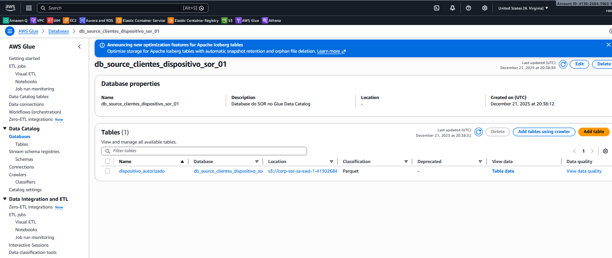
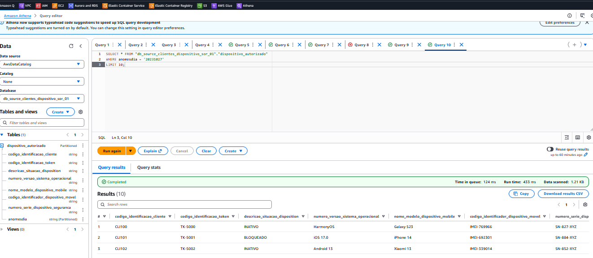

# Estudos AWS: Glue Data Catalog com Partition Projection

Este repositório provisiona, via **Terraform**, uma estrutura simples para laboratório/estudo com:

- **S3** (armazenamento dos arquivos Parquet)
- **AWS Glue Data Catalog** (Database + Table)
- **Amazon Athena** (consultas SQL)
- **Partition Projection** (partições “virtuais”, sem precisar registrar no catálogo)

A ideia é demonstrar como deixar dados no S3 consultáveis no Athena de forma imediata, sem depender de processos manuais ou Glue Crawlers para registrar partições.

---


## 🏗️ Recursos provisionados

- **S3 Bucket**: Armazenamento dos dados em formato Parquet com criptografia **AES256**.
- **Glue Catalog Database**: Banco de dados `db_source_clientes_dispositivo_sor_01`.
- **Glue Catalog Table**: Tabela `dispositivo_autorizado` com esquema de colunas para gestão de dispositivos.
- **IAM Role & Policy**: Permissões para operações relacionadas ao Glue e ao bucket do projeto.
- **Partition Projection**: Configuração dinâmica para a partição `anomesdia` no formato `yyyyMMdd`.

---

## ✅ Pré-requisitos

- Terraform instalado (recomendado **>= 1.6**)
- AWS CLI configurada (profile, SSO ou variáveis de ambiente)
- Permissões na conta AWS para criar/alterar:
  - S3 (bucket/objects)
  - Glue (database/table)
  - IAM (role/policy), caso seu projeto crie roles/policies

> **Importante:** Glue e Athena são **regionais**. Use a **mesma região** no Terraform e no console do Athena.

---

## 🗂️ Estrutura do projeto

Sugestão de estrutura (ajuste se o seu repositório tiver nomes diferentes):

```

.
├── main.tf
├── s3.tf
├── iam.tf
├── data.tf
├── variables.tf
├── versions.tf
└── script_gera_dados/
├──── requirements.txt
└──── gera_dados_parquet.py

````

---

## 🚀 Como utilizar

### 1) Preparação dos dados (Python)

Antes de aplicar o Terraform, gere o arquivo Parquet de amostra utilizando o script disponível na pasta `script_gera_dados/`:

```bash
cd script_gera_dados/

python -m venv venv
# Windows: venv\Scripts\activate
# Linux/macOS: source venv/bin/activate

pip install -r requirements.txt
python gera_dados_parquet.py
````

O script gera o arquivo `dados_dispositivo_amostra_20.parquet` para o teste inicial.

---

### 2) Provisionamento (Terraform)

Volte para a raiz do projeto e execute:

```bash
terraform init
terraform plan
terraform apply
```
Recurso criados no Glue Data Catalog:


---

### 3) Validação no Amazon Athena

No Athena (na **mesma região** onde você aplicou o Terraform), execute:

```sql
SELECT *
FROM "db_source_clientes_dispositivo_sor_01"."dispositivo_autorizado"
WHERE anomesdia = '20231027'
LIMIT 20;
```


> **Nota:** No console do Glue, a aba **Partitions** pode aparecer como **Partitions (0)**.
> Isso é esperado quando você usa **Partition Projection**, pois as partições são calculadas no momento da consulta e não ficam persistidas no catálogo.

---

## 🧩 Partition Projection

A tabela é particionada por `anomesdia` (string) no formato `yyyyMMdd`.

Com Partition Projection:

* Você **não precisa** registrar partições manualmente
* Você **não precisa** rodar `MSCK REPAIR TABLE`
* O Athena “enxerga” as partições com base no range e no template do S3

Exemplo de template (conceito):

* `s3://<bucket>/<tabela>/anomesdia=${anomesdia}/`

---

## ⚙️ Variáveis (inputs)

> Ajuste os defaults conforme seus arquivos `.tf`.

| Variável             | Descrição                                     | Exemplo                                   |
| -------------------- | --------------------------------------------- | ----------------------------------------- |
| `control_account`    | (Opcional) Account ID usado como `catalog_id` | `"123456789012"`                          |
| `sor_s3bucket`       | (Opcional) Nome do bucket SOR                 | `"corp-sor-sa-east-1-123456789012"`       |
| `sor_db_name_source` | Nome do Glue Database                         | `"db_source_clientes_dispositivo_sor_01"` |
| `sor_table_name`     | Nome da tabela no Glue/Athena                 | `"dispositivo_autorizado"`                |

Exemplo de `terraform.tfvars`:

```hcl
# control_account     = "123456789012"
# sor_s3bucket        = "corp-sor-sa-east-1-123456789012"

sor_db_name_source = "db_source_clientes_dispositivo_sor_01"
sor_table_name     = "dispositivo_autorizado"
```

---

## 🗑️ Limpeza de recursos

Para destruir tudo ao final do laboratório:

```bash
terraform destroy
```

---

## 🧯 Troubleshooting

### A tabela aparece no Glue, mas não aparece no Athena

Checklist:

* O Athena está na **mesma região** em que você criou o Glue Database/Table?
* No Athena, o **Data source** está como `AwsDataCatalog`?
* Você está logado na **mesma conta** AWS?
* Se estiver usando Lake Formation, há permissões bloqueando a listagem/consulta?

### “Partitions (0)” no Glue Console

Se você está usando **Partition Projection**, isso é normal.
A consulta no Athena deve funcionar quando você filtra por `anomesdia`.

### Query lenta ou muito scan no S3

Sempre filtre por partição, por exemplo:

```sql
WHERE anomesdia BETWEEN '20231001' AND '20231031'
```


