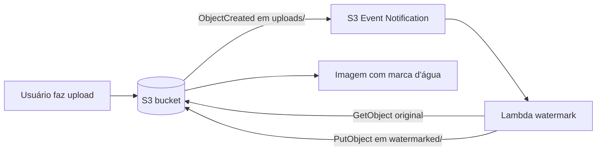

# Terraform demo — S3 + Lambda + marca d'água automática no upload

Projeto acadêmico e funcional para GitHub: ao fazer upload de uma imagem em `uploads/`, uma função AWS Lambda aplica uma marca d'água e grava a nova imagem em `watermarked/`.

> Objetivo didático: mostrar um fluxo **event-driven**, simples e atual, com **Terraform**, **S3 Event Notification** e **Lambda**.

## Arquitetura



## O que o projeto cria

- 1 bucket S3 com versionamento, SSE-S3 e bloqueio de acesso público
- 1 Lambda em Python
- 1 Lambda Layer com `Pillow`
- 1 `aws_lambda_permission` para permitir invocação pelo S3
- 1 `aws_s3_bucket_notification` escutando uploads em `uploads/`

## Estrutura

```text
.
├── artifacts/
├── lambda/
│   └── handler.py
├── scripts/
│   └── build_layer.sh
├── terraform/
│   ├── main.tf
│   ├── outputs.tf
│   ├── terraform.tfvars.example
│   └── variables.tf
├── Makefile
└── README.md
```

## Pré-requisitos

- Terraform >= 1.5
- Docker
- AWS CLI configurado
- permissões para criar S3, Lambda, IAM e CloudWatch Logs

## Como subir

```bash
git clone <seu-repo>.git
cd terraform-s3-watermark-lambda-complete
./scripts/build_layer.sh
cp terraform/terraform.tfvars.example terraform/terraform.tfvars
cd terraform
terraform init
terraform plan
terraform apply
```

## Variáveis principais

```hcl
aws_region         = "us-east-1"
project_name       = "s3-watermark-demo"
source_prefix      = "uploads"
destination_prefix = "watermarked"
watermark_text     = "CONFIDENTIAL"
watermark_opacity  = 90
output_format      = "ORIGINAL"
```

## Como testar

```bash
terraform output bucket_name
aws s3 cp ./sample.jpg s3://<bucket-name>/uploads/sample.jpg
aws s3 ls s3://<bucket-name>/watermarked/ --recursive
aws s3 cp s3://<bucket-name>/watermarked/sample.jpg ./sample-watermarked.jpg
```

## Como funciona

1. Upload em `uploads/`
2. S3 dispara `ObjectCreated`
3. Lambda baixa o original
4. Lambda aplica a marca d'água com Pillow
5. Lambda grava em `watermarked/`
6. O original continua intacto

## Observações

- O prefixo de saída é diferente do de entrada para evitar loop.
- O bucket usa versionamento para facilitar testes.
- O bucket usa SSE-S3 por padrão.
- Formatos suportados: PNG, JPG, JPEG, WEBP.

## Troubleshooting

### `pillow_layer.zip` não existe

```bash
./scripts/build_layer.sh
```

### Nada foi processado

Verifique se o upload foi feito em `uploads/`.

### Ver logs da Lambda

```bash
aws logs tail /aws/lambda/s3-watermark-demo-watermark --follow
```

## Limpeza

```bash
cd terraform
terraform destroy
```
