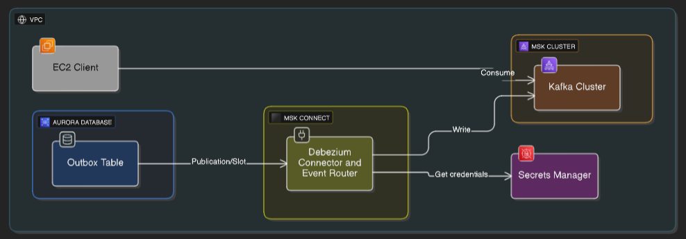
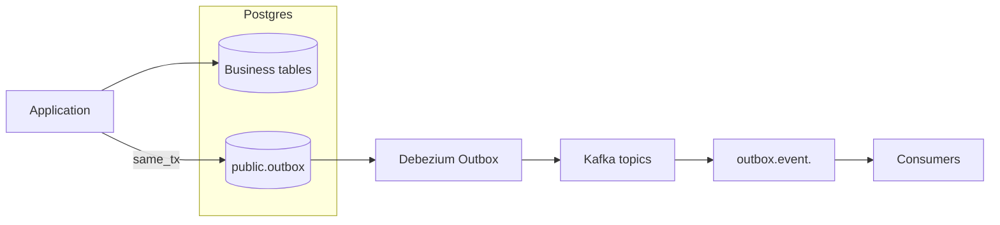
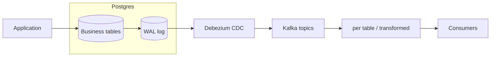
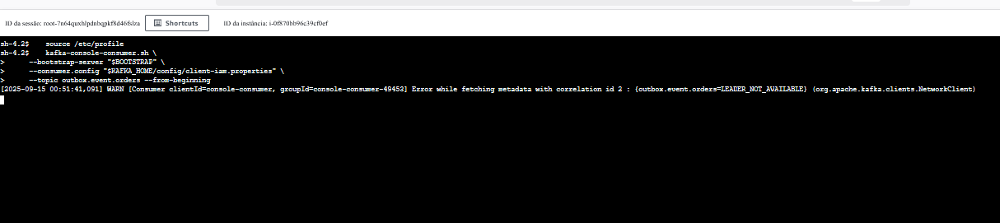
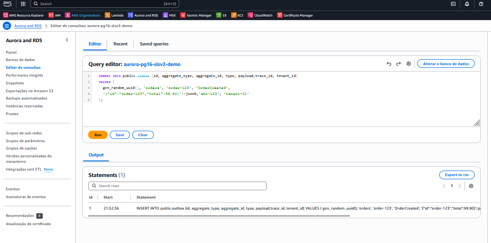
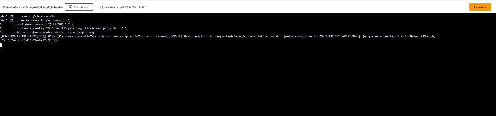

# Aurora PostgreSQL + MSK Connect (Debezium Outbox)

Projeto didático **IaC com Terraform** que implementa o *Outbox Pattern* usando **Aurora PostgreSQL 16**, **Amazon MSK 3.6**, **MSK Connect** com **Debezium PostgreSQL Connector** e uma **EC2 cliente** para validar ponta a ponta. Inclui integração com **AWS Secrets Manager** para credenciais, e parâmetros de replicação lógica no Aurora para o Debezium.

> **Objetivo**: servir como guia reproduzível para quem quer aprender a capturar eventos de negócio a partir de uma tabela `public.outbox` no PostgreSQL e publicá-los em tópicos Kafka com roteamento automático (Event Router), de forma segura e observável.

---

## Arquitetura (visão geral)




**Pontos-chave**

* Aurora com **replicação lógica** habilitada (parâmetro `rds.logical_replication=1`).
* Debezium lê a `public.outbox` via **publication** e **replication slot**.
* **EventRouter** roteia para tópicos no padrão `outbox.event.<aggregate_type>`.
* Credenciais **não** ficam em texto plano: MSK Connect lê do **Secrets Manager**.
* EC2 com cliente Kafka (autenticação **IAM** preparada) para inspeção.


---

## Outbox vs CDC — conceitos e diferenças

**Outbox** é um padrão de integração orientado a eventos no qual a própria aplicação grava, **na mesma transação** do comando de negócio, um registro em uma tabela dedicada (ex.: `public.outbox`) descrevendo o evento de domínio (payload + metadados). Um conector/worker (aqui, Debezium + Event Router) lê **apenas essa tabela de outbox** e publica o evento no broker (Kafka), preservando a atomicidade e evitando o problema de *dual‑write* (escrever no banco e no broker separadamente). Vantagens: contrato de evento **explícito e versionável**, menor acoplamento com o esquema interno das tabelas de origem, controle do *routing* e de metadados (headers), além de semântica mais previsível para *exactly‑once* ao nível da aplicação. Exige, por outro lado, **mudança de código** (gravar na outbox) e um desenho intencional do formato do evento.

**CDC (Change Data Capture)** é uma técnica mais genérica que lê o **log de transações** do banco (ex.: WAL no PostgreSQL) para capturar INSERT/UPDATE/DELETE diretamente das tabelas de dados. Tem como ponto forte a **baixa intrusão** (pouca ou nenhuma mudança no código da aplicação) e pode cobrir muitos objetos/tabelas de uma vez. Porém, tende a **expor o esquema físico** do banco, dificulta a construção de **eventos de domínio bem modelados** (é preciso transformar CRUD → eventos), e pode introduzir acoplamento indesejado entre consumidores e a estrutura interna das tabelas. Por esses motivos, **este projeto usa Outbox**, priorizando a atomicidade transacional e um **contrato de evento claro e estável** para integração entre serviços.

---


### Diagramas comparativos

**Outbox Pattern (usado neste projeto)**



**CDC (Change Data Capture) genérico**



> No **Outbox**, a aplicação controla o **contrato do evento** e evita *dual‑write* (DB+Kafka) ao gravar o evento **na mesma transação**. No **CDC**, você captura mudanças das **tabelas reais**, o que normalmente requer transformar/normalizar os registros de CRUD em **eventos de domínio**.

---

## Componentes provisionados

* **Aurora PostgreSQL 16** (1 Writer, 1 Reader)

    * Parameter group com `rds.logical_replication=1` e `wal_level=logical` (implícito/compatível).
* **Amazon MSK 3.6.0** (cluster com N brokers configuráveis).
* **MSK Connect**

    * **Debezium PostgreSQL Connector** (plugin)
    * **Worker configuration** com provider `secretsmanager` habilitado.
    * **Connector configuration** usando tokens `${secretsmanager:...}` para `database.user` e `database.password`.
* **EC2 Client**

    * Instance Profile com permissões para MSK IAM auth.
    * Cliente Kafka instalado e `client-iam.properties` pronto para uso.

---

## Pré‑requisitos

* **Terraform** ≥ 1.6
* **AWS CLI** configurado com credenciais/admin em uma conta de laboratório
* VPC/Subnets/Security Groups conforme os módulos (ou deixe o projeto criá-los, se aplicável)
* **Região**: `us-east-1` (ajuste conforme necessidade)

> Custos: os recursos criados **geram cobrança** (RDS, MSK, EC2). Provisione em ambientes de teste e **lembre-se do "destroy"** ao final.

---


## Deploy

1. **Inicializar e aplicar**

   ```bash
   terraform init
   terraform apply
   ```

2. **Aguardar o Aurora ficar disponível** e então criar a **tabela outbox** e a **publication**. Você pode usar o **Query Editor** do console AWS, `psql` ou Data API.

   ```sql
   -- Tabela Outbox
   CREATE TABLE IF NOT EXISTS public.outbox (
     id             uuid PRIMARY KEY,
     aggregate_type text        NOT NULL,
     aggregate_id   text        NOT NULL,
     type           text        NOT NULL,
     payload        jsonb       NOT NULL,
     timestamp      timestamptz NOT NULL DEFAULT now(),
     trace_id       text,
     tenant_id      text
   );

   -- Publication para o Debezium
   CREATE PUBLICATION debezium_pub FOR TABLE public.outbox;
   ```

   **Verificações úteis**

   ```sql
   SHOW rds.logical_replication;  -- deve retornar: on
   SHOW wal_level;                -- esperado: logical
   ```

3. **Validação do Connector**

    * O conector Debezium deve estar com `snapshot.mode=no_data` (ajuste conforme seu caso).
    * Exemplo de credenciais via **Secrets Manager** (no MSK Connect Console):

      ```
      database.user=${secretsmanager:meu-segredo:username}
      database.password=${secretsmanager:meu-segredo:password}
      ```
    * **Worker configuration** (MSK Connect):

      ```
      config.providers=secretsmanager
      config.providers.secretsmanager.class=com.amazonaws.kafka.config.providers.SecretsManagerConfigProvider
      config.providers.secretsmanager.param.region=us-east-1
      ```

4. **Consumir mensagens pela EC2** (com IAM auth):

   ```bash
   source /etc/profile
   kafka-console-consumer.sh \
     --bootstrap-server "$BOOTSTRAP" \
     --consumer.config "$KAFKA_HOME/config/client-iam.properties" \
     --topic outbox.event.orders --from-beginning
   ```
    
5. **Gerar um evento** (insert na outbox):

   ```sql
   INSERT INTO public.outbox (id, aggregate_type, aggregate_id, type, payload,trace_id, tenant_id)
   VALUES (
     gen_random_uuid(), 'orders', 'order-123', 'OrderCreated',
     '{"id":"order-123","total":99.90}'::jsonb,'abc-123', 'tenant-01'
   );
   
   INSERT INTO public.outbox (id, aggregate_type, aggregate_id, type, payload,trace_id, tenant_id)
    VALUES (gen_random_uuid(), 'orders', 'order-123', 'OrderCreated',
    '{"id": "order-123", "total": 99.90, "items": [{"sku":"X","qty":1}]}'::jsonb,'abc-123', 'tenant-01');
   ```
    
   Você deverá visualizar as mensagens no tópico `outbox.event.orders`.

---

## Configuração do Debezium (exemplo)

> **Console MSK Connect** (formato *key=value*), usando Secrets Manager:

```
connector.class=io.debezium.connector.postgresql.PostgresConnector
plugin.name=pgoutput


# Banco
database.hostname=<endpoint-aurora>
database.port=5432
database.dbname=appdb
database.sslmode=require


database.user=${secretsmanager:meu-segredo:username}
database.password=${secretsmanager:meu-segredo:password}


# Replicação
slot.name=debezium_slot
publication.name=debezium_pub
publication.autocreate.mode=filtered
slot.drop.on.stop=false


# Outbox Event Router
transforms=outbox
transforms.outbox.type=io.debezium.transforms.outbox.EventRouter
transforms.outbox.table.field.event.id=id
transforms.outbox.table.field.event.key=aggregate_id
transforms.outbox.table.field.event.payload=payload
transforms.outbox.table.expand.json.payload=true
transforms.outbox.route.by.field=aggregate_type
transforms.outbox.table.fields.additional.placement=trace_id:header,tenant_id:header


table.include.list=public.outbox
schema.include.list=public
snapshot.mode=no_data


# Tópicos
topic.prefix=pg
heartbeat.topics.prefix=__debezium-heartbeat


# Criação de tópicos (opcional)
topic.creation.default.partitions=3
topic.creation.default.replication.factor=2


# Erros & DLQ
errors.tolerance=all
errors.log.enable=true
errors.deadletterqueue.topic.name=_dlq.debezium.aurora.pg
errors.deadletterqueue.context.headers.enable=true


# Metadados
provide.transaction.metadata=true
heartbeat.interval.ms=10000
```

> **Terraform**: ao declarar em `connector_configuration`, escape o `${...}` com `$$` (ex.: `"$${secretsmanager:...}"`).

---

## Dicas de Segurança

* Use **Secrets Manager** para as credenciais do DB, com rotação (opcional).
* Conceda à **service execution role** do MSK Connect apenas `secretsmanager:GetSecretValue` no segredo necessário.
* Restrinja **SG** (entrada 5432) apenas aos **ENIs** do MSK Connect e aos IPs que precisam conectar.
* Não exponha endpoints/brokers publicamente se não houver necessidade didática.

---

## Troubleshooting (erros comuns)

* **Terraform**: `Extra characters after interpolation expression` ao usar `${secretsmanager:...}`

    * Use `"$${secretsmanager:...}"` no `connector_configuration` do Terraform.

* **RDS**: `InvalidParameterCombination: cannot use immediate apply method for static parameter`

    * Parâmetros estáticos exigem `apply_method = "pending-reboot"` + **reboot** das instâncias.

* **Debezium não inicia / falha no slot/publication**

    * Confirme `CREATE PUBLICATION ...` e nomes (slot/publication) iguais aos do connector.
    * Garanta `rds.logical_replication=1` no parameter group do **cluster**.

* **AccessDenied no Secrets Manager**

    * A role do connector precisa de `secretsmanager:GetSecretValue` para o ARN do segredo.

* **Sem mensagens no tópico**

    * Confira `table.include.list`, `schema.include.list` e o `aggregate_type` usado no insert; veja se o tópico esperado existe.

* **MSK/IAM auth**

    * Verifique `client-iam.properties` e variáveis carregadas na EC2 (`$BOOTSTRAP`, `$KAFKA_HOME`).

---

## Limpeza

Para evitar custos:

```bash
terraform destroy
```

---

## Referências úteis

* Debezium Outbox Event Router — documentação oficial
* AWS: MSK Connect + Debezium PostgreSQL — guia de exemplo
* Aurora PostgreSQL — replicação lógica / parameter groups
* https://www.youtube.com/watch?v=G87fm-tjhmY
* https://github.com/JayaprakashKV/streaming-pipeline-aws
* https://repost.aws/questions/QUHDBV6n40SeyevDIiopfdoA/mks-service-with-debezium
* https://aws.amazon.com/pt/blogs/aws/introducing-amazon-msk-connect-stream-data-to-and-from-your-apache-kafka-clusters-using-managed-connectors/
* https://docs.aws.amazon.com/pt_br/msk/latest/developerguide/msk-connect-debeziumsource-connector-example-steps.html
* https://debezium.io/documentation/reference/stable/transformations/outbox-event-router.html
* https://www.youtube.com/watch?v=QJFqfbVcD6s
* https://repost.aws/questions/QUHDBV6n40SeyevDIiopfdoA/mks-service-with-debezium
* https://medium.com/data-hackers/integra%C3%A7%C3%A3o-de-dados-em-tempo-real-do-postgres-para-o-s3-com-debezium-65b0ac97bdb2
---
