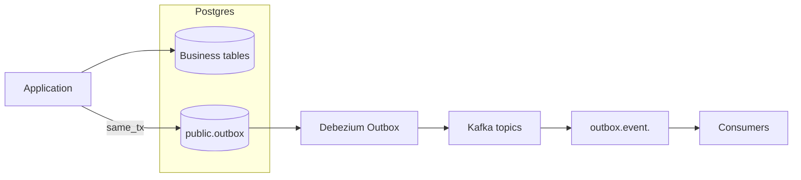
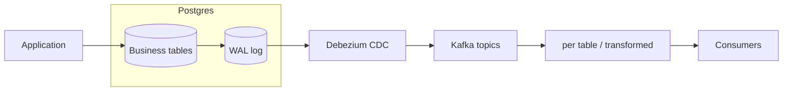

# Aurora PostgreSQL + MSK Connect (Debezium Outbox)

Projeto didático **IaC com Terraform** que implementa o *Outbox Pattern* usando **Aurora PostgreSQL 16**, **Amazon MSK 3.6**, **MSK Connect** com **Debezium PostgreSQL Connector** e uma **EC2 cliente** para validar ponta a ponta. Inclui integração com **AWS Secrets Manager** para credenciais, e parâmetros de replicação lógica no Aurora para o Debezium.

> **Objetivo**: servir como guia reproduzível para quem quer aprender a capturar eventos de negócio a partir de uma tabela `public.outbox` no PostgreSQL e publicá-los em tópicos Kafka com roteamento automático (Event Router), de forma segura e observável.

---

## Por que usar Outbox? Problemas que ele resolve

- **Dual‑write e inconsistência**: sem Outbox, a aplicação precisa **gravar no banco** e **publicar no broker** em dois passos distintos. Se um deles falhar (ex.: DB commit ok, mas publish em Kafka falha), você cria **estado divergente**. Com Outbox, o evento é gravado **na mesma transação** do comando de negócio; a publicação para o Kafka é feita de forma assíncrona e confiável pelo conector.
- **Ordem e idempotência por agregado**: usando `aggregate_id` como **chave de partição** e um **`event.id`** único, consumidores conseguem **preservar ordem** por entidade e implementar **deduplicação** (idempotência) com facilidade.
- **Menos acoplamento ao esquema interno**: CDC puro costuma expor o **CRUD** e o **esquema físico** (colunas/tabelas) da base. O Outbox publica um **evento de domínio** (contrato estável), blindando consumidores de mudanças internas nas tabelas operacionais.
- **Recuperação e reprocessamento simples**: eventos ficam **persistidos** na tabela `public.outbox` até serem lidos pelo conector; se ele cair, **retoma** do ponto certo (replication slot). Você pode **replay** com segurança quando necessário.
- **Backpressure e resiliência**: a aplicação **não bloqueia** esperando o broker; escreve localmente e delega a entrega ao pipeline. Isso reduz impacto de picos/indisponibilidade do Kafka.
- **Auditoria e rastreabilidade**: payload + metadados (ex.: `trace_id`, `tenant_id`) ficam **armazenados** e também seguem como **headers** no tópico, facilitando troubleshooting e observabilidade de ponta a ponta.
- **Evolução independente**: você pode **migrar/otimizar** o modelo relacional interno sem quebrar os assinantes, desde que **preserve o contrato** do evento da outbox.
- **Fan‑out para múltiplos destinos**: um mesmo evento pode ser roteado para **tópicos diferentes** (por tipo/agregado), atendendo múltiplos serviços sem mudar o fluxo de negócio.


> **Limitacoes e trade-offs**: manter a tabela `public.outbox` saudavel exige rotinas de limpeza ou arquivamento; a publicacao e assincrona, entao existe uma latencia ate o evento chegar ao topico; e payloads grandes gravados na mesma transacao podem aumentar tempo de commit ou uso de storage. Avalie esses pontos antes de levar o padrao para producao.

> **Quando considerar CDC (em vez de Outbox)?** Para casos de **replicação de dados** para *data lake/warehouse* ou integrações onde não há necessidade de modelar **eventos de domínio**: CDC genérico pode ser suficiente e menos intrusivo.

---


## O que é Debezium (e por que neste projeto)

**Debezium** é uma plataforma *open‑source* de **Change Data Capture (CDC)** construída sobre o **Kafka Connect**. Ela fornece conectores para bancos como PostgreSQL, MySQL, SQL Server etc. No PostgreSQL, o conector usa **logical decoding** (plugin `pgoutput`) com **publication** e **replication slot** para ler mudanças de forma confiável. No **MSK Connect** (gerenciado pela AWS), o Debezium roda como um *connector* gerenciado — sem você precisar operar o cluster de Connect.

**Fluxo resumido**
- O PostgreSQL grava comandos de negocio e eventos na tabela `public.outbox`.
- O Debezium consome o WAL via replication slot, aplica o Outbox Event Router e publica no Kafka/MSK.
- Consumidores autenticados leem os topicos `outbox.event.*`, preservando ordenacao por `aggregate_id`.

**Pre-requisitos tecnicos**
- Usuario do Aurora com privilegios para criar publication/slot e acessar `public.outbox`.
- Parametro `rds.logical_replication = 1` (ja definido via Terraform).
- Rede liberada para que os workers do MSK Connect alcancem a porta 5432 do Aurora.

Neste projeto, o Debezium é usado com o **Outbox Event Router (SMT)**: em vez de capturar CRUD das tabelas de negócio, ele lê **somente** a tabela `public.outbox` e transforma cada linha em **evento de domínio**, roteando para tópicos (ex.: `outbox.event.<aggregate_type>`) e propagando metadados (headers como `trace_id`, `tenant_id`). Assim, você preserva a **atomicidade** (evento gravado na mesma transação do comando) e entrega um **contrato de evento estável** para os consumidores.

**O que o Debezium resolve aqui**
- **Streaming confiável** de eventos a partir do banco, com **retomada após falhas** (offsets/posição de leitura) e sem código custom de *polling*.
- **Transformação e roteamento** dos registros da outbox em **eventos de domínio** (SMT Outbox), evitando expor o esquema físico das tabelas.
- **Ordem por entidade** (quando você particiona por `aggregate_id`) e suporte a **idempotência** do lado consumidor (usando `event.id`).
- Integração nativa com **Kafka/MSK** e **Secrets Manager** (via config provider), reduzindo atrito operacional.

---

## Arquitetura (visão geral)


O fluxo ponta a ponta funciona assim: a aplicacao grava na `public.outbox`; o Debezium le o WAL pelo slot `debezium_slot`, transforma com o Event Router e publica no MSK como `outbox.event.<aggregate_type>`; consumidores (IAM ou SCRAM) tratam as mensagens preservando ordenacao por agregado.


**Pontos-chave**

* Aurora com **replicação lógica** habilitada (parâmetro `rds.logical_replication=1`).
* Debezium lê a `public.outbox` via **publication** e **replication slot**.
* **EventRouter** roteia para tópicos no padrão `outbox.event.<aggregate_type>`.
* Credenciais **não** ficam em texto plano: MSK Connect lê do **Secrets Manager**.
* EC2 com cliente Kafka (autenticação **IAM** preparada) para inspeção.


---

## Outbox vs CDC — conceitos e diferenças

**Outbox** é um padrão de integração orientado a eventos no qual a própria aplicação grava, **na mesma transação** do comando de negócio, um registro em uma tabela dedicada (ex.: `public.outbox`) descrevendo o evento de domínio (payload + metadados). Um conector/worker (aqui, Debezium + Event Router) lê **apenas essa tabela de outbox** e publica o evento no broker (Kafka), preservando a atomicidade e evitando o problema de *dual‑write* (escrever no banco e no broker separadamente). Vantagens: contrato de evento **explícito e versionável**, menor acoplamento com o esquema interno das tabelas de origem, controle do *routing* e de metadados (headers), além de semântica mais previsível para *exactly‑once* ao nível da aplicação. Exige, por outro lado, **mudança de código** (gravar na outbox) e um desenho intencional do formato do evento.


**CDC (Change Data Capture)** é uma técnica mais genérica que lê o **log de transações** do banco (ex.: WAL no PostgreSQL) para capturar INSERT/UPDATE/DELETE diretamente das tabelas de dados. Tem como ponto forte a **baixa intrusão** (pouca ou nenhuma mudança no código da aplicação) e pode cobrir muitos objetos/tabelas de uma vez. Porém, tende a **expor o esquema físico** do banco, dificulta a construção de **eventos de domínio bem modelados** (é preciso transformar CRUD → eventos), e pode introduzir acoplamento indesejado entre consumidores e a estrutura interna das tabelas. Por esses motivos, **este projeto usa Outbox**, priorizando a atomicidade transacional e um **contrato de evento claro e estável** para integração entre serviços.


* **Outbox**: só `INSERT` na outbox; “operação” e “antes/depois” ficam **no evento que você escrever** (ex.: `type`, `payload.old/new`).
* **CDC tradicional**: Debezium fornece `op` + `before/after` automaticamente para as **tabelas de negócio** (configure `ALTER TABLE PUBLIC.MY_ORDERS REPLICA IDENTITY FULL` para `before` completo).

---


### Diagramas comparativos

**Outbox Pattern (usado neste projeto)**



**CDC (Change Data Capture) genérico**



> No **Outbox**, a aplicação controla o **contrato do evento** e evita *dual‑write* (DB+Kafka) ao gravar o evento **na mesma transação**. No **CDC**, você captura mudanças das **tabelas reais**, o que normalmente requer transformar/normalizar os registros de CRUD em **eventos de domínio**.

---

## Componentes provisionados

* **Aurora PostgreSQL 16** (1 Writer, 1 Reader)

    * Parameter group com `rds.logical_replication=1` e `wal_level=logical` (implícito/compatível).
* **Amazon MSK 3.6.0** (cluster com N brokers configuráveis).
* **MSK Connect**

    * **Debezium PostgreSQL Connector** (plugin)
    * **Worker configuration** com provider `secretsmanager` habilitado.
    * **Connector configuration** usando tokens `${secretsmanager:...}` para `database.user` e `database.password`.
* **EC2 Client**

    * Instance Profile com permissões para MSK IAM auth.
    * Cliente Kafka instalado e `client-iam.properties` pronto para uso.

---

## Pré‑requisitos

* **Terraform** ≥ 1.6
* **AWS CLI** configurado com credenciais/admin em uma conta de laboratório
* VPC/Subnets/Security Groups conforme os módulos (ou deixe o projeto criá-los, se aplicável)
* **Região**: `us-east-1` (ajuste conforme necessidade)

> Custos: os recursos criados **geram cobrança** (RDS, MSK, EC2). Provisione em ambientes de teste e **lembre-se do "destroy"** ao final.

---


## Deploy

1. **Inicializar e aplicar**

   ```bash
   terraform init
   terraform apply
   ```

2. **Aguardar o Aurora ficar disponível** e então criar a **tabela outbox** e a **publication**. Você pode usar o **Query Editor** do console AWS, `psql` ou Data API.

   ```sql
   -- Tabela Outbox
   CREATE TABLE IF NOT EXISTS public.outbox (
     id             uuid PRIMARY KEY,
     aggregate_type text        NOT NULL,
     aggregate_id   text        NOT NULL,
     type           text        NOT NULL,
     payload        jsonb       NOT NULL,
     timestamp      timestamptz NOT NULL DEFAULT now(),
     trace_id       text,
     tenant_id      text
   );

   -- Publication para o Debezium
   CREATE PUBLICATION debezium_pub FOR TABLE public.outbox;
   ```

   **Verificações úteis**

   ```sql
   SHOW rds.logical_replication;  -- deve retornar: on
   SHOW wal_level;                -- esperado: logical
   ```

3. **Validação do Connector**

    * O conector Debezium deve estar com `snapshot.mode=no_data` (ajuste conforme seu caso).
    * Exemplo de credenciais via **Secrets Manager** (no MSK Connect Console):

      ```
      database.user=${secretsmanager:meu-segredo:username}
      database.password=${secretsmanager:meu-segredo:password}
      ```
    * **Worker configuration** (MSK Connect):

      ```
      config.providers=secretsmanager
      config.providers.secretsmanager.class=com.amazonaws.kafka.config.providers.SecretsManagerConfigProvider
      config.providers.secretsmanager.param.region=us-east-1
      ```

4. **Consumir mensagens pela EC2** (com IAM auth):

   ```bash
   source /etc/profile
   kafka-console-consumer.sh \
     --bootstrap-server "$BOOTSTRAP" \
     --consumer.config "$KAFKA_HOME/config/client-iam.properties" \
     --topic outbox.event.maria_vendas --from-beginning
   ```
    
5. **Gerar um evento** (insert na outbox):

   ```sql
   INSERT INTO public.outbox (id, aggregate_type, aggregate_id, type, payload,trace_id, tenant_id)
   VALUES (
     gen_random_uuid(), 'orders', 'order-123', 'OrderCreated',
     '{"id":"order-123","total":99.90}'::jsonb,'abc-123', 'tenant-01'
   );
   
   INSERT INTO public.outbox (id, aggregate_type, aggregate_id, type, payload,trace_id, tenant_id)
    VALUES (gen_random_uuid(), 'orders', 'order-123', 'OrderCreated',
    '{"id": "order-123", "total": 99.90, "items": [{"sku":"X","qty":1}]}'::jsonb,'abc-123', 'tenant-01');
   ```
    
   Você deverá visualizar as mensagens no tópico `outbox.event.orders`.

---

## Configuração do Debezium (exemplo)

> **Console MSK Connect** (formato *key=value*), usando Secrets Manager:

```
connector.class=io.debezium.connector.postgresql.PostgresConnector
plugin.name=pgoutput


# Banco
database.hostname=<endpoint-aurora>
database.port=5432
database.dbname=appdb
database.sslmode=require


database.user=${secretsmanager:meu-segredo:username}
database.password=${secretsmanager:meu-segredo:password}


# Replicação
slot.name=debezium_slot
publication.name=debezium_pub
publication.autocreate.mode=filtered
slot.drop.on.stop=false

# FILTRO DIRETO NO POSTGRES
# Apenas linhas da tabela outbox cujo status seja 'pendente'
# table.filter.query=SELECT * FROM public.outbox WHERE tenant_id = 'tenant-01'


# Outbox Event Router
transforms=outbox

# Aplica primeiro o filtro, depois o Outbox Event Router
# transforms=filter,outbox

# ----- Filtro -----
#transforms.filter.type=org.apache.kafka.connect.transforms.Filter
# Mantém só mensagens cujo campo 'tenant_id' == 'tenant-01'
#transforms.filter.condition=$[?($.tenant_id == 'tenant-01')]
#transforms.filter.action=keep

transforms.outbox.type=io.debezium.transforms.outbox.EventRouter
transforms.outbox.table.field.event.id=id
transforms.outbox.table.field.event.key=aggregate_id
transforms.outbox.table.field.event.payload=payload
transforms.outbox.table.expand.json.payload=true
transforms.outbox.route.by.field=aggregate_type
transforms.outbox.table.fields.additional.placement=trace_id:header,tenant_id:header


table.include.list=public.outbox
schema.include.list=public
snapshot.mode=no_data


# Tópicos
topic.prefix=pg
heartbeat.topics.prefix=__debezium-heartbeat


# Criação de tópicos (opcional)
topic.creation.default.partitions=3
topic.creation.default.replication.factor=2


# Erros & DLQ
errors.tolerance=all
errors.log.enable=true
errors.deadletterqueue.topic.name=_dlq.debezium.aurora.pg
errors.deadletterqueue.context.headers.enable=true


# Metadados
provide.transaction.metadata=true
heartbeat.interval.ms=10000
```

> **Terraform**: ao declarar em `connector_configuration`, escape o `${...}` com `$$` (ex.: `"$${secretsmanager:...}"`).

---

## Dicas de Segurança

* Use **Secrets Manager** para as credenciais do DB, com rotação (opcional).
* Conceda à **service execution role** do MSK Connect apenas `secretsmanager:GetSecretValue` no segredo necessário.
* Restrinja **SG** (entrada 5432) apenas aos **ENIs** do MSK Connect e aos IPs que precisam conectar.
* Não exponha endpoints/brokers publicamente se não houver necessidade didática.

---

## Troubleshooting (erros comuns)

* **Terraform**: `Extra characters after interpolation expression` ao usar `${secretsmanager:...}`

    * Use `"$${secretsmanager:...}"` no `connector_configuration` do Terraform.

* **RDS**: `InvalidParameterCombination: cannot use immediate apply method for static parameter`

    * Parâmetros estáticos exigem `apply_method = "pending-reboot"` + **reboot** das instâncias.

* **Debezium não inicia / falha no slot/publication**

    * Confirme `CREATE PUBLICATION ...` e nomes (slot/publication) iguais aos do connector.
    * Garanta `rds.logical_replication=1` no parameter group do **cluster**.

* **AccessDenied no Secrets Manager**

    * A role do connector precisa de `secretsmanager:GetSecretValue` para o ARN do segredo.

* **Sem mensagens no tópico**

    * Confira `table.include.list`, `schema.include.list` e o `aggregate_type` usado no insert; veja se o tópico esperado existe.

* **MSK/IAM auth**

    * Verifique `client-iam.properties` e variáveis carregadas na EC2 (`$BOOTSTRAP`, `$KAFKA_HOME`).

---

## Limpeza

Para evitar custos:

```bash
terraform destroy
```

---

### Referências oficiais

* Debezium — Conector PostgreSQL: [https://debezium.io/documentation/reference/stable/connectors/postgresql.html](https://debezium.io/documentation/reference/stable/connectors/postgresql.html)
* Debezium — Outbox Event Router (SMT): [https://debezium.io/documentation/reference/stable/transformations/outbox-event-router.html](https://debezium.io/documentation/reference/stable/transformations/outbox-event-router.html)
* Debezium — Documentação principal: [https://debezium.io/documentation/](https://debezium.io/documentation/)
* AWS Docs — MSK Connect + Debezium (exemplo): [https://docs.aws.amazon.com/pt\_br/msk/latest/developerguide/msk-connect-debeziumsource-connector-example-steps.html](https://docs.aws.amazon.com/pt_br/msk/latest/developerguide/msk-connect-debeziumsource-connector-example-steps.html)
* AWS Blog — Introducing Amazon MSK Connect: [https://aws.amazon.com/pt/blogs/aws/introducing-amazon-msk-connect-stream-data-to-and-from-your-apache-kafka-clusters-using-managed-connectors/](https://aws.amazon.com/pt/blogs/aws/introducing-amazon-msk-connect-stream-data-to-and-from-your-apache-kafka-clusters-using-managed-connectors/)
* PostgreSQL — Logical decoding & replication slots: [https://www.postgresql.org/docs/current/logicaldecoding-explanation.html](https://www.postgresql.org/docs/current/logicaldecoding-explanation.html)

### Materiais complementares

* YouTube: [https://www.youtube.com/watch?v=G87fm-tjhmY](https://www.youtube.com/watch?v=G87fm-tjhmY)
* YouTube: [https://www.youtube.com/watch?v=QJFqfbVcD6s](https://www.youtube.com/watch?v=QJFqfbVcD6s)
* GitHub — Exemplo de pipeline: [https://github.com/JayaprakashKV/streaming-pipeline-aws](https://github.com/JayaprakashKV/streaming-pipeline-aws)
* Q\&A (repost.aws) — MSK + Debezium: [https://repost.aws/questions/QUHDBV6n40SeyevDIiopfdoA/mks-service-with-debezium](https://repost.aws/questions/QUHDBV6n40SeyevDIiopfdoA/mks-service-with-debezium)
* Medium (Data Hackers) — Debezium do Postgres para S3: [https://medium.com/data-hackers/integra%C3%A7%C3%A3o-de-dados-em-tempo-real-do-postgres-para-o-s3-com-debezium-65b0ac97bdb2](https://medium.com/data-hackers/integra%C3%A7%C3%A3o-de-dados-em-tempo-real-do-postgres-para-o-s3-com-debezium-65b0ac97bdb2)


---
