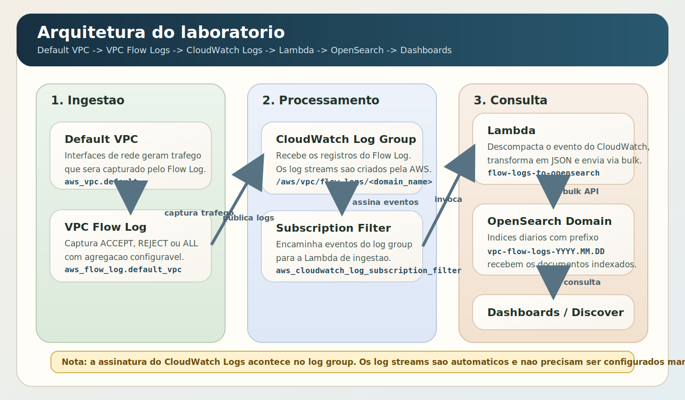
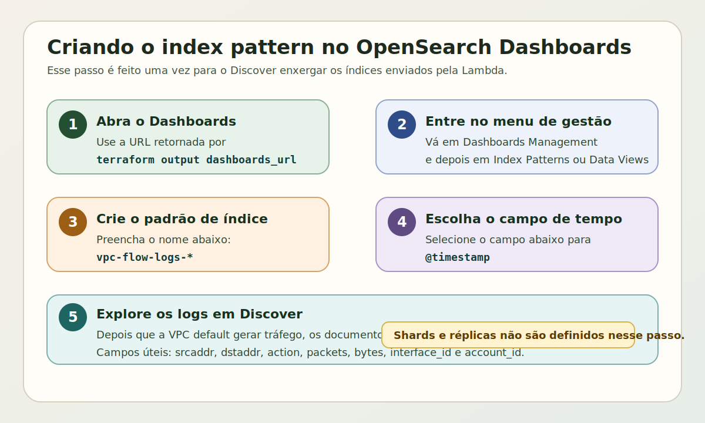
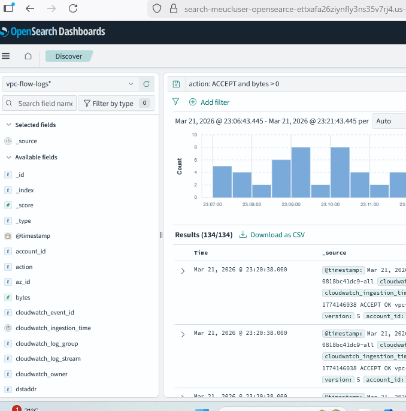

# Projeto Terraform - Amazon OpenSearch Service

Projeto simples para estudo acadêmico da integração entre `Amazon VPC Flow Logs`, `CloudWatch Logs`, `AWS Lambda` e um cluster provisionado no `Amazon OpenSearch Service`:

- domínio público
- IP type `dualstack`
- OpenSearch `3.5`
- `3-AZ` sem standby
- tipo de instância `m5.large.search`
- `3` nós de dados
- EBS `gp3` com `10 GiB`, `3000 IOPS` e `125 MiB/s`
- Fine-Grained Access Control com usuário mestre interno
- HTTPS obrigatório
- criptografia em repouso
- criptografia nó a nó
- Auto-Tune habilitado
- credenciais do OpenSearch armazenadas no Secrets Manager
- Lambda usando AWS Parameters and Secrets Lambda Extension com cache
- VPC Flow Logs da VPC default enviados para CloudWatch Logs
- assinatura do CloudWatch Logs para Lambda
- ingestão dos logs no OpenSearch

## Estrutura

- `versions.tf`: versões do Terraform e providers
- `provider.tf`: provider AWS
- `variables.tf`: variáveis principais pedidas
- `main.tf`: domínio OpenSearch e senha randômica
- `locals.tf`: nomes e formato dos VPC Flow Logs
- `vpc_flow_logs.tf`: Flow Log da VPC default, CloudWatch Logs, IAM e subscription filter
- `lambda.tf`: Secrets Manager, IAM e Lambda que envia os logs para o OpenSearch
- `lambda/flow_logs_to_opensearch/lambda_function.py`: código da Lambda que envia os logs para o OpenSearch
- `artifacts/flow-logs-to-opensearch.zip`: pacote ZIP usado pela Lambda
- `outputs.tf`: saídas principais do laboratório
- `terraform.tfvars.example`: exemplo de preenchimento

## Arquitetura do laboratório

O fluxo implementado no projeto ficou assim:

`default VPC` -> `VPC Flow Log` -> `CloudWatch Log Group` -> `CloudWatch Logs subscription filter` -> `Lambda` -> `OpenSearch`



Observação importante: a assinatura do CloudWatch Logs acontece no `log group`, não em um `log stream` específico. Os `log streams` são criados automaticamente pela AWS, normalmente um por interface de rede dentro do grupo de logs.
Outra observação importante: a Lambda não mantém mais a senha do OpenSearch em variável de ambiente. Ela lê as credenciais de um segredo no `Secrets Manager` por meio da `AWS Parameters and Secrets Lambda Extension`, que usa cache local por padrão.
Brevemente sobre a extension: ela expõe um endpoint HTTP local dentro do runtime da Lambda, normalmente em `localhost:2773`. Estamos usando essa abordagem para evitar colocar a senha diretamente nas environment variables da função e, ao mesmo tempo, não precisar consultar o `Secrets Manager` pela internet a cada evento. Referência oficial da porta e da variável `PARAMETERS_SECRETS_EXTENSION_HTTP_PORT`: https://docs.aws.amazon.com/systems-manager/latest/userguide/ps-integration-lambda-extensions.html

## Como usar

```bash
cp terraform.tfvars.example terraform.tfvars
terraform init
terraform plan
terraform apply
```

**Atenção:** este projeto cria um domínio provisionado do `Amazon OpenSearch Service` (cluster gerenciado), e não `OpenSearch Serverless`. Por isso, a criação da infraestrutura costuma demorar em torno de **25 minutos**, então é esperado que o `terraform apply` leve algum tempo até concluir.

## Como destruir os recursos

Quando terminar o laboratório, remova os recursos para evitar cobranças desnecessárias:

```bash
terraform destroy
```

Se quiser revisar antes da exclusão:

```bash
terraform plan -destroy
terraform destroy
```

## Como obter usuário e senha no Secrets Manager

Depois do `terraform apply`, obtenha o ARN do segredo com:

```bash
terraform output opensearch_admin_secret_arn
```

Em seguida, abra o `AWS Secrets Manager` no console, localize esse segredo e visualize o conteúdo JSON. As credenciais do OpenSearch ficam nos campos:

- `username`
- `password`

## Como ver os VPC Flow Logs no OpenSearch

Depois do `terraform apply`:

1. Descubra a URL do Dashboards:

```bash
terraform output dashboards_url
```

2. Recupere o usuário e a senha no `Secrets Manager` usando o segredo retornado por `terraform output opensearch_admin_secret_arn`.

O segredo guarda um JSON com:

- `username`
- `password`

3. No OpenSearch Dashboards, entre no menu `Dashboards Management` e crie um index pattern com:

```text
vpc-flow-logs-*
```

ou use o valor retornado por:

```bash
terraform output vpc_flow_logs_index_pattern
```

4. Na primeira vez, crie o index pattern manualmente no OpenSearch Dashboards. Esse passo é necessário para o menu `Discover` conseguir listar os índices enviados pela Lambda.



Resumo dos campos:

- nome do index pattern: `vpc-flow-logs-*`
- campo de tempo: `@timestamp`

Observação sobre a primeira abertura do Dashboards:

- na criação do index pattern, o foco é apenas informar `vpc-flow-logs-*` e escolher `@timestamp`
- os índices são criados automaticamente pela Lambda quando os documentos chegam ao OpenSearch
- se o Dashboards mostrar alguma tela inicial de onboarding, sample data ou opções extras, você pode ignorar isso e seguir para `Dashboards Management`
- configuração de shards primários e réplicas não faz parte da criação do index pattern; isso pertence a criação de índice ou template, que não é necessária para este laboratório

5. Aguarde alguns minutos para a Lambda indexar os documentos. Se quiser acelerar os testes, crie uma instância EC2 simples na `default VPC` e gere tráfego pela interface de rede dela, por exemplo com acesso HTTP/HTTPS para a internet. O VPC Flow Log captura o tráfego IP das interfaces de rede dentro da VPC, então sem recursos ativos pode não haver eventos suficientes para visualizar no `Discover`.

6. Consulte os documentos no Dashboards usando campos como `srcaddr`, `dstaddr`, `action`, `interface_id` e `account_id`.

Exemplo da tela `Discover` com o índice `vpc-flow-logs-*`:



Exemplo de filtro:

```text
action: ACCEPT and bytes > 0
```

## Variáveis principais

As variáveis solicitadas ficam em `variables.tf`:

- `availability_zone_count`
- `domain_name`
- `master_user_name`
- `engine_version`
- `instance_type`
- `data_node_count`
- `flow_logs_retention_in_days`
- `flow_logs_traffic_type`
- `flow_logs_max_aggregation_interval`
- `flow_logs_index_prefix`
- `flow_logs_subscription_filter_pattern`
- `parameters_secrets_extension_layer_arn`
- `secrets_manager_ttl_seconds`

## Outputs úteis

- `dashboards_url`
- `opensearch_admin_secret_arn`
- `default_vpc_id`
- `vpc_flow_logs_log_group_name`
- `vpc_flow_logs_index_pattern`

## Observações importantes

1. A senha do admin é criada automaticamente com `random_password`, e o usuário vem de `master_user_name`.
2. A Lambda usa `Secrets Manager` com `AWS Parameters and Secrets Lambda Extension`, então a senha do OpenSearch não fica mais nas environment variables da função.
3. Para usar o Dashboards, consulte o usuário e a senha no `Secrets Manager`.
4. Este exemplo está propositalmente simples e público para fins acadêmicos. Para produção, o mais comum é usar domínio privado em VPC, rotação de segredo, políticas mais restritas, DLQ para falhas da Lambda e monitoramento.
5. O projeto depende da existência da `default VPC` na região configurada. Se ela não existir, o `terraform apply` falha no data source `aws_vpc.default`.
6. O log group usado para assinatura está em classe `STANDARD`, porque o streaming para OpenSearch no CloudWatch Logs exige essa classe.
7. O cache da `AWS Parameters and Secrets Lambda Extension` usa TTL configurável por `secrets_manager_ttl_seconds`. O valor padrão é `300` segundos.
8. O mapa `parameters_secrets_extension_layer_arns_by_region` em `locals.tf` já inclui várias regiões. Se a sua região não estiver mapeada ou se a AWS publicar uma versão mais nova da layer, defina `parameters_secrets_extension_layer_arn` explicitamente.
9. Como o segredo é criado pelo próprio Terraform, o valor ainda permanece no Terraform state. Em produção, o ideal é evitar gerenciar essa credencial diretamente no state.

## Custos

Este projeto **gera custos reais** na AWS. O maior componente de custo é o domínio provisionado do `Amazon OpenSearch Service`.
As estimativas abaixo usam como referência os preços públicos consultados em **22 de março de 2026**.

Observação sobre `AWS Free Tier`: para contas elegíveis no modelo atual da AWS Free Tier, o `Amazon OpenSearch Service` aparece com uma oferta limitada de até `750 horas/mês` de uma instância `t2.small.search` ou `t3.small.search` em `single-AZ`, além de `10 GB` de armazenamento `EBS`. Mesmo assim, **este projeto não se enquadra nesse benefício**, porque usa um domínio provisionado com `3` nós `m5.large.search`, `3-AZ` e `30 GiB` totais de `gp3`.

Premissas para a estimativa abaixo:

- região de referência: `us-east-1`, que é o valor padrão em `variables.tf`
- cluster provisionado com `3` nós `m5.large.search`
- `10 GiB` de EBS `gp3` por nó, totalizando `30 GiB`
- `1` segredo no `AWS Secrets Manager`
- pouco volume de logs e poucas invocações da Lambda

Estimativa base de custo por 1 hora de laboratório:

- OpenSearch: `3 x m5.large.search x US$ 0,14/h` = **US$ 0,42/h**
- EBS gp3 do OpenSearch: `30 GiB x US$ 0,122/GB-mês` = **~US$ 0,005/h**
- 1 segredo no Secrets Manager: **~US$ 0,00056/h**
- Total base aproximado, sem considerar volume relevante de logs, Lambda e transferência: **~US$ 0,43/h**

Exemplo simples de 1 hora com algum uso:

- custo base do cluster e segredo: **~US$ 0,43**
- se, durante essa 1 hora, os `VPC Flow Logs` enviarem cerca de `100 MB` de dados para o `CloudWatch Logs`, isso representa aproximadamente `0,1 GB` de ingestão. Considerando um preço de referência de `US$ 0,50 por GB` ingerido, o acréscimo fica em torno de **US$ 0,05**
- no caso da `AWS Lambda`, o custo desse laboratório tende a ser pequeno em comparação ao OpenSearch. Como referência, a AWS informa um `Free Tier` mensal de **1 milhão de requisições** e **400.000 GB-seconds** por mês. Para detalhes atualizados, consulte: https://aws.amazon.com/lambda/pricing/
- total aproximado desse cenário: **~US$ 0,48 por 1 hora**

Observações sobre cobrança:

- no `Amazon OpenSearch Service`, **horas parciais de instância são cobradas como horas completas**
- a cobrança do OpenSearch começa quando a instância fica disponível e continua até a exclusão do domínio
- o custo real pode variar conforme região, retenção de logs, volume ingerido, data transfer, Free Tier e mudanças futuras de preço

Referências oficiais de preços:

- Amazon OpenSearch Service Pricing: https://aws.amazon.com/opensearch-service/pricing/
- AWS Free Tier - Analytics / Amazon OpenSearch Service: https://aws.amazon.com/free/analytics/
- Amazon CloudWatch Pricing: https://aws.amazon.com/cloudwatch/pricing/
- AWS Lambda Pricing: https://aws.amazon.com/lambda/pricing/
- AWS Secrets Manager Pricing: https://aws.amazon.com/secrets-manager/pricing/

## Observação sobre a política de acesso

Neste projeto, a access policy do domínio foi deixada propositalmente aberta para `es:ESHttp*`, enquanto a autenticação e a autorização ficam a cargo do Fine-Grained Access Control com usuário interno. Isso simplifica o laboratório e evita depender de requisições assinadas com IAM/SigV4 em todas as chamadas. Em produção, o ideal é restringir a policy e preferir um domínio privado em VPC.
