# quicksight-vendas

Projeto Terraform para preparar a base de dados no AWS Glue, S3 e Athena e depois consumir esses dados no Amazon QuickSight.

## Objetivo

Este projeto foi usado para:

- criar a tabela `orders` no Glue Catalog;
- configurar o bucket de dados e o bucket de resultados do Athena;
- configurar um workgroup dedicado do Athena para o projeto;
- usar o QuickSight para criar a fonte de dados, o conjunto de dados e as analises.

## O que o Terraform cria

Os arquivos Terraform deste projeto criam a base necessaria para consultas no Athena:

- bucket S3 com os dados de vendas;
- bucket S3 para salvar resultados de consultas do Athena;
- Glue Catalog Database;
- Glue Catalog Table `orders`;
- configuracao de um Athena Workgroup dedicado ao projeto;
- permissoes IAM/S3 de apoio para o fluxo com Athena e QuickSight.

## Limitacoes do QuickSight com Terraform

Apesar de o Terraform preparar a infraestrutura, ainda existem etapas do QuickSight que foram feitas manualmente no console.

### Limitacao principal

Para este projeto funcionar no QuickSight, foi necessario acessar o menu:

`Manage QuickSight -> AWS resources`

Nessa tela, foi preciso selecionar o bucket de resultados do Athena e habilitar a opcao de gravacao.

Sem essa configuracao, o QuickSight pode falhar ao testar a conexao com Athena, mesmo com o bucket e as permissoes criadas no Terraform.

Referencia:

<https://docs.aws.amazon.com/pt_br/quick/latest/userguide/accessing-data-sources.html>

### Outras etapas feitas manualmente no QuickSight

As etapas abaixo tambem foram feitas no console do QuickSight:

- criacao da conta do QuickSight;
- criacao da fonte de dados;
- criacao do conjunto de dados;
- conversao de colunas de data;
- criacao das analises e dos dashboards.

### Escopo deste estudo

Este estudo ficou concentrado na preparacao da base, integracao com Athena e construcao dos datasets, analises e dashboards no QuickSight.

Nao foi trabalhada a parte de permissao e acesso de usuarios no QuickSight, como grupos, papeis, compartilhamento de ativos e controle de acesso por usuario.

Essa parte poderia ter sido implementada em um estudo mais completo, principalmente em um cenario real com multiplos usuarios consumindo fontes de dados, conjuntos de dados, analises e dashboards.

## Passo a passo usado no projeto

### 1. Provisionar Glue e Athena

Primeiro, o projeto criou a tabela no Glue Catalog e a configuracao necessaria do Athena.

Comandos usados:

```bash
terraform init
terraform apply
```

### 2. Criar a conta no QuickSight

Depois, foi criada a conta no QuickSight.

### 3. Autorizar recursos AWS no QuickSight

No QuickSight, foi acessado o menu:

`Manage QuickSight -> AWS resources`

Nessa etapa, foi selecionado o bucket de resultados do Athena para leitura e gravacao.

Bucket usado:

`athena-results-vendas-<account_id>`

A primeira imagem mostra a visao geral do QuickSight com mais de um bucket S3 autorizado. Para este estudo, o bucket critico foi o bucket de resultados do Athena, destacado na segunda imagem com permissao de gravacao para o workgroup.

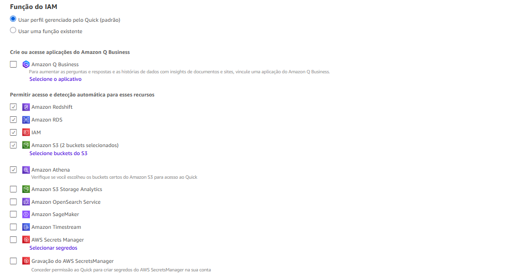
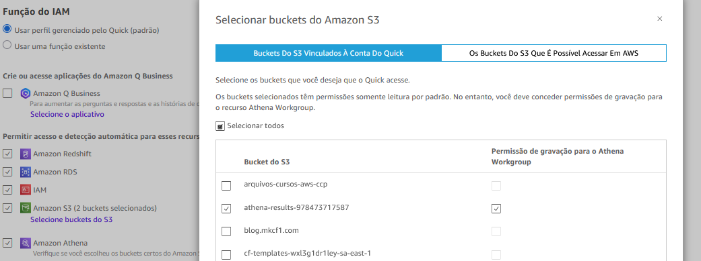

### 4. Criar a fonte de dados

Depois, foi criada uma fonte de dados no QuickSight com as seguintes configuracoes:

- tipo: `Athena`;
- workgroup: `quicksight-vendas`;
- nome da fonte de dados nas capturas: `meudatasource2`.

Observacao:

Nas capturas do projeto, a fonte aparece como `meudatasource2` porque ela foi recriada durante os testes. Se preferir, voce pode usar outro nome, desde que mantenha consistencia nas etapas seguintes.

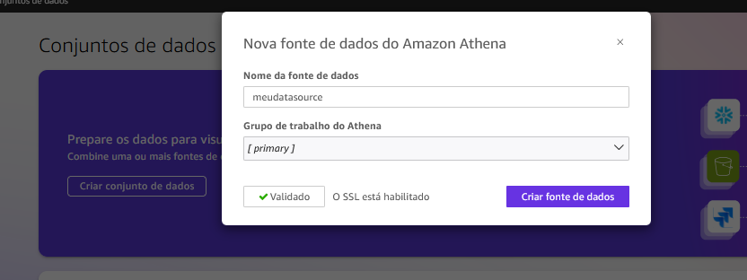

### 5. Criar o conjunto de dados

Depois, foi criado um conjunto de dados a partir da fonte de dados:

- datasource usado nas capturas: `meudatasource2`;
- tabela escolhida: `orders`;
- modo de armazenamento escolhido: `SPICE`.

Neste estudo, o conjunto de dados foi carregado em `SPICE` para melhorar a performance das analises e tornar a exploracao dos dados mais rapida dentro do QuickSight.

O QuickSight tambem oferece a outra opcao, que e consultar diretamente a fonte de dados, sem carregar os dados em SPICE.

Para este caso, foi mantido o uso de `SPICE`, mas a consulta direta na fonte tambem poderia ter sido utilizada dependendo da necessidade de atualizacao, volume de dados e estrategia de uso.

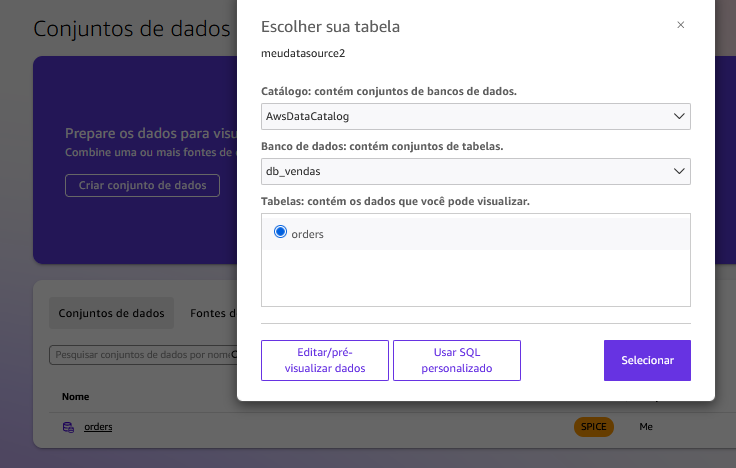

### 6. Converter colunas de data

No conjunto de dados, as duas colunas de data que estavam como `string` foram convertidas para o tipo `date`:

- `order_date`;
- `delivery_date`.

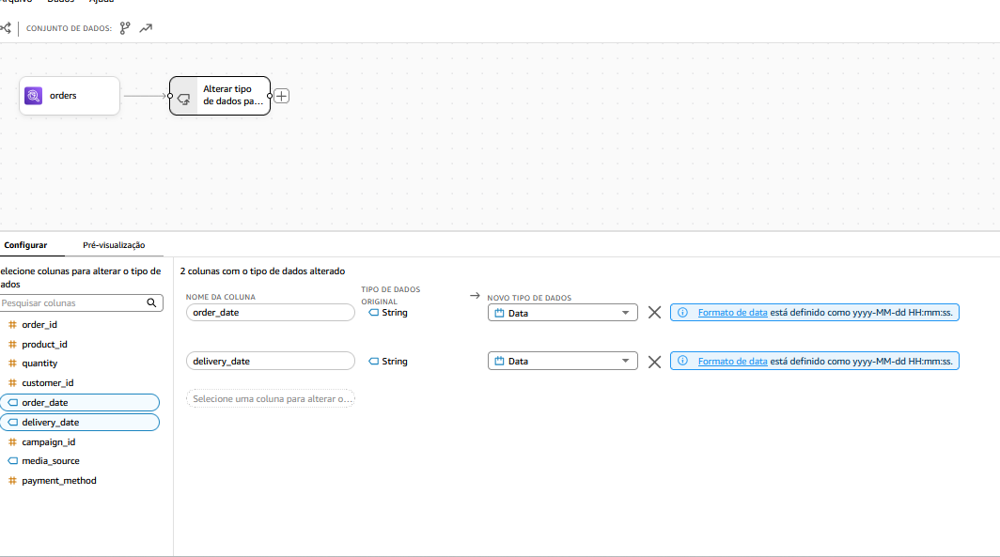
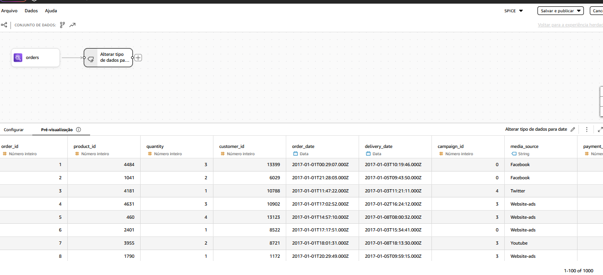

### 7. Criar as analises

Depois, foram criadas analises em cima do conjunto de dados com 3 graficos.

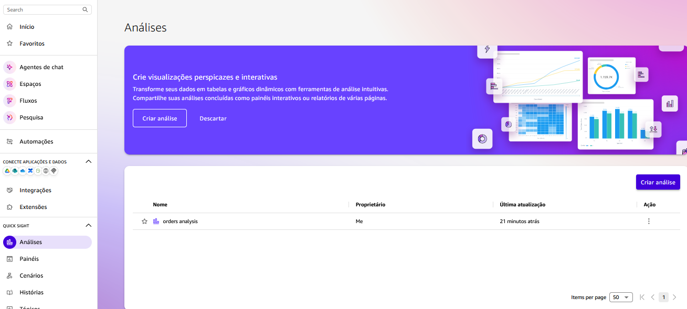

Temas analisados:

- o dia com maior numero de pedidos;
- a diferenca entre periodos ao longo do dia;
- o volume de registros por midia e por campanha.
- uma previsao futura de 60 dias com uso de forecast no grafico temporal.

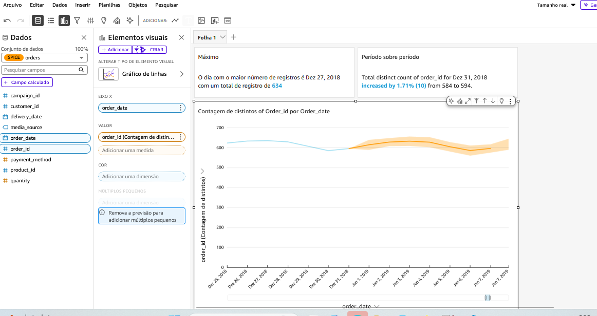
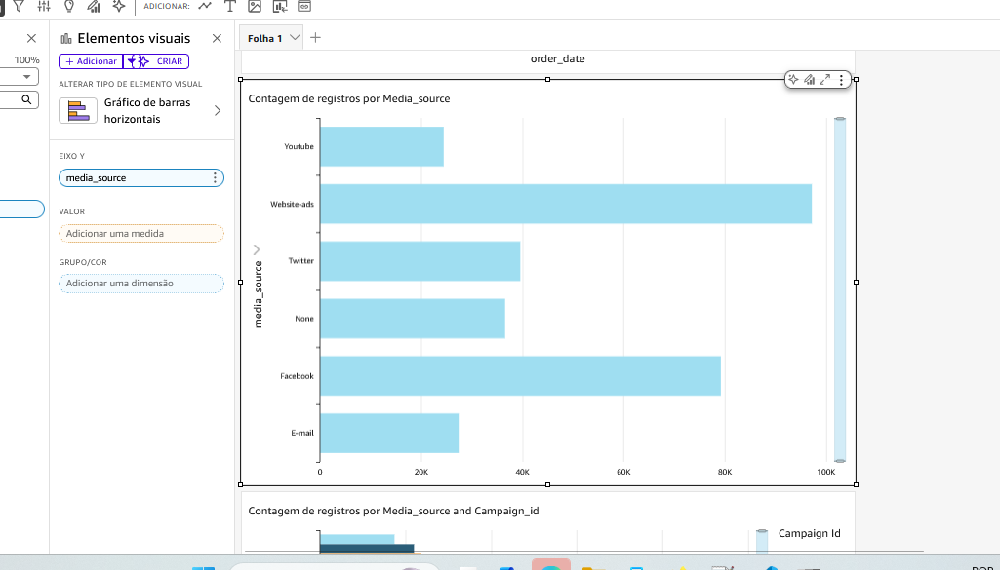
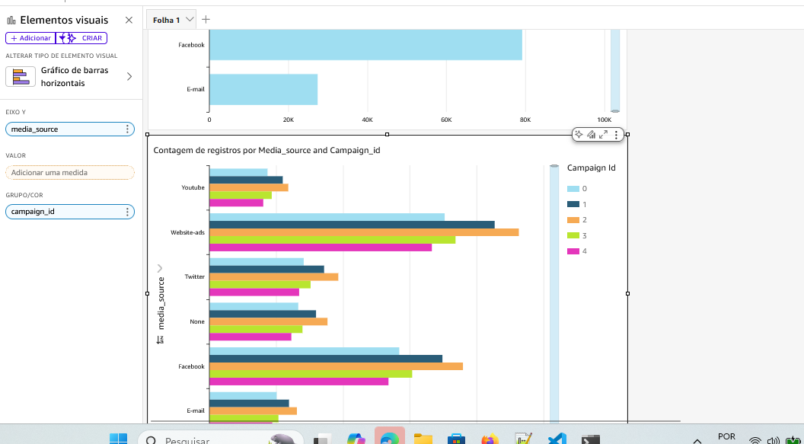

### 8. Dashboard

Por fim, as analises foram organizadas em um dashboard para consolidar a visualizacao dos resultados.

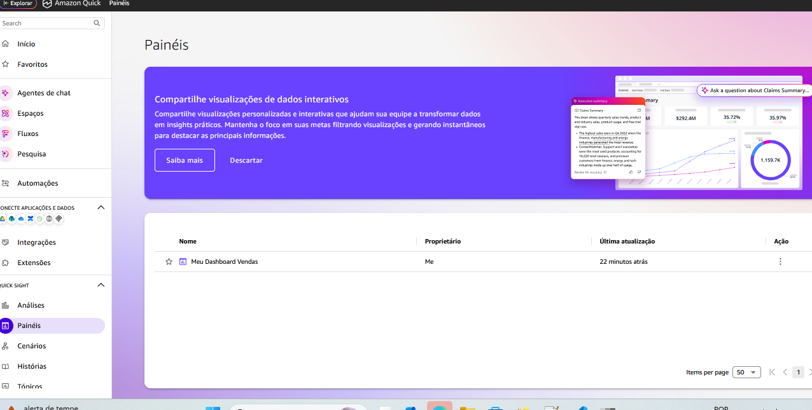
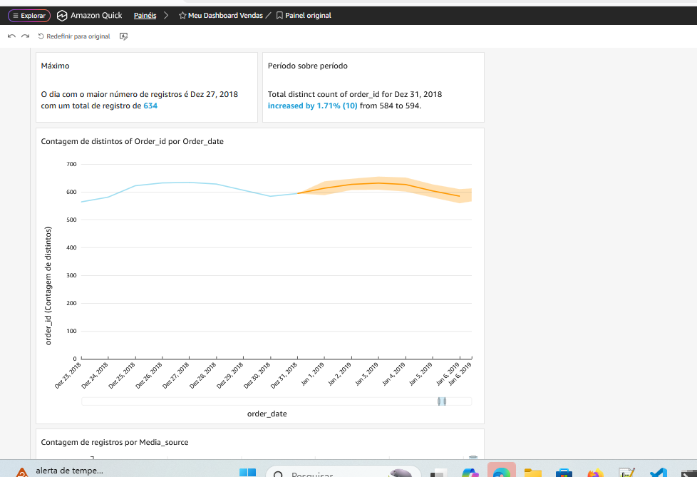
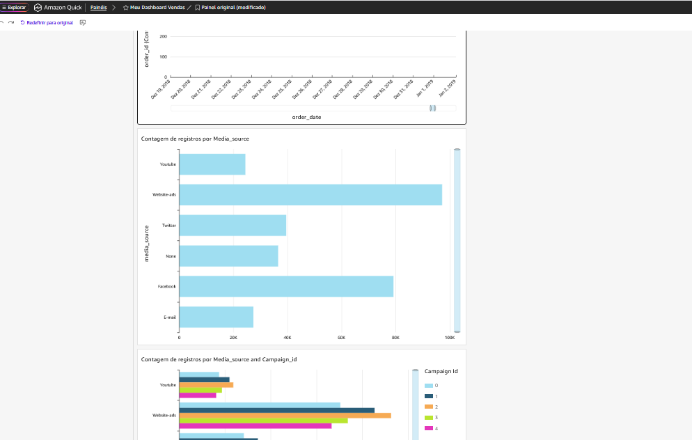

## Encerramento do ambiente

Ao finalizar os testes, lembre-se de destruir a infraestrutura criada pelo Terraform para evitar custos desnecessarios.

Comando:

```bash
terraform destroy
```

Observacoes importantes:

- o bucket de resultados do Athena pode acumular arquivos de consultas e impedir o `terraform destroy` se ele nao estiver vazio;
- neste projeto, a variavel `force_destroy_buckets` esta com valor padrao `true`, entao o Terraform pode remover os objetos dos buckets automaticamente durante o `destroy`;
- a conta do QuickSight, as fontes de dados, os conjuntos de dados, as analises e os dashboards criados manualmente no console nao sao removidos pelo `terraform destroy`;
- se voce nao for mais usar o ambiente, revise tambem os recursos criados manualmente no QuickSight para evitar custos recorrentes.

### Encerramento da conta do QuickSight

Se voce nao pretende mais usar o QuickSight apos o estudo, o mais seguro e revisar tambem a propria conta/subscription do servico, e nao apenas apagar os recursos criados no console.

Apagar somente dashboards, analises, datasets e data sources pode nao ser suficiente para encerrar toda a cobranca do QuickSight, porque a AWS tambem considera o modelo de assinatura e os usuarios provisionados no servico.

De forma pratica:

- se voce ainda pretende continuar estudando ou reutilizar o ambiente, pode manter a conta do QuickSight e apenas remover os recursos criados;
- se voce nao pretende mais usar o servico, avalie encerrar tambem a conta/subscription do QuickSight para evitar cobrancas futuras;
- a exclusao da conta do QuickSight e uma acao global da conta AWS e remove os dados do servico em todas as regioes.

Referencias oficiais da AWS:

- gerenciamento de subscriptions do QuickSight: <https://docs.aws.amazon.com/en_us/quicksight/latest/user/manage-qs-subscriptions.html>
- API oficial para exclusao da conta/subscription: <https://docs.aws.amazon.com/quicksight/latest/APIReference/API_DeleteAccountSubscription.html>
- pagina oficial de precos do QuickSight: <https://aws.amazon.com/quick/quicksight/pricing/>

## Custos envolvidos

Os custos deste projeto dependem principalmente do uso de QuickSight, Athena, S3 e Glue.

Como este projeto usa a regiao `us-east-1`, os exemplos abaixo consideram essa regiao e os valores consultados em **25 de marco de 2026**. Esses valores podem mudar com o tempo.

Principais pontos de custo:

- **Amazon Athena**: consultas SQL sao cobradas por volume processado, a **$5 por TB lido**, com minimo de **10 MB por consulta**;
- **AWS Glue Data Catalog**: os **primeiros 1 milhao de objetos** e os **primeiros 1 milhao de acessos** por mes ficam na faixa gratuita;
- **Amazon S3**: ha custo de armazenamento e de requisicoes; em exemplos oficiais da AWS, o **S3 Standard em us-east-1** aparece com valor de referencia de **$0.023 por GB/mes**, com requisicoes `PUT/LIST` em torno de **$0.005 por 1.000** e `GET` em torno de **$0.0004 por 1.000**;
- **Amazon QuickSight**: o custo tende a ser o principal deste estudo. Para os exemplos abaixo, foi considerado o modelo de cobranca por usuario consultado na pagina oficial: um usuario **Author** a **$24 por usuario/mes**, um **Reader** a **$3 por usuario/mes**, e capacidade **SPICE adicional** a **$0.38 por GB/mes**. Cada Author provisionado inclui **10 GB de SPICE**. Outros modelos de cobranca, como capacity pricing para sessoes de Reader, podem mudar o valor final.

### Exemplos de custo

#### Exemplo 1. Laboratorio individual

Cenario:

- 1 usuario Author no QuickSight;
- menos de 1 GB armazenado em S3;
- Glue Catalog com poucos objetos, ainda dentro da faixa gratuita;
- 100 GB lidos no Athena ao longo do mes;
- uso de SPICE dentro dos 10 GB incluidos no Author.

Estimativa:

- QuickSight Author: **$24.00/mes**;
- S3: aproximadamente **$0.02/mes** para menos de 1 GB armazenado;
- Athena: cerca de **$0.50/mes** para 100 GB lidos;
- Glue Data Catalog: **$0.00** dentro da faixa gratuita.

Total aproximado:

- **$24.52/mes**, sem considerar impostos e pequenas variacoes de requisicoes.

#### Exemplo 2. Pequeno uso em equipe

Cenario:

- 1 usuario Author;
- 5 usuarios Reader;
- 5 GB armazenados em S3;
- 1 TB lido no Athena no mes;
- 30 GB totais em SPICE, ou seja, 20 GB adicionais alem dos 10 GB incluidos no Author.

Estimativa:

- QuickSight Author: **$24.00/mes**;
- QuickSight Readers: **5 x $3 = $15.00/mes**;
- SPICE adicional: **20 x $0.38 = $7.60/mes**;
- Athena: **1 x $5 = $5.00/mes**;
- S3: aproximadamente **$0.12/mes** para 5 GB armazenados;
- Glue Data Catalog: **$0.00** se continuar dentro da faixa gratuita.

Total aproximado:

- **$51.72/mes**, sem considerar impostos e custos residuais de requisicoes.

### Referencias de preco

- Athena pricing: <https://aws.amazon.com/athena/pricing/>
- Glue pricing: <https://aws.amazon.com/glue/pricing/>
- S3 pricing: <https://aws.amazon.com/s3/pricing/>
- QuickSight pricing: <https://aws.amazon.com/quick/quicksight/pricing/>

## Estrutura do projeto

```text
quicksight-vendas/
|-- assets/
|   `-- imagens do processo e dashboards
|-- athena.tf
|-- data/
|   `-- orders_full.csv
|-- data.tf
|-- main.tf
|-- s3.tf
|-- variables.tf
`-- version.tf
```

## Schema usado na tabela `orders`

O arquivo `data/orders_full.csv` possui o seguinte schema:

| Coluna | Tipo |
|---|---|
| order_id | int |
| product_id | int |
| quantity | int |
| customer_id | int |
| order_date | string |
| delivery_date | string |
| campaign_id | int |
| media_source | string |
| payment_method | int |
