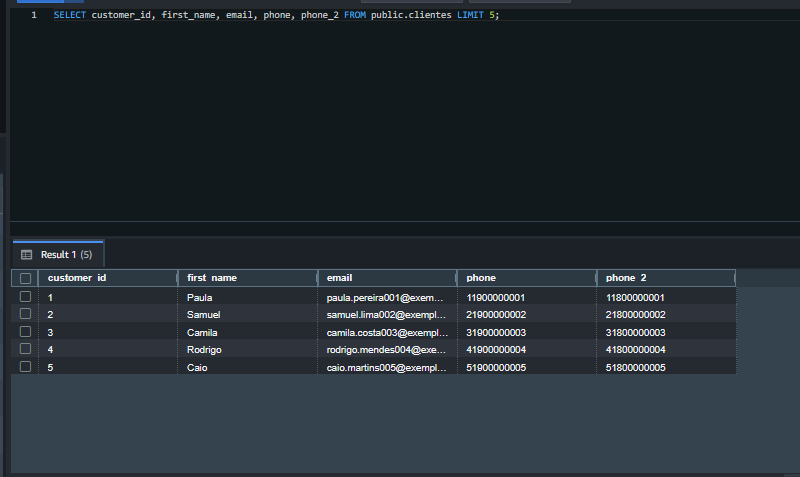
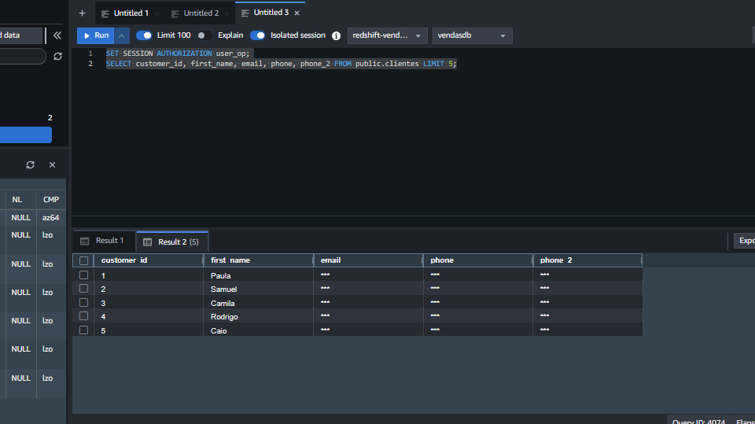

# Amazon Redshift - Dynamic Data Masking Demo

Projeto educacional demonstrando como implementar mascaramento dinâmico de dados (Dynamic Data Masking) no Amazon Redshift para proteger informações sensíveis.

> 🛠️ **Infraestrutura como Código**: Este projeto inclui código Terraform para provisionamento automático da infraestrutura AWS.

## 📋 Pré-requisitos

- Cluster Amazon Redshift ativo
- Bucket S3 com os dados de clientes
- IAM Role configurada para acesso do Redshift ao S3
- Cliente SQL (Query Editor v2, DBeaver, etc.)

## 🎯 Objetivo

Demonstrar como diferentes grupos de usuários podem ter acesso aos mesmos dados com níveis diferentes de visibilidade:
- **Recursos Humanos**: Visualiza dados completos (email e telefones)
- **Operações**: Visualiza dados mascarados (***)

## 📊 Estrutura dos Dados

Arquivo CSV: `customers_1.csv`
```csv
customer_id,first_name,last_name,email,phone,phone 2,address
1,Paula,Pereira,paula.pereira001@exemplo.com,11900000001,11800000001,Rua A 107
2,Samuel,Lima,samuel.lima002@exemplo.com,21900000002,21800000002,Rodovia B 114
```

## 🏗️ Arquitetura

```
┌─────────────┐
│   S3 Bucket │
│ (CSV Files) │
└──────┬──────┘
       │ COPY Command
       ▼
┌─────────────────────────────┐
│   Amazon Redshift Cluster   │
│                             │
│  ┌─────────────────────┐   │
│  │  Table: clientes    │   │
│  └─────────────────────┘   │
│           │                 │
│           ├─────────────────┤
│           │                 │
│  ┌────────▼────────┐       │
│  │ Masking Policy  │       │
│  │  - mask_email   │       │
│  │  - mask_phone   │       │
│  └─────────────────┘       │
│           │                 │
│     ┌─────┴─────┐          │
│     ▼           ▼          │
│  ┌─────┐    ┌─────┐       │
│  │ RH  │    │ OPS │       │
│  │Full │    │Mask │       │
│  └─────┘    └─────┘       │
└─────────────────────────────┘
```

## 🚀 Passo a Passo

### 0️⃣ Provisionar Infraestrutura com Terraform (Opcional)

O Terraform neste projeto cria:
- **VPC** com subnets públicas e privadas
- **Cluster Redshift** (dc2.large, 1 node)
- **Bucket S3** para armazenar os arquivos CSV
- **IAM Role** para o Redshift acessar o S3
- **Security Group** configurado

> ⚠️ **Nota de Segurança**: O cluster está configurado com `enhanced_vpc_routing = false` para simplificar o acesso ao S3. Em produção, considere habilitar o Enhanced VPC Routing e configurar VPC Endpoints para maior segurança.

```bash
terraform init
terraform plan
terraform apply
```

Após o `terraform apply`, anote os outputs:
- `redshift_cluster_endpoint`
- `s3_bucket_name`
- `iam_role_arn`

### 1️⃣ Criar a Tabela

```sql
CREATE TABLE IF NOT EXISTS public.clientes (
    customer_id INTEGER,
    first_name  VARCHAR(50),
    last_name   VARCHAR(50),
    email       VARCHAR(100),
    phone       VARCHAR(20),
    phone_2     VARCHAR(20),
    address     VARCHAR(100)
);
```

### 2️⃣ Carregar Dados do S3

> ⚠️ **Importante**: Substitua os valores abaixo pelos seus:
> - `nome-do-seu-bucket`: Nome do seu bucket S3
> - `123456789012`: Seu AWS Account ID
> - `redshift-s3-role`: Nome da sua IAM Role

```sql
COPY clientes
FROM 's3://nome-do-seu-bucket/clientes/'
IAM_ROLE 'arn:aws:iam::123456789012:role/redshift-s3-role'
DELIMITER ','
IGNOREHEADER 1
REGION 'us-east-1';
```

### 3️⃣ Verificar Dados Carregados

```sql
SELECT * FROM public.clientes LIMIT 10;
```

### 4️⃣ Configurar Roles, Grupos e Usuários

```sql
-- Criar ROLES
CREATE ROLE role_recursosHumanos;
CREATE ROLE role_operacoes;

-- Criar GRUPOS
CREATE GROUP recursosHumanos;
CREATE GROUP operacoes;

-- Criar USUÁRIOS (⚠️ troque as senhas em produção)
CREATE USER user_rh PASSWORD 'SenhaForte123!';
CREATE USER user_op PASSWORD 'SenhaForte123!';

-- Adicionar usuários aos grupos
ALTER GROUP recursosHumanos ADD USER user_rh;
ALTER GROUP operacoes ADD USER user_op;

-- Conceder roles aos usuários
GRANT ROLE role_recursosHumanos TO user_rh;
GRANT ROLE role_operacoes TO user_op;
```

### 5️⃣ Conceder Permissões de Leitura

```sql
-- Permitir acesso ao schema
GRANT USAGE ON SCHEMA public TO ROLE role_recursosHumanos;
GRANT USAGE ON SCHEMA public TO ROLE role_operacoes;

-- Permitir SELECT na tabela
GRANT SELECT ON TABLE public.clientes TO ROLE role_recursosHumanos;
GRANT SELECT ON TABLE public.clientes TO ROLE role_operacoes;
```

### 6️⃣ Aplicar Mascaramento de Dados

#### Policy para Email

```sql
CREATE MASKING POLICY mask_email
WITH (val VARCHAR(100))
USING ('***'::TEXT);

ATTACH MASKING POLICY mask_email
ON public.clientes(email)
TO ROLE role_operacoes
PRIORITY 20;
```

#### Policy para Telefones

```sql
CREATE MASKING POLICY mask_phone
WITH (val VARCHAR(20))
USING ('***'::TEXT);

ATTACH MASKING POLICY mask_phone
ON public.clientes(phone)
TO ROLE role_operacoes
PRIORITY 20;

ATTACH MASKING POLICY mask_phone
ON public.clientes(phone_2)
TO ROLE role_operacoes
PRIORITY 20;
```

### 7️⃣ Testar o Mascaramento

#### Como Usuário de Recursos Humanos (dados completos)

```sql
SET SESSION AUTHORIZATION user_rh;
SELECT customer_id, first_name, email, phone, phone_2 
FROM public.clientes 
LIMIT 5;
```

**Resultado esperado:**
```
customer_id | first_name | email                          | phone        | phone_2
------------|------------|--------------------------------|--------------|-------------
1           | Paula      | paula.pereira001@exemplo.com   | 11900000001  | 11800000001
2           | Samuel     | samuel.lima002@exemplo.com     | 21900000002  | 21800000002
```



#### Como Usuário de Operações (dados mascarados)

```sql
SET SESSION AUTHORIZATION user_op;
SELECT customer_id, first_name, email, phone, phone_2 
FROM public.clientes 
LIMIT 5;
```

**Resultado esperado:**
```
customer_id | first_name | email | phone | phone_2
------------|------------|-------|-------|--------
1           | Paula      | ***   | ***   | ***
2           | Samuel     | ***   | ***   | ***
```



#### Voltar ao Usuário Admin

```sql
RESET SESSION AUTHORIZATION;
```

## 🧹 Limpeza (Opcional)

### Remover Políticas de Mascaramento

```sql
-- Primeiro, desanexar as políticas das colunas
DETACH MASKING POLICY mask_email 
ON public.clientes(email) 
FROM ROLE role_operacoes;

DETACH MASKING POLICY mask_phone 
ON public.clientes(phone) 
FROM ROLE role_operacoes;

DETACH MASKING POLICY mask_phone 
ON public.clientes(phone_2) 
FROM ROLE role_operacoes;

-- Depois, remover as políticas
DROP MASKING POLICY mask_email;
DROP MASKING POLICY mask_phone;
```

### Remover Usuários e Grupos

```sql
DROP USER user_rh;
DROP USER user_op;
DROP GROUP recursosHumanos;
DROP GROUP operacoes;
DROP ROLE role_recursosHumanos;
DROP ROLE role_operacoes;
```

### Remover Tabela

```sql
DROP TABLE public.clientes;
```

### Destruir Infraestrutura Terraform

Para remover todos os recursos AWS criados pelo Terraform:

```bash
terraform destroy
```

> ⚠️ **Atenção**: Este comando irá destruir o cluster Redshift, bucket S3, VPC e todos os recursos relacionados.

## 📚 Recursos Adicionais

- [AWS Redshift - Dynamic Data Masking](https://docs.aws.amazon.com/redshift/latest/dg/t_ddm.html)
- [AWS Redshift - User and Group Management](https://docs.aws.amazon.com/redshift/latest/dg/r_Users_groups_and_databases.html)
- [AWS Redshift - COPY Command](https://docs.aws.amazon.com/redshift/latest/dg/r_COPY.html)

## 💡 Conceitos Aprendidos

- ✅ Dynamic Data Masking no Amazon Redshift
- ✅ Gerenciamento de Roles, Grupos e Usuários
- ✅ Políticas de Mascaramento (Masking Policies)
- ✅ Controle de acesso baseado em roles (RBAC)
- ✅ Comando COPY para carga de dados do S3
- ✅ Proteção de dados sensíveis (PII)

## ⚠️ Avisos de Segurança

- **Nunca** commite credenciais reais no GitHub
- Use senhas fortes em ambientes de produção
- Revise as políticas de IAM antes de aplicar em produção
- Este é um projeto educacional - adapte para suas necessidades de segurança

## 📝 Licença

Este projeto é de código aberto para fins educacionais.

---

**Desenvolvido para demonstração de Dynamic Data Masking no Amazon Redshift** 🚀