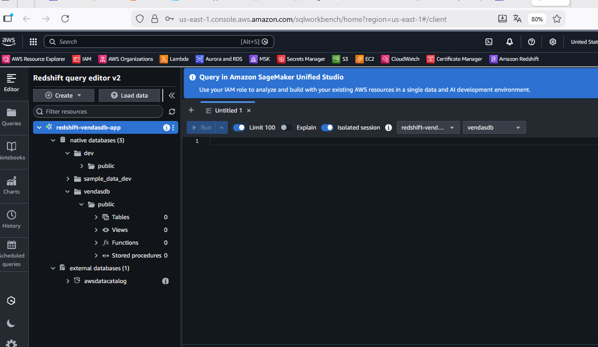
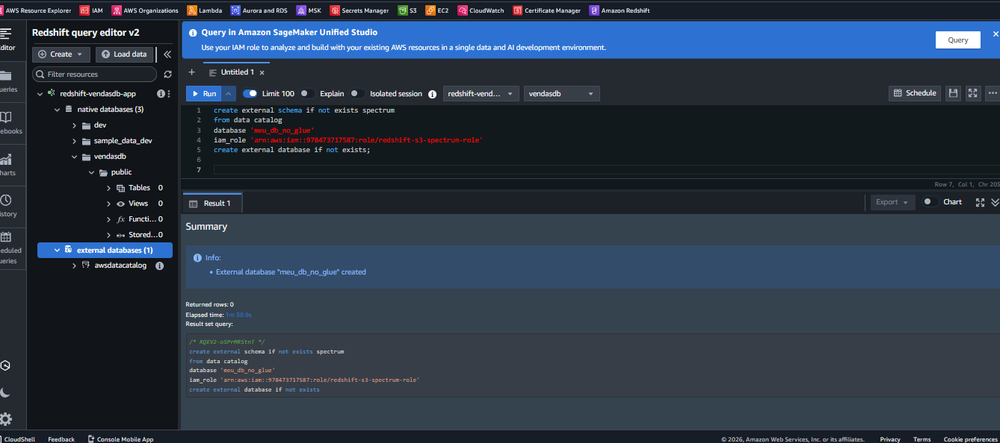
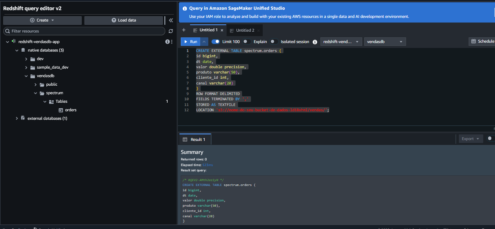
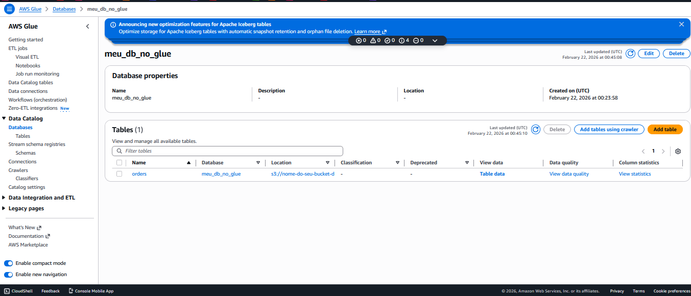
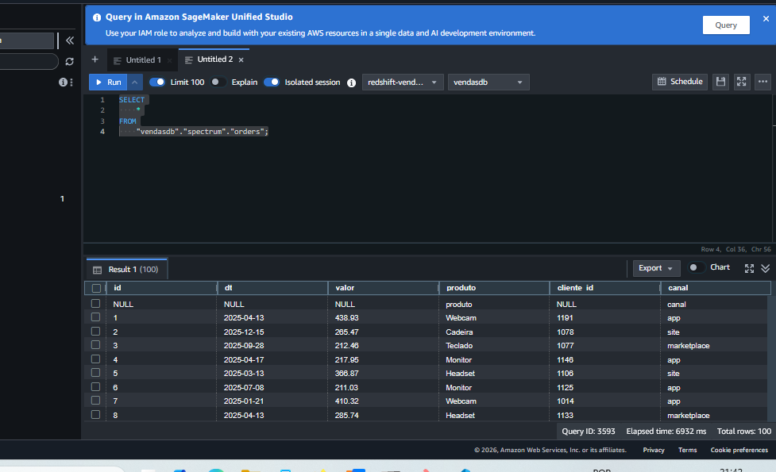

# Amazon Redshift Spectrum - Consulta de Dados no S3

## 📋 Descrição

Este projeto demonstra como utilizar o **Amazon Redshift Spectrum** para consultar dados armazenados no Amazon S3 diretamente, sem a necessidade de carregá-los no Redshift. A solução utiliza o AWS Glue Data Catalog para catalogar as tabelas externas e permite consultas SQL sobre arquivos CSV no S3.

### O que é Redshift Spectrum?

Redshift Spectrum é uma funcionalidade do Amazon Redshift que permite executar consultas SQL diretamente em arquivos armazenados no Amazon S3, sem precisar carregar os dados no data warehouse. Isso possibilita:

- ✅ Consultar grandes volumes de dados no S3 sem movimentação
- ✅ Reduzir custos de armazenamento no Redshift
- ✅ Escalar consultas de forma independente do cluster Redshift
- ✅ Integrar dados estruturados e semi-estruturados

## 🏗️ Arquitetura

O projeto provisiona a seguinte infraestrutura com **Enhanced VPC Routing** habilitado para máxima segurança:

```
┌──────────────────────────────────────────────────────────────────┐
│                          VPC Privada                             │
│                                                                  │
│  Query Editor V2  ──────► Amazon Redshift Cluster               │
│                                │  (Enhanced VPC Routing)         │
│                                │                                 │
│                                ▼                                 │
│                    Redshift Spectrum Engine                      │
│                                │                                 │
│                    ┌───────────┴───────────┐                    │
│                    │                       │                     │
│                    ▼                       ▼                     │
│            VPC Endpoint Glue       VPC Endpoint STS             │
│            (Interface)             (Interface)                  │
│                    │                       │                     │
│                    └───────────┬───────────┘                    │
│                                │                                 │
│                                ▼                                 │
│                         AWS Glue Catalog                         │
│                         (meu_db_no_glue)                         │
│                                                                  │
│                    VPC Endpoint S3 (Gateway)                     │
│                                │                                 │
│                                ▼                                 │
│                         Amazon S3 Bucket                         │
│                         ├── vendas/                              │
│                         │   └── vendas_1.csv                     │
│                         └── clientes/                            │
│                             └── customers_1.csv                  │
│                                                                  │
└──────────────────────────────────────────────────────────────────┘
```

## 📦 Recursos Criados

Este projeto Terraform provisiona os seguintes recursos AWS:

### Redshift
- **Cluster Redshift** (single-node, ra3.large)
    - Database: `vendasdb`
    - Criptografia habilitada com KMS
    - Enhanced VPC Routing
    - Logs habilitados

### S3
- **Bucket de dados** - Armazena arquivos CSV (vendas e clientes)
- **Bucket de logs** - Armazena logs de auditoria do Redshift
- Criptografia AES256
- Bloqueio de acesso público

### IAM
- **Role IAM** para Redshift Spectrum
    - Permissões de leitura/escrita no S3
    - Permissões no AWS Glue Data Catalog

### Networking
- Security Group para Redshift
- Security Group para VPC Endpoints
- Subnet Group com 3 AZs (Multi-AZ)
- **VPC Endpoints** (obrigatórios para Enhanced VPC Routing):
  - **S3 Gateway Endpoint** - Acesso privado ao S3 sem custos adicionais
  - **Glue Interface Endpoint** - Comunicação segura com AWS Glue Data Catalog
  - **STS Interface Endpoint** - Autenticação segura via AWS STS

### Glue
- Database externo `meu_db_no_glue` (criado via SQL, não gerenciado pelo Terraform)
- Tabela externa `spectrum.orders` (criada via SQL, não gerenciada pelo Terraform)

> ⚠️ **Importante**: O database e a tabela do Glue são criados via comandos SQL no Query Editor e **não são gerenciados pelo Terraform**. Portanto, devem ser deletados manualmente antes do `terraform destroy`. Veja a seção [Limpeza dos Recursos](#-limpeza-dos-recursos) para instruções detalhadas.

## 📋 Pré-requisitos

- [Terraform](https://www.terraform.io/downloads.html) >= 1.0
- [AWS CLI](https://aws.amazon.com/cli/) configurado
- Credenciais AWS com permissões para criar:
    - Redshift Cluster
    - S3 Buckets
    - IAM Roles e Policies
    - KMS Keys
    - VPC Resources

## 🚀 Como Usar

### 1. Inicialize o Terraform

```bash
terraform init
```

### 2. Revise o plano de execução

```bash
terraform plan
```

### 3. Aplique a infraestrutura

```bash
terraform apply
```

Confirme digitando `yes` quando solicitado.

### 5. Anote os outputs

Após a execução bem-sucedida, o Terraform exibirá informações importantes:

```shell
Outputs:

database_redshift = "vendasdb"
endpoint_redshift = "redshift-vendasdb-app.c1m9hl5jewfc.us-east-1.redshift.amazonaws.com:5439"
nome_bucket = "nome-do-seu-bucket-de-dados-ldi8xhml"
pass_redshift = "A6HuopVMi1a"
role_redshift_spectrum = "arn:aws:iam::978473717587:role/redshift-s3-spectrum-role"
user_redshift = "meu_usuario"
```

> ⚠️ **Importante**: Guarde essas credenciais em local seguro. A senha é gerada aleatoriamente.

## 🔍 Configurando o Redshift Spectrum

### 1. Conectar ao Redshift Query Editor V2

Acesse o [Query Editor V2](https://console.aws.amazon.com/sqlworkbench/home) no console AWS e conecte-se usando as credenciais dos outputs:



### 2. Criar o Schema Externo

Execute o comando SQL abaixo para criar um schema externo que aponta para o AWS Glue Data Catalog:

```sql
CREATE EXTERNAL SCHEMA IF NOT EXISTS spectrum
FROM DATA CATALOG
DATABASE 'meu_db_no_glue'
IAM_ROLE 'arn:aws:iam::978473717587:role/redshift-s3-spectrum-role'
CREATE EXTERNAL DATABASE IF NOT EXISTS;
```

> 📝 **Nota**: Substitua o ARN da role pelo valor do output `role_redshift_spectrum`.



### 3. Criar a Tabela Externa

Crie a tabela externa que mapeia os arquivos CSV no S3:

```sql
CREATE EXTERNAL TABLE spectrum.orders (
    id bigint,
    dt date,
    valor double precision,
    produto varchar(50),
    cliente_id int,
    canal varchar(20)
)
ROW FORMAT DELIMITED
FIELDS TERMINATED BY ','
STORED AS TEXTFILE
LOCATION 's3://nome-do-seu-bucket-de-dados-ldi8xhml/vendas/';
```

> 📝 **Nota**: Substitua o nome do bucket pelo valor do output `nome_bucket`.



### 4. Verificar no AWS Glue Catalog

Acesse o [AWS Glue Console](https://console.aws.amazon.com/glue/home) e verifique que o database `meu_db_no_glue` e a tabela `orders` foram criados:



### 5. Consultar os Dados

Agora você pode consultar os dados diretamente do S3:

```sql
SELECT *
FROM "vendasdb"."spectrum"."orders"
LIMIT 10;
```



Exemplos de consultas analíticas:

```sql
-- Total de vendas por produto
SELECT produto, SUM(valor) as total_vendas
FROM spectrum.orders
GROUP BY produto
ORDER BY total_vendas DESC;

-- Vendas por canal
SELECT canal, COUNT(*) as qtd_vendas, SUM(valor) as total
FROM spectrum.orders
GROUP BY canal;

-- Vendas por período
SELECT DATE_TRUNC('month', dt) as mes, SUM(valor) as total
FROM spectrum.orders
GROUP BY mes
ORDER BY mes;
```

## 📁 Estrutura do Projeto

```
.
├── assets/                          # Imagens do README
├── data.tf                          # Data sources (VPC, Subnets, Account)
├── iam.tf                           # IAM Role e Policies para Spectrum
├── output.tf                        # Outputs do Terraform
├── providers.tf                     # Configuração do provider AWS
├── redshift.tf                      # Cluster Redshift e configurações
├── s3.tf                            # Buckets S3 e upload de arquivos
├── security.tf                      # Security Groups
├── versions.tf                      # Versões do Terraform e providers
├── vpc-endpoint.tf                  # VPC Endpoints (opcional)
├── vendas_1.csv                     # Dados de exemplo - vendas
├── customers_1.csv                  # Dados de exemplo - clientes
└── README.md                        # Este arquivo
```

## 💰 Custos Estimados

> ⚠️ **ATENÇÃO**: Este projeto provisiona recursos que geram custos na AWS!

### Principais custos:
- **Amazon Redshift** (ra3.large single-node): ~$0.375/hora (~$270/mês se mantido ligado)
- **VPC Endpoints Interface** (Glue + STS): ~$14.60/mês ($0.01/hora × 2 endpoints)
- **VPC Endpoint Gateway** (S3): **Gratuito**
- **Amazon S3**: Armazenamento + requisições (geralmente < $1/mês para testes)
- **Redshift Spectrum**: $5 por TB de dados escaneados
- **AWS Glue Data Catalog**: Primeiros 1 milhão de objetos gratuitos

**Custo Total Estimado**: ~$285/mês (se cluster mantido ligado 24/7)

### Recomendações para reduzir custos:
- ✅ Destrua os recursos após os testes
- ✅ Use Redshift Serverless para workloads intermitentes
- ✅ Configure alertas de billing no AWS Budgets
- ✅ Para estudos, considere desabilitar Enhanced VPC Routing (economia de ~$14.60/mês)
- ✅ Pause o cluster Redshift quando não estiver em uso

## 🧹 Limpeza dos Recursos

> ⚠️ **IMPORTANTE**: Siga os passos na ordem para evitar erros de dependência!

Para evitar custos desnecessários, destrua todos os recursos criados seguindo esta sequência:

### Passo 1: Remover Recursos Criados pelo Query Editor

Antes de executar o `terraform destroy`, você precisa **deletar manualmente** os recursos criados via SQL no Query Editor V2:

#### 1.1. Conectar ao Redshift Query Editor V2

Acesse o [Query Editor V2](https://console.aws.amazon.com/sqlworkbench/home) e conecte-se ao cluster.

#### 1.2. Deletar a Tabela Externa

```sql
-- Deletar a tabela externa criada no Spectrum
DROP TABLE IF EXISTS spectrum.orders;
```

#### 1.3. Deletar o Schema Externo

```sql
-- Deletar o schema externo
DROP SCHEMA IF EXISTS spectrum;
```

#### 1.4. Deletar o Database do AWS Glue (Opcional)

O database `meu_db_no_glue` foi criado automaticamente pelo comando `CREATE EXTERNAL DATABASE IF NOT EXISTS`. Para removê-lo:

**Opção A: Via AWS Glue Console**
1. Acesse o [AWS Glue Console](https://console.aws.amazon.com/glue/home)
2. No menu lateral, clique em **Databases**
3. Selecione o database `meu_db_no_glue`
4. Clique em **Delete database**
5. Confirme a exclusão

**Opção B: Via AWS CLI**
```bash
aws glue delete-database --name meu_db_no_glue
```

> 📝 **Nota**: Se você não deletar o database do Glue, ele permanecerá na sua conta (sem custos, pois está dentro do free tier de 1 milhão de objetos).

### Passo 2: Destruir Infraestrutura com Terraform

Após remover os recursos do Query Editor, execute:

```bash
terraform destroy
```

Confirme digitando `yes` quando solicitado.

### O que será removido:

✅ Cluster Redshift  
✅ Buckets S3 (dados e logs)  
✅ IAM Roles e Policies  
✅ Security Groups  
✅ VPC Endpoints (Glue, STS, S3)  
✅ KMS Keys  
✅ Subnet Groups  

> 💡 **Dica**: O Terraform irá remover automaticamente todos os recursos provisionados, incluindo os dados nos buckets S3 (configurado com `force_destroy = true`).

### Passo 3: Verificar Remoção Completa

Após o `terraform destroy`, verifique no console AWS:

1. **Redshift**: Cluster foi deletado
2. **S3**: Buckets foram removidos
3. **Glue**: Database `meu_db_no_glue` foi deletado (se você executou o Passo 1.4)
4. **VPC**: Endpoints foram removidos

### Troubleshooting

**Erro: "Cannot delete database because it contains tables"**
```
Solução: Execute o Passo 1.2 para deletar a tabela antes do database
```

**Erro: "Error deleting Redshift cluster: InvalidClusterState"**
```
Solução: Aguarde alguns minutos e tente novamente. O cluster pode estar em estado transitório.
```

**Erro: "Error deleting S3 bucket: BucketNotEmpty"**
```
Solução: Não deve ocorrer devido ao force_destroy = true, mas se ocorrer:
aws s3 rm s3://nome-do-bucket --recursive
```

### Resumo da Ordem de Limpeza

```
1. DROP TABLE spectrum.orders          (Query Editor)
2. DROP SCHEMA spectrum                 (Query Editor)
3. Delete database meu_db_no_glue       (Glue Console ou CLI)
4. terraform destroy                    (Terminal)
5. Verificar remoção completa           (Console AWS)
```

> ⚠️ **Atenção**: Se você pular o Passo 1 e executar apenas o `terraform destroy`, o database e a tabela do Glue permanecerão na sua conta. Embora não gerem custos (free tier), é uma boa prática removê-los para manter o ambiente limpo. Terraform irá remover automaticamente todos os recursos, incluindo os dados nos buckets S3 (configurado com `force_destroy = true`).

## 📚 Casos de Uso

- **Data Lake Analytics**: Consultar grandes volumes de dados históricos no S3
- **ETL Simplificado**: Processar dados sem movimentação prévia
- **Análise de Logs**: Consultar logs armazenados no S3
- **Integração de Dados**: Combinar dados do Redshift com dados no S3
- **Redução de Custos**: Manter dados frios no S3 e quentes no Redshift

## 🔗 Referências

### Documentação AWS
- [Amazon Redshift Spectrum](https://docs.aws.amazon.com/redshift/latest/dg/c-using-spectrum.html)
- [Enhanced VPC Routing](https://docs.aws.amazon.com/redshift/latest/mgmt/enhanced-vpc-routing.html)
- [AWS Glue Data Catalog](https://docs.aws.amazon.com/glue/latest/dg/catalog-and-crawler.html)
- [VPC Endpoints for AWS Services](https://docs.aws.amazon.com/vpc/latest/privatelink/privatelink-access-aws-services.html)
- [Gateway VPC Endpoints for S3](https://docs.aws.amazon.com/vpc/latest/privatelink/vpc-endpoints-s3.html)
- [Redshift Query Editor V2](https://docs.aws.amazon.com/redshift/latest/mgmt/query-editor-v2.html)
- [Security in Amazon Redshift](https://docs.aws.amazon.com/redshift/latest/mgmt/security.html)

### Ferramentas
- [Terraform AWS Provider](https://registry.terraform.io/providers/hashicorp/aws/latest/docs)
- [AWS Pricing Calculator](https://calculator.aws)

## 🔒 Segurança e Arquitetura de Rede

### Enhanced VPC Routing

Este projeto implementa **Enhanced VPC Routing** no Amazon Redshift, uma funcionalidade crítica de segurança que força todo o tráfego de rede do cluster a passar pela VPC, em vez de utilizar a rede pública da AWS.

#### Por que Enhanced VPC Routing?

Segundo a [documentação oficial da AWS](https://docs.aws.amazon.com/redshift/latest/mgmt/enhanced-vpc-routing.html), quando o Enhanced VPC Routing está habilitado:

> "Amazon Redshift forces all COPY and UNLOAD traffic between your cluster and your data repositories through your VPC. If Enhanced VPC Routing is not enabled, Amazon Redshift routes traffic through the internet, including traffic to other services within the AWS network."

**Benefícios de segurança:**

- 🔐 **Isolamento de Rede**: Todo tráfego permanece dentro da VPC, nunca atravessando a internet pública
- 🛡️ **Controle Granular**: Uso de Security Groups e NACLs para controlar todo o tráfego de entrada e saída
- 📊 **Auditoria Completa**: VPC Flow Logs capturam todo o tráfego de rede para análise de segurança
- 🔍 **Conformidade**: Atende requisitos de compliance que exigem isolamento de rede (PCI-DSS, HIPAA, SOC 2)
- 🚫 **Prevenção de Exfiltração**: Impede vazamento de dados através de rotas não autorizadas

### VPC Endpoints: Necessários para Enhanced VPC Routing

Com Enhanced VPC Routing habilitado, o Redshift **não pode** acessar serviços AWS pela internet. Por isso, os **VPC Endpoints são obrigatórios** para comunicação com:

#### 1. AWS Glue Data Catalog (Interface Endpoint)

```hcl
resource "aws_vpc_endpoint" "glue" {
  vpc_id              = data.aws_vpc.default.id
  service_name        = "com.amazonaws.${var.aws_region}.glue"
  vpc_endpoint_type   = "Interface"
  private_dns_enabled = true
}
```

**Função**: Permite que o Redshift Spectrum consulte metadados de tabelas externas no Glue Catalog via conexão privada.

**Sem este endpoint**: O comando `CREATE EXTERNAL SCHEMA FROM DATA CATALOG` falhará com timeout.

#### 2. AWS STS (Interface Endpoint)

```hcl
resource "aws_vpc_endpoint" "sts" {
  vpc_id              = data.aws_vpc.default.id
  service_name        = "com.amazonaws.${var.aws_region}.sts"
  vpc_endpoint_type   = "Interface"
  private_dns_enabled = true
}
```

**Função**: Permite que o Redshift assuma a IAM Role necessária para acessar S3 e Glue de forma segura.

**Referência**: [AWS Security Token Service endpoints](https://docs.aws.amazon.com/general/latest/gr/sts.html)

#### 3. Amazon S3 (Gateway Endpoint)

```hcl
resource "aws_vpc_endpoint" "s3" {
  vpc_id            = data.aws_vpc.default.id
  service_name      = "com.amazonaws.${var.aws_region}.s3"
  vpc_endpoint_type = "Gateway"
}
```

**Função**: Permite que o Redshift Spectrum leia dados diretamente do S3 sem tráfego pela internet.

**Vantagem**: Gateway Endpoints para S3 são **gratuitos** (sem custos adicionais).

**Referência**: [Gateway VPC endpoints for Amazon S3](https://docs.aws.amazon.com/vpc/latest/privatelink/vpc-endpoints-s3.html)

### Configuração de Security Groups

A arquitetura utiliza Security Groups separados para maior segurança:

**Security Group do Redshift:**
- Permite conexões internas na porta 5439 (comunicação entre nós)
- Permite tráfego de saída para VPC Endpoints

**Security Group dos VPC Endpoints:**
- Permite entrada HTTPS (porta 443) apenas do Security Group do Redshift
- Princípio do menor privilégio aplicado

### Fluxo de Comunicação Segura

```
1. Redshift executa: CREATE EXTERNAL SCHEMA FROM DATA CATALOG
   ↓
2. Tráfego é roteado pela VPC (Enhanced VPC Routing)
   ↓
3. Security Group permite saída do Redshift
   ↓
4. VPC Endpoint Glue recebe conexão HTTPS (porta 443)
   ↓
5. Glue Endpoint encaminha para AWS Glue Service via PrivateLink
   ↓
6. Resposta retorna pelo mesmo caminho privado
```

**Nenhum dado trafega pela internet pública em momento algum.**

### Custos dos VPC Endpoints

| Endpoint | Tipo | Custo Mensal (us-east-1) |
|----------|------|-------------------------|
| S3 | Gateway | **$0** (gratuito) |
| Glue | Interface | ~$7.30 ($0.01/hora) |
| STS | Interface | ~$7.30 ($0.01/hora) |
| **Total** | | **~$14.60/mês** |

**Referência**: [AWS PrivateLink Pricing](https://aws.amazon.com/privatelink/pricing/)

> 💡 **Nota**: O custo dos VPC Endpoints é justificado pelos benefícios de segurança, especialmente em ambientes de produção que exigem conformidade regulatória.

### Alternativa: Desabilitar Enhanced VPC Routing

Para **ambientes de desenvolvimento/estudos**, você pode optar por desabilitar o Enhanced VPC Routing:

```hcl
# redshift.tf
resource "aws_redshift_cluster" "default" {
  # ...
  enhanced_vpc_routing = false  # Tráfego via AWS Backbone
  # ...
}
```

**Consequências:**
- ✅ VPC Endpoints se tornam opcionais (economia de ~$14.60/mês)
- ✅ Tráfego usa a rede interna da AWS (AWS Backbone)
- ⚠️ Menor controle sobre o tráfego de rede
- ⚠️ Não recomendado para ambientes de produção

### Referências de Segurança

- [Enhanced VPC Routing - AWS Documentation](https://docs.aws.amazon.com/redshift/latest/mgmt/enhanced-vpc-routing.html)
- [Amazon Redshift Spectrum Best Practices](https://docs.aws.amazon.com/redshift/latest/dg/c-spectrum-external-performance.html)
- [AWS PrivateLink for AWS Services](https://docs.aws.amazon.com/vpc/latest/privatelink/privatelink-access-aws-services.html)
- [Security in Amazon Redshift](https://docs.aws.amazon.com/redshift/latest/mgmt/security.html)
- [AWS Well-Architected Framework - Security Pillar](https://docs.aws.amazon.com/wellarchitected/latest/security-pillar/welcome.html)

## 📝 Notas Adicionais

- O cluster Redshift é criado em uma VPC privada (não acessível publicamente)
- Enhanced VPC Routing está habilitado para máxima segurança
- VPC Endpoints garantem comunicação privada com serviços AWS
- Todos os dados permanecem dentro da rede privada da AWSente)
- Enhanced VPC Routing está habilitado para maior segurança
- Logs de auditoria são armazenados em bucket S3 separado
- A senha do Redshift é gerada aleatoriamente a cada apply
- Os arquivos CSV devem estar no formato correto (delimitados por vírgula)

## 🤝 Contribuições

Contribuições são bem-vindas! Sinta-se à vontade para abrir issues ou pull requests.

## 📄 Licença

Este projeto é fornecido como exemplo educacional.
