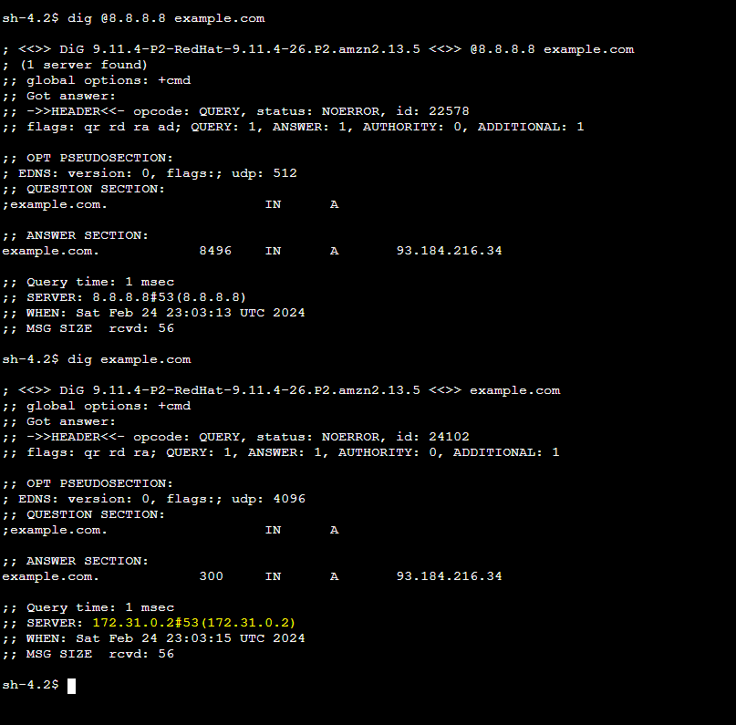

Este projeto utiliza Terraform para automatizar a criação de uma infraestrutura na AWS com o objetivo de configurar e testar o AWS Route 53 Resolver para o encaminhamento condicional de DNS.

## Recursos Criados

- **VPC na AWS:** Uma Virtual Private Cloud (VPC) é usada padrão da Conta.
- **Route 53 Resolver:** Configurado para demonstrar o encaminhamento condicional de DNS. Isso permite que as consultas DNS para um domínio específico sejam encaminhadas para um resolver DNS específico.
- **Instância EC2:** Utilizada para testar a configuração do DNS, realizando consultas ao domínio configurado.

## Como Usar

### Passos para Execução

1. **Inicialização do Terraform**

   Execute o comando abaixo para inicializar o diretório de trabalho do Terraform, o que prepara o ambiente para a criação dos recursos:

   ```bash
   terraform init
   ```

2. **Criação da Infraestrutura**

   Para criar os recursos na AWS conforme definido no projeto Terraform, execute:

   ```bash
   terraform apply
   ```

   Confirme a ação quando solicitado.

   3. **Teste da Resolução de DNS**

   Após a criação da infraestrutura, acesse a instância EC2 configurada via SSH. Dentro da instância, execute o comando a seguir para testar a resolução de DNS do domínio que você configurou:
   A partir dos resultados, podemos observar que o endereço IP 172.31.0.2 utilizado como resolver da nossa consulta DNS. No entanto, somente essa informação não é suficiente para confirmarmos definitivamente que a consulta passou pelo AWS Route 53 Resolver.

   Para ter certeza de que o Route 53 Resolver está processando nossas consultas DNS, é necessário habilitar o log de consultas no DNS do VPC Resolver e verificar os registros no Amazon CloudWatch. Essa etapa permitirá identificar claramente se as consultas DNS estão sendo resolvidas pelo serviço do Route 53 Resolve
   
   

   Substitua `example.com` pelo domínio específico configurado para o teste. Este comando utiliza o Google DNS (`8.8.8.8`) para simular a resolução de DNS que seria encaminhada pelo Route 53 Resolver.

