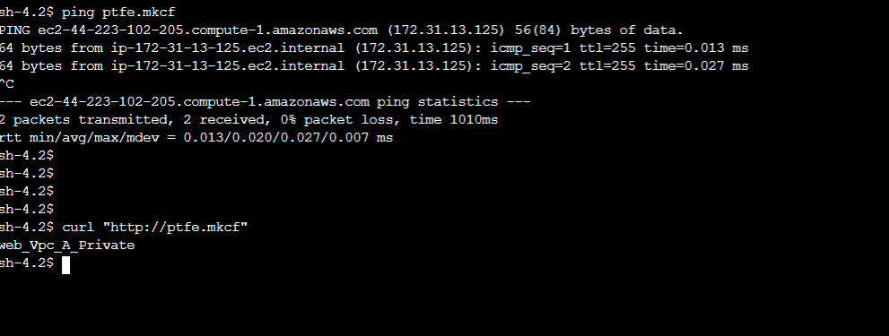

# Projeto de Infraestrutura com Apache e DNS Privado na AWS

## Sobre
Este projeto utiliza Terraform para automatizar a criação de uma infraestrutura na AWS que inclui:
- Uma zona hospedada privada no AWS Route 53, associada à VPC padrão da conta.
- Uma instância EC2 rodando um servidor Apache, servindo uma página estática na porta 80.
- Um registro CNAME na zona hospedada privada, apontando para o nome DNS da instância EC2.
- Um teste de conectividade utilizando `curl` para acessar a página estática através do nome CNAME configurado.

## Recursos Criados
- **AWS Route 53 Hosted Zone Privada:** Zona DNS para gerenciamento interno de nomes.
- **Instância EC2 com Apache:** Servidor web configurado para servir uma página estática.
- **Registro CNAME:** Aponta para o DNS da instância EC2, facilitando o acesso à página.
- **Teste de Conectividade:** Utiliza `curl` para validar a configuração acessando a página estática.

## Pré-Requisitos
- Terraform v0.12+ instalado.
- Acesso configurado para a AWS CLI e Terraform.

## Como Executar

### 1. Inicialização do Terraform
```bash
terraform init
```

### 2. Planejamento do Terraform
Para revisar as alterações planejadas antes de aplicá-las:
```bash
terraform plan
```

### 3. Aplicação das Alterações
Para criar os recursos na nuvem:
```bash
terraform apply
```

## Testando a Configuração

Após a criação dos recursos, você pode testar a configuração executando um comando `curl` para acessar a página estática através do registro CNAME configurado. Este teste deve ser realizado dentro da instância EC2 ou de outra instância dentro da mesma VPC que tenha acesso à zona hospedada privada.



