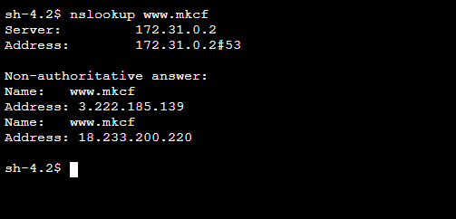
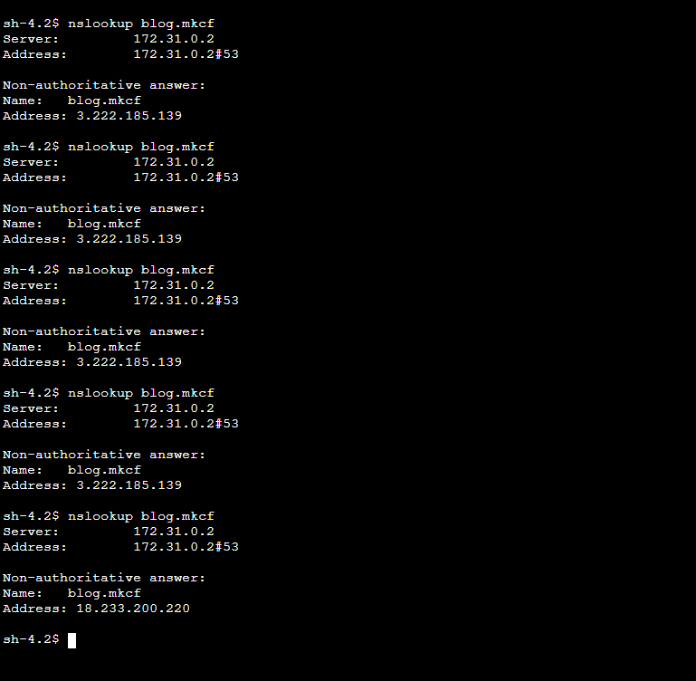

# Projeto de Infraestrutura com Apache e DNS Privado na AWS

## Sobre
Este projeto utiliza o Terraform para automatizar a criação de uma infraestrutura na AWS, que inclui:
- Uma zona hospedada privada no AWS Route 53, associada à VPC padrão da conta.
- Duas instâncias EC2 rodando um servidor Apache, cada uma servindo uma página estática na porta 80.
- Configuração de cenário de roteamento por peso.
- Configuração de cenário de roteamento com retorno de múltiplos valores e health check.
- Health check configurado para cada instância.
- Um teste de conectividade utilizando `nslookup` para resolver o endereço A configurado.

## Recursos Criados
- **AWS Route 53 Hosted Zone Privada:** Zona DNS para o gerenciamento interno de nomes.
- **Instâncias EC2 com Apache:** Servidores web configurados para servir uma página estática cada.
- **Roteamento Weighted:** Divide o tráfego, direcionando 25% para o Blog e 75% para o servidor ao vivo, utilizando registros do tipo A.
- **Roteamento Multi Value Answer:** Retorna ambos os IPs na consulta DNS do tipo de registro A, com associação de um Health Check.
- **Teste de Resolução de Nome:** Utiliza `nslookup` para validar a configuração.

## Pré-Requisitos
- Terraform v0.12 ou superior instalado.
- Acesso configurado para a AWS CLI e Terraform.

## Como Executar

### 1. Inicialização do Terraform
Execute o seguinte comando para inicializar o Terraform:
```bash
terraform init
```

### 2. Planejamento do Terraform
Para revisar as alterações planejadas antes de aplicá-las, execute:
```bash
terraform plan
```

### 3. Aplicação das Alterações
Para criar os recursos na nuvem, execute:
```bash
terraform apply
```

## Testando a Configuração de Multi Value Answer

Após a criação dos recursos, teste a configuração executando um comando `nslookup` para fazer a resolução de nome através do registro A configurado. Este teste deve ser realizado dentro da instância EC2 ou de outra instância dentro da mesma VPC que tenha acesso à zona hospedada privada.



## Testando a Configuração Weighted

De maneira similar, após a criação dos recursos, você pode testar a configuração de roteamento ponderado (`Weighted`) executando um comando `nslookup` para resolução de nome através do registro A configurado. Este teste também deve ser realizado dentro da instância EC2 ou de outra instância dentro da mesma VPC.


