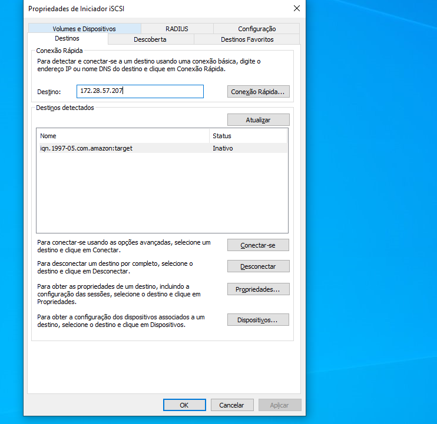
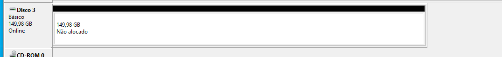

# Gateway de Armazenamento AWS

## Sobre o Projeto
Este projeto implementa um gateway de armazenamento do tipo Volume Gateway Cache na AWS, montando o disco sobre o protocolo iSCSI (Internet Small Computer Systems Interface).

## Recursos Criados
Este projeto cria os seguintes recursos na AWS:

- **AWS Storage Gateway** do tipo Volume Cache Gateway, configurado para trabalhar com o Amazon S3.
- **Criação Volume iSCSI**, que possibilita a montagem do disco via protocolo.

## Como Reproduzir o Ambiente
Para configurar este ambiente, siga os passos abaixo:

1. Faça o download da imagem da [Máquina Virtual Hyper-V](https://dh47azuclyxas.cloudfront.net/aws-storage-gateway-cached.hyperv.zip) diretamente do site da Amazon, utilizando o Hyper-V da Microsoft.

   

2. Após importar a VM, ative a rede da máquina virtual. É recomendável fixar o endereço IP da placa de rede.

3. Crie um novo disco rígido virtual para armazenamento para CACHE STORAGE mínimo 165 GiB [Documentação AWS](https://docs.aws.amazon.com/pt_br/storagegateway/latest/vgw/create-volume-gateway.html). Sugestão de nome: "disco_cache". Use a pasta "Virtual Hard Disks" onde a VM foi importada.

   

4. Inicie a VM e faça login com as credenciais padrão: usuário `admin` e senha `password`. Anote o endereço IP exibido na rede eth0.

   

5. Atualize a variável `gateway_ip_address` no arquivo `variables.tf` com o IP anotado.

6. Inicie o Terraform para criar a infraestrutura:

```shell
terraform init
terraform apply
```

7. Conectando no disco iSCSI. No Windows, utilize o programa "iscsicpl.exe". Para demais sistemas operacionais, consulte a [documentação de montagem iSCSI](https://docs.aws.amazon.com/pt_br/storagegateway/latest/vgw/GettingStarted-use-volumes.html#issci-windows):




8. Formatando disco iSCSI, no Windows, utilize o programa "diskmgmt.msc". Consulte a [documentação sobre como formatar disco](https://docs.aws.amazon.com/pt_br/storagegateway/latest/vgw/GettingStarted-use-volumes.html#format-volume).



Siga os passos até o final após clicar em novo volume simples.


Após a conclusão da configuração, diversas ações podem ser realizadas para aproveitar ao máximo o seu ambiente de armazenamento integrado. Primeiramente, a unidade mapeada está pronta para ser utilizada como um meio eficaz de armazenamento local, onde você pode salvar arquivos, documentos e outros dados importantes com facilidade e segurança. Esta funcionalidade é especialmente útil para a gestão diária de dados e para garantir que os arquivos críticos estejam acessíveis localmente.

Além disso, a AWS oferece opções robustas de backup e recuperação para seus volumes iSCSI. Uma das funcionalidades mais poderosas é a capacidade de criar snapshots dos seus volumes diretamente na console da AWS. Esses snapshots capturam o estado completo do volume em um ponto específico no tempo, fornecendo uma maneira conveniente de realizar backups incrementais e de recuperar seus dados em caso de necessidade.

Após a criação de um snapshot, você tem a flexibilidade de utilizá-lo de diversas maneiras. Por exemplo, é possível anexar o snapshot a uma instância EC2, permitindo que você monte o volume em uma máquina virtual na nuvem. Esta opção é particularmente útil para testes de recuperação de desastres, migração de dados ou até mesmo para a clonagem de ambientes para desenvolvimento e teste.

Para resumir, a configuração do seu Volume Gateway oferece um leque de possibilidades práticas para a gestão de dados:

- **Armazenamento Local**: Utilize a unidade mapeada para o armazenamento e acesso rápido a arquivos e documentos importantes.
- **Backup e Recuperação**: Utilize a console da AWS para criar snapshots dos seus volumes iSCSI, proporcionando uma solução eficaz de backup.
- **Flexibilidade e Escalabilidade**: Aproveite os snapshots para montar volumes em instâncias EC2, facilitando a recuperação de desastres, a migração de dados, e a replicação de ambientes para desenvolvimento e teste.

Com essas funcionalidades ao seu dispor, você pode assegurar a integridade dos seus dados e a continuidade dos negócios com eficiência e confiança.


## Destruindo o Ambiente

Para destruir todos os recursos criados pelo Terraform, execute o seguinte comando no terminal:

```shell
terraform destroy
```

**Observação:** Durante a elaboração deste documento, foi observado que o comando `terraform destroy` pode não funcionar corretamente para o recurso `aws_storagegateway_gateway` e remover Snaphost caso tenha feito pela Console. Caso encontre dificuldades, a exclusão manual pelo Console Web da AWS é recomendada. Após deletar pelo Console, execute novamente `terraform destroy` para garantir que todos os recursos sejam removidos.