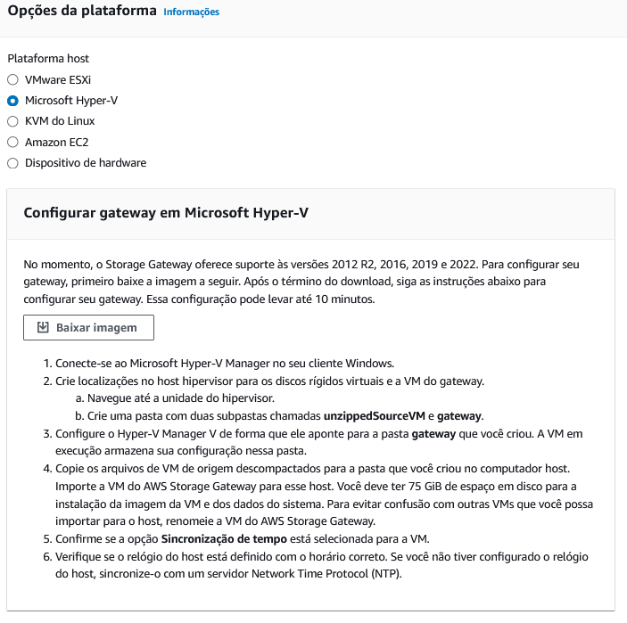

# Gateway de Armazenamento AWS

## Sobre o Projeto
Este projeto implementa um gateway de armazenamento do tipo File Gateway na AWS, utilizando o serviço AWS Storage Gateway para integrar o armazenamento em nuvem do Amazon S3 com um sistema de arquivos NFS local. Esta integração permite que os dados sejam armazenados e recuperados de forma transparente entre o ambiente local e o S3.

## Recursos Criados
Este projeto cria os seguintes recursos na AWS:

- **AWS Storage Gateway** do tipo File Gateway, configurado para trabalhar com o Amazon S3.
- **Bucket do S3**, que serve como o destino de armazenamento onde os dados são sincronizados.
- **Regras de IAM**, que fornecem as permissões necessárias para que o Storage Gateway interaja com o S3.

## Como Reproduzir o Ambiente
Para configurar este ambiente, siga os passos abaixo:

1. Faça o download da imagem da [Máquina Virtual Hyper-V](https://dd958of58tzpr.cloudfront.net/aws-storage-gateway-file-s3.hyperv.zip) diretamente do site da Amazon, utilizando o Hyper-V da Microsoft.

   

2. Após importar a VM, ative a rede da máquina virtual. É recomendável fixar o endereço IP da placa de rede.

3. Crie um novo disco rígido virtual para armazenamento. Sugestão de nome: "dados". Use a pasta "Virtual Hard Disks" onde a VM foi importada.


   

5.  Inicie a VM e faça login com as credenciais padrão: usuário `admin` e senha `password` e anote o endereço IP exibido na rede eth0.

   

6. Atualize a variável `gateway_ip_address` no arquivo `variables.tf` com o IP anotado.

7. Inicie o Terraform para criar a infraestrutura:

```shell
terraform init
terraform apply
```

8. No Windows, instale o Cliente NFS via "Ativar ou desativar recursos do Windows". Monte o compartilhamento NFS com o comando:

```shell
mount -o nolock -o mtype=hard <Endereço_IP_Gateway>:/cloud_dados_storage_share [Letra_Unidade]:
```

9. Acesse o diretório NFS montado pelo Windows Explorer para adicionar ou acessar arquivos.

   


## Sincronismo entre S3 e NFS
Arquivos adicionados ao compartilhamento NFS são sincronizados quase imediatamente com o bucket S3. Contudo, arquivos carregados diretamente no S3 podem levar até 5 minutos para serem visíveis no compartilhamento NFS devido ao cache do Storage Gateway.


## Destruindo o Ambiente

Para destruir todos os recursos criados pelo Terraform, execute o seguinte comando no terminal:

```shell
terraform destroy
```
**Observação:** Durante a elaboração deste documento, foi observado que o comando `terraform destroy` pode não funcionar corretamente para o recurso `aws_storagegateway_gateway` do tipo NFS. Caso encontre dificuldades ao executar o comando, recomenda-se a exclusão manual do recurso por meio do Console Web da AWS.
Após deletar pela Console Web, rodar o comando novamente `terraform destroy` para ter certeza que excluir tudo.

Esta versão revisada melhora a formatação do Markdown e torna a nota sobre a exclusão manual mais clara para os leitores.

Lembre-se de executar este passo apenas quando for necessário remover completamente a infraestrutura e todos os dados associados.