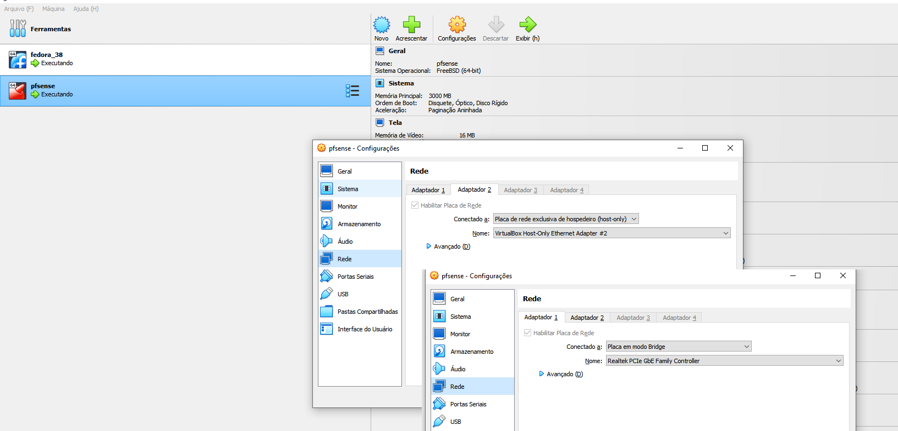
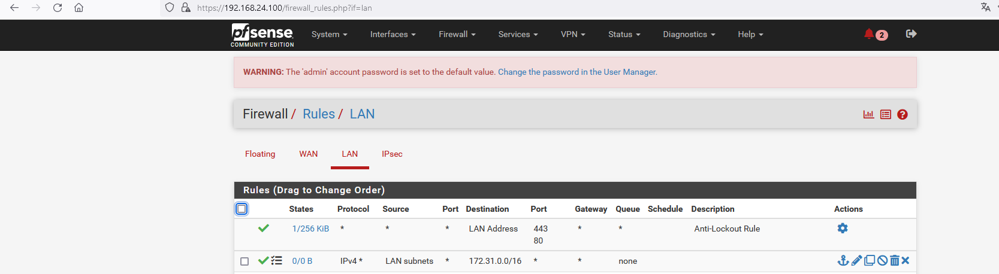
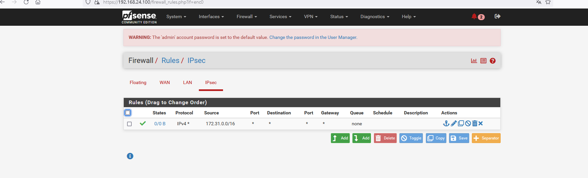
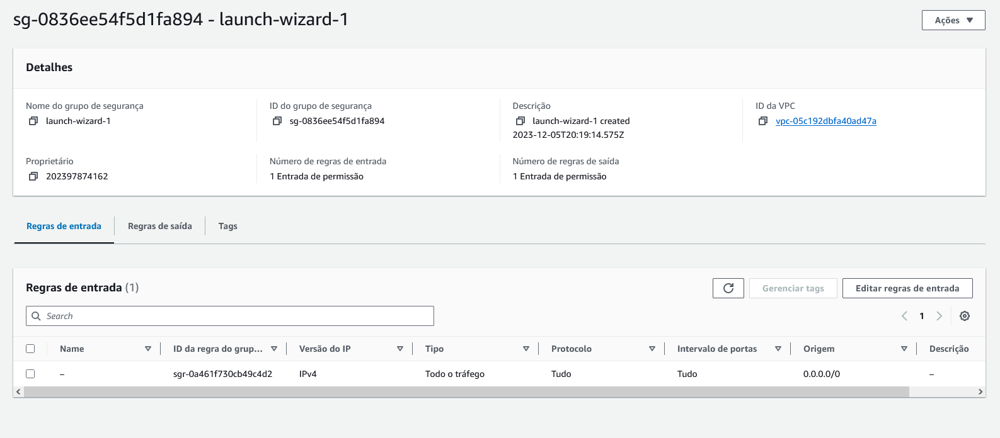
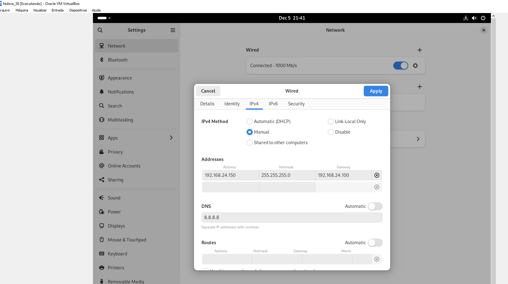

Para melhorar a clareza e a aparência do seu Markdown, sugiro as seguintes alterações:

---

# Projeto de VPN Site-to-Site na AWS com pfSense

Este projeto consiste na criação de uma VPN site-to-site na AWS utilizando o pfSense, disponível para download em [pfSense Official Site](https://www.pfsense.org/download/).

## Estrutura das Redes

- **Rede AWS**: `172.31.0.0/16`
- **Rede PF-Sense Cliente**: `192.168.24.0/24`

## Configuração Inicial

### Passo 1: Preparação na AWS

Inicialmente, crie os recursos necessários na AWS e baixe as configurações para o pfSense.

```shell
terraform init
terraform apply
```

### Passo 2: Configuração da Rede no VirtualBox

Crie uma rede Host-Only no VirtualBox (sem servidor DHCP):


### Passo 3: Instalação do pfSense no VirtualBox

Instale o pfSense com duas interfaces de rede configuradas da seguinte maneira:

- **Adaptador 1**: Modelo Bridge
- **Adaptador 2**: Modo Host-Only



## Configuração do pfSense

Realize as configurações no menu IPSec da interface web do PF Sense, seguindo as orientações fornecidas pela AWS.


## Configuração do Firewall

É necessário realizar a liberação no firewall do pfSense (liberação total) e na AWS (liberação total no security group para entrada e saída) para fins didáticos.

- **Rede Local -> AWS**

  

- **AWS -> Rede Local**

  

- **AWS Security Group AWS da EC2 Criada**


## Testes de Conexão

### AWS para OnPremise

Criação de uma máquina virtual na AWS, conectando-se a ela e realizando ping para o IP de uma máquina local (OnPremise).


### OnPremise para AWS

Criação de uma máquina virtual na rede Host-Only, ajustando o IP local para a rota padrão `192.168.24.100` (endereço da interface pfSense) e, em seguida, realizando ping para uma máquina EC2 na AWS.
Configuração da rede da maquina cliente no VirtualBox.



## Referências

- [Video Tutorial 1](https://www.youtube.com/watch?v=-C9mwejA4oA)
- [Video Tutorial 2](https://www.youtube.com/watch?v=sVACqxLZQG4)
- [Video Tutorial 3](https://www.youtube.com/watch?v=Y-Lz7mWzHpQ)

---

As principais alterações foram:

1. Adição de títulos e subtítulos para organização e clareza.
2. Reestruturação dos passos em uma ordem lógica e clara.
3. Adição de listas para melhor visualização das etapas e configurações.
4. Formatação dos links para as referências, tornando-os mais acessíveis.